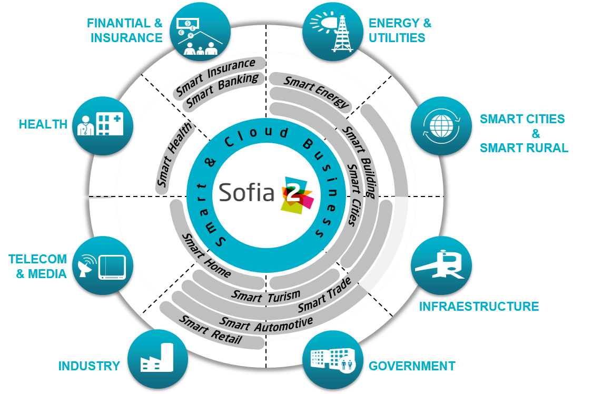

.. figure::  ./images/logo_sofia2_grande.png
 :align:   center
 
Ámbitos de aplicación
=====================

Internet of Things se posiciona transversalmente cruzando distintos sectores y negocios. La plataforma Sofia2 ofrece soluciones en todos los ámbitos.

 
 |

Smart Cities.
---------------
Aportamos soluciones Smart City que sitúan al ciudadano en el centro de actuación pública y de gobierno.

Sofia2 como cerebro de OS de la ciudad:

* Recolección de datos de los sensores y dispositivos de la ciudad.

* Integrado con resto de sistemas de la ciudad.

* Evaluación de Reglas y Motor CEP para toma de decisiones en la ciudad.

* Suscripción a eventos, alarmas,...

* Soporte multidispositivo.

|descargar-mini| `Sofia2 como cerebro de la ciudad (Pdf) <http://sofia2.com/docs/Sofia2%20como%20cerebro%20de%20la%20ciudad%20(abril%202015).pdf>`_

|ver-video| `SmartCity: Un modelo de mobilidad sostenible para las ciudades del futuro <https://www.youtube.com/watch?v=tNIKZo12UrU>`_

Smart Energy.
---------------
Aportamos soluciones Smart Energy para la gestión eficiente de los procesos de generación, distribución y comercialización.

SOFIA2 como Plataforma para dispositivos domiciliarios:

* Recoge información de dispositivos domóticos.

* Almacena, procesa y toma decisiones sobre grandes volúmenes de información.

* Gestión de los dispositivos domóticos.

* Soporta servicios adicionales sobre la plataforma domiciliaria.

Smart Health.
---------------
Aportamos soluciones Smart Health para un modelo de Salud sostenible, que prioriza la atención y la prevención de enfermedades.

SOFIA2 como Plataforma de Interoperabilidad entre Sistemas:

* Desplegable en dispositivos para salud domiciliaria.

* Funcionamiento como Bus de comunicación entre Sistemas de Salud.

* Gestión centralizada de las reglas, variables,...

* Almacenamiento de información histórica.

Industria 4.0.
---------------

Productos, procesos y modelos de negocio preparados para la Cuarta Revolución Industrial.

* Información enriquecida de equipos y procesos sobre dispositivos móviles, superponiendo información virtual sobre elementos del mundo real.

* Integración de múltiples dispositivos y sensores de manera inteligente.

* Algoritmos avanzados de mantenimiento predictivo, optimización de inventarios o gestión de rutas, para habilitar una óptima gestión de recursos.

* Funcionalidades de integración y colaboración en procesos logísticos, compras o facturación entre compañías.

* Funcionalidades de eficiencia energética para monitorizar y controlar el consumo energético de edificios e instalaciones industriales.

* Proyectos avanzados de I+D+i en curso para la fabricación de drones y vehículos autoguiados para entornos industriales. 

Smart Retails.
---------------
Aportamos soluciones Smart Retail que conectan a las marcas con clientes, mejoran procesos logísticos, maximizan la adquisición ….

SOFIA2 en la optimización de modelos comerciales de tiendas:

* Gestión Smart de un supermercado permitiendo conocer el número de visitantes, analítica online de productos más solicitados,...

* Gateway en cualquier máquina vending o TPV permitiendo aplicar analítica para mejora de ventas.

* Gestión del SW.

Smart Banking.
---------------
Soluciones Smart Banking para desarrollar Banca Digital y liderar procesos de transformación de la información.

SOFIA2 encaja como Solución Transversal en Banca:

* Plataforma para el mobile payment e integración con otras empresas.

* Plataforma CEP para detección de fraude.

* Plataforma de gestión de logs: recepción centralizada, almacenamiento, explotación.

|descargar-mini| `Soluciones Sofia2 (Pdf) <http://sofia2.com/docs/Sofia2-Soluciones.pdf>`_

.. |descargar-mini| image:: ./images/mini-download.png
.. |ver-video| image:: ./images//youtube.png
   :target: https://www.youtube.com/watch?v=tNIKZo12UrU
