 
Arquitectura Detallada
======================

A continuación vamos a describir los módulos que componen la Plataforma sobre la vista modular con más detalle:

Módulos IoT:
============

SDK
----
IDE personalizado basado en Eclipse para el desarrollo simplificado de integraciones sobre la Plataforma.

`Descargar <http://sofia2.com/desarrollador.html#descargas>`_

Sofia2 Control Panel
--------------------
La Plataforma ofrece una **completa web de administración/configuración** desarrollada con tecnología HTML5 que permite gestionar todos los conceptos que maneja la Plataforma. 

El resto de módulos de la Plataforma se operan/configuran desde este módulo, que persiste su configuración en la **BDC** (Base Datos Configuración) del Sofia2-Repository.

Toda la interacción con la Plataforma Sofia2 puede realizarse desde el Sofia2 Control Panel. 

El panel de control es una herramienta que, mediante interfaces normalizadas, permite una representación estructurada de la información y un diseño de operación destinado a sacar el máximo rendimiento de los usuarios del sistema, facilitando el aprendizaje y reduciendo el tiempo de respuesta.

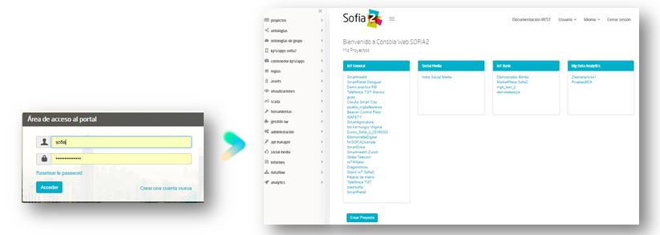

Provee a los usuarios (en función de los privilegios de su rol) funcionalidades como estas:

* **Herramienta de consulta sobre la BDTR y BDH**: permite acceder a los datos insertados en la plataforma a través de un motor de queries integrado.
Esta interfaz posibilita lanzar queries en lenguaje SQL. Asimismo será posible el filtrado de los resultados (ej. por operador, identificador del jugador, tipo de juego, intervalo de fechas) mediante cláusulas where de SQL.
El hecho de poder ejecutar sentencias SQL permitirá la actualización y borrado manual de registros a aquellos roles capacitados para tal fin.

* **Monitorización de procesos**: a través de la consola web es posible llevar el control sobre la planificación de procesos (como por ej. la carga de ficheros, el paso de datos a la BDH, etc.), permitiendo además su monitorización en tiempo real.
Esto posibilitará la monitorización del estado y funcionamiento de las cargas, cuánto han tardado, si ha habido algún error en ellas y cuál ha sido la naturaleza del mismo.

* **Gestión de usuarios y roles**: asignación de roles a usuarios, asignación de permisos sobre información almacenada en la plataforma.
A través de esta capacidad será posible la integración con la gestión de perfiles centralizada usada en el Sistema.

* **Gestión de clientes de la Plataforma y sus tokens** (requeridos para interactuar con la plataforma): permite una gestión integral de aquellos clientes (KPs) que están accediendo o insertando datos en la plataforma, pudiendo invalidar en cualquier momento tokens de acceso. 

* **Visualizaciones**: La Plataforma permite acceder a la información gestionada por ella a través de cualquiera de sus APIs (por ejemplo API Javascript para desarrollo de Webs), a través del API Manager vía Interfaces REST y a través de conexión ODBC y JDBC. Además de esto ofrece 3 módulos que resuelven out-of-the-box las necesidades de visualización:

 * **Dashboards**:
Este módulo permite crear de forma sencilla y visual Cuadros de Mando sobre la información gestionada por la Plataforma.

Este módulo permite crear cuadros de mando de forma sencilla y visual desde el Panel de control de la Plataforma. 
Para eso ofrece diversos tipos de gadgets:

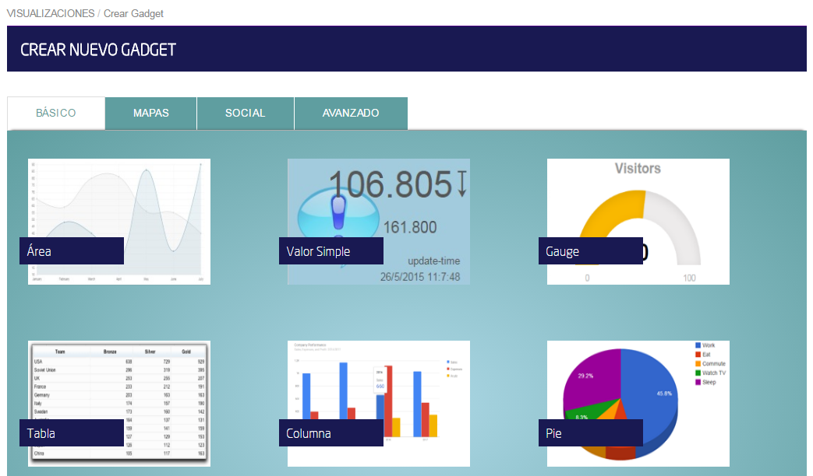
 
que pueden unirse para generar un completo Dashboard,  bien sobre la información que se va añadiendo a la plataforma, bien sobre la información histórica:

.. figure::  ./images/DashboardsCompleto.png
 :align:   center

|
Por lo tanto las capacidades que nos ofrecen los son las siguientes:

* **Biblioteca** para la configuración de **Gadgets**.
* Composición de **Dashboards** reutilizando Gadgets configurados.
* **Gestión** (Creación/modificación/eliminación) de Gadgets y Dashboards desde la misma interfaz **centralizada** de administración.
* **Integración** con los repositorios de información y con fuentes externas.
* **Exportación** de la información en distintos formatos (xls, csv, html)
|

  * **Sinópticos**:
Este módulo permite desde el Panel de Control crear visualmente sinópticos tipo SCADA que reaccionan a los eventos (ontologías) generados en la Plataforma permitiendo crear completos cuadros de mando operacionales

Por lo tanto permite la **monitorización y actuación** en **tiempo real** sobre **procesos industriales** para los que se proporcionan las herramientas de diseño de Sinópticos, reglas, alertas y tags

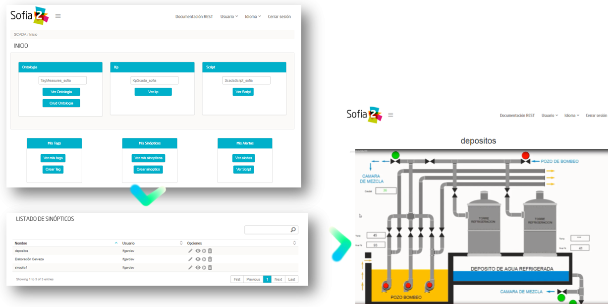
 

|
 * **Informes**:

Este módulo ofrece una funcionalidad de reporting sobre la información gestionada por el Sofia2 Storage (BDTR y la BDH). 

Permite:

* Diseñar Informes de forma flexible desde el editor de informes visual integrado en Sofia2-SDK.
* Acceder a BDTR y BDH.
* Cargar informes en la Plataforma a través de la Consola Web de la Plataforma.
* Visualizar Informes en formato HTML integrados en la Consola.
* Generar informes en formatos HTML, PDF, Word, Excel,…
* Guardar informes generados, catalogarlos y darles permisos de visualización.

La implementación de referencia de este módulo se basa en la librería open-source Jasper Reports, que permite diseñar informes de manera flexible y personalizable:

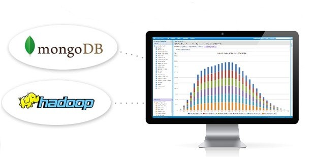

Desde Sofia2 Control Panel  y dependiendo del perfil del usuario se habilitarán las opciones a las que se tenga acceso.

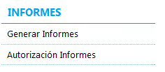

Con el perfil de Administrador se pueden crear/modificar/eliminar informes y asignar permisos de consulta a otros usuarios. La opción Autorización Informes no estará disponible para usuarios con rol Usuario.

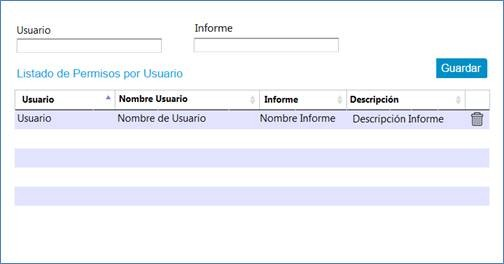

Sólo el propietario (o usuarios administradores) podrá consultar, editar y eliminar sus informes. Los informes generados se almacenarán y se pueden crear grupos de usuarios de consulta a dichos informes.

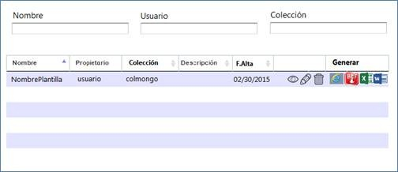

El usuario, desde la interfaz de gestión puede visualizar sus propios informes y sobre los tenga permiso. En caso de que se trate de un informe parametrizado, tras pulsar sobre la generación de uno de los tipos de informes, se solicitará mediante un diálogo los parámetros necesarios para su ejecución. Una vez introducidos, se presentará por pantalla el resultado.

Los informes se podrán visualizar en HTML o PDF y exportar los informes a formato PDF, a una hoja de cálculo de Excel o a un documento Word. 

|
Semantic Broker (SIB)
---------------------

|
IoT Gateway
-----------
Capa de abstracción del protocolo de comunicación, que implementa el protocolo SSAP (Smart Space Access Protocol). 

Este módulo se especializa en el esquema de comunicación con dispositivos, sensores y sistemas TI en un contexto IoT, donde se debe facilitar el uso de protocolos de comunicación ligeros en un entorno tecnológico heterogéneo. El protocolo SSAP proporciona tanto la ligereza del mensaje como su homogeneización a nivel de aplicación. De esta manera, la información gestionada por las subsiguientes capas de la plataforma es completamente agnóstica del protocolo tecnológico usado para el envío del dato, dando lugar a su gestión desde un punto de vista semántico.

Para agilizar la integración con la plataforma (desde sensores, dispositivos o sistemas TI), este componente ofrece la interpretación de multitud de protocolos “out of the box”:

* REST y WebSockets: para clientes Javascript, smartphones,..
* MQTT para comunicaciones bidireccionales y dispositivos básicos.
* Web Services/JMS/AMQP para aplicaciones empresariales.

Además, se facilita la incorporación de nuevos protocolos gracias al despliegue de nuevos Plugins.

Esto, sumado a las **APIS multilenguaje** `(Descargar) <http://sofia2.com/desarrollador.html#descargas>`_ que ofrece la plataforma facilita el desarrollo de cualquier cliente que quiera comunicarse con la plataforma, permitiendo la abstracción de los detalles técnicos del protocolo a utilizar (ya considerados en el API).

|
Process
-------
Se compone de los dos módulos siguientes:

Motor de Reglas (Sofia2-Rules)
------------------------------
El módulo Sofia2-Rules permite ampliar el funcionamiento de la Plataforma permitiendo definir reglas que se ejecutan ante ciertas condiciones (inserción de un nuevo dato o cada cierto tiempo). 
 
Estas reglas dan la capacidad de definir, en base a Scripting, acciones que ejecuta la Plataforma. Gracias a ellas se pueden gestionar y tratar los datos de la plataforma. 

Por ejemplo se pueden definir transformaciones a los datos existentes o implementar el motor de reglas en tiempo real sobre patrones/datos/eventos. 

Todas estas reglas se crean desde la Consola Web de forma sencilla y sin programar. La creación de reglas desde la consola va en función del rol, por ejemplo usuario administrador puede crear reglas sobre cualquier ontología mientras que un usuario colaborador puede definir reglas sobre ontologías de las que es propietario.

La Plataforma disponibiliza  un conjunto de acciones predefinidas que se pueden ejecutar dentro de la regla, como Enviar Mail, Generar Alarma,… Además, se pueden crear nuevas acciones predefinidas en tiempo de desarrollo.

Podemos diferenciar dos tipos de Reglas Scripting:

* **Reglas Temporizadas**. Ejecutan el Script definido cada X segundos definidos en la creación de la regla, este tipo de Reglas únicamente define el THEN pues no existe un flujo alternativo a una condición.

* **Reglas Ontología**. Son reglas asociadas a una Ontología y por lo tanto únicamente entran en acción cuando se realiza la inserción de una Instancia de Ontología en el SIB. Definen una condición sobre un valor de la instancia de la Ontología, con los operadores  (=,>,<, ¡=), está escrito en lenguaje Groovy e interpretado como un Script.

Las reglas pueden ser desarrolladas en Groovy (lenguaje sencillo y de alta productividad basado en Java), Python, R o directamente en Java.

Los scripts pueden ser desplegados en caliente en la Plataforma, de forma que pueden actuar en tiempo real directamente tras su creación.
 
La ejecución de cada uno de los Script se realiza de forma independiente de la JVM que gestiona el SIB aislando al SIB y los diferentes Script de posibles errores. 

Las Reglas se desarrollan haciendo uso de una biblioteca de APIS que permiten interactuar con los diferentes elementos de la plataforma (p.e. ontologías, BDTR) y con elementos externos a ella (p.e. envío de correos, redes sociales). Estas APIS son extensibles por el administrador de forma sencilla, estando disponibles out-of-the-box librerías para gestión de conexiones HTTP, JMS, LOGS, mail, BDTR, ejecución de Scripts, SSAP, Twitter, entre otras.

|
Motor CEP (Sofia2-CEP)
-----------------------

|
Sofia2 Storage
--------------
Modulo de almacenamiento de la información de la plataforma.

Con el objetivo de garantizar que, para cada momento del **ciclo de vida de la información**, ésta se gestiona de la menor manera, la plataforma plantea el uso de tres repositorios distintos que se complementan y comunican componiendo una solución de almacenamiento completa:

 
Este módulo nos ofrece las siguientes **Capacidades**:
 
* Un repositorio adecuado para cada momento en el **ciclo de vida de la información**.
* Optimización de tiempos de acceso a la información.
* **Soporte a diferentes tecnologías** en función del patrón de accesos, altas y consultas de cada repositorio.
* **Escalabilidad horizontal** de todos los repositorios.
* Los repositiorios están integrados entre sí y con las demás capas de la plataforma.
* Soportan estándares y bases de datos  **SQL y NO-SQL**.

 
Base de Datos Tiempo Real (BDTR)
--------------------------------

Almacena la información recibida en tiempo real, como instancias de ontologías, siendo, por lo tanto el primer repositorio en el que se almacena la información recibida de:

* sensores y dispositivos integrados con la plataforma en un contexto IoT típico. 
*	Redes Sociales, en los casos en que la escucha de twitter, Facebook, Instagram… es un dato más en el universo de los datos configurados.
*	Cualquier otra fuente cuya información sea requerida y/o reportada frecuentemente.
Esta información se valida automáticamente, garantizando corrección de la estructura según la definición previa de las ontologías (entidades o conceptos de negocio). 

Por cada ontología se puede configurar una ventana de tiempo a partir de la cual la información ya no se considera ‘información en tiempo real’, de tal manera que será migrada automáticamente al repositorio de información histórica.

En función del patrón de accesos a la información de tiempo real, se puede implementar este módulo con tecnologías diferentes, que aseguren el acceso ágil a la misma (MongoDB, Hbase, BD relacionales…).

Gracias a Kudu e Impala se facilita el acceso en tiempo Real para la analítica de datos.

Podemos destacar las siguientes **capacidades** de este repositorio:

* **Acceso ágil** a la información.
* **Herramienta de consulta SQL** integrada en el panel de control Sofia2 incluso si la base de datos es NO-SQL.
* **Origen de datos para Analítica** de Datos en Tiempo Real.
* **Integración** con el motor de Reglas, Machine Learning y capas de integración.
* **Escalabilidad** horizontal.
* **Control sintáctico** de la información insertada de acuerdo a las ontologías definidas.

|
Base de Datos Histórica (BDH).
------------------------------
Almacena la información histórica para su posterior explotación analítica.

La información almacenada estará disponible como origen de datos para los distintos módulos de la plataforma: Integración, Machine Learning, API Manager…

La implementación  de este repositorio está basada en Hadoop  como repositorio, Hive como solución Datawarehouse y SparkSQL para facilitar el acceso homogéneo a los datos.

Como **características** más importantes de este repositorio podemos destacar las siguientes:

* **Almacenamiento temporal** de información heterogénea.
* **Herramienta de consulta SQL** integrada en el panel de control Sofia2.
* **Origen de datos para Analítica** de Datos Históricos
* **Integración** con el motor de Reglas, Machine Learning  y capas de integración.
* **Escalabilidad** horizontal.
* Actúa como el corazón del **Data Lake** de la plataforma, almacenando información heterogénea con capacidad de procesamiento	

Repositorio Staging
-------------------
**Almacena información** en diferentes estados (estructurada, semi-estructurada y no estructurada) **temporalmente**, para facilitar procesos complejos de transformación, ingestión y exposición de datos que requieran la persistencia temporal de estados intermedios del proceso.

Este repositorio se implementa sobre **HDFS**, cuya arquitectura basada en ficheros de texto y nodos de procesamiento paralelo, proporcionan la flexibilidad y escalado horizontal necesarios.

.. figure::  ./images/HDFS.jpg
 :align:   center

Podemos destacar las siguientes capacidades de este repositorio:

* **Almacenamiento temporal** de información heterogénea.
* **Usado para dar soporte a procesos analíticos** y de transformación de dato complejos.
* **Integración** con el motor de Reglas y Machine Learning.
* **Escalabilidad** horizontal.

|
API Manager
-----------
Este módulo permite acceder a la información recolectada y gestionada por la Plataforma.

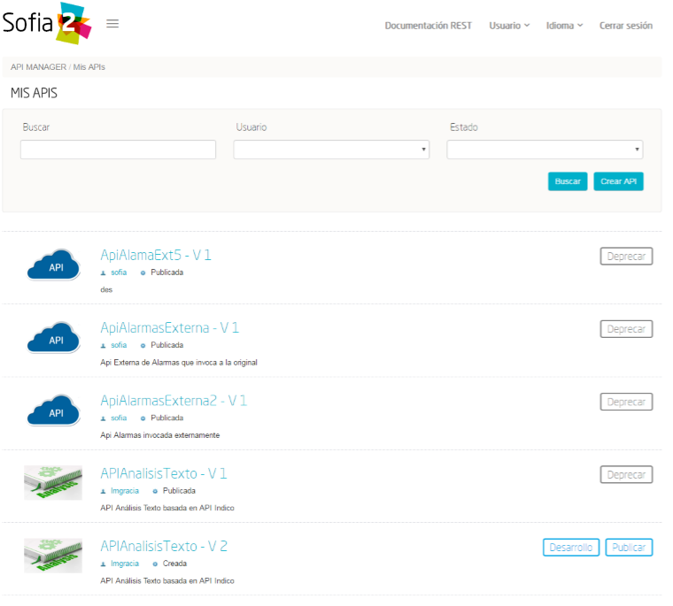

Para ello, publica la información gestionada por la plataforma como APIs REST. Esto permite poner toda información a disposición y uso directo de los distintos stakeholders involucrados en el desarrollo de la actividad diaria sin necesidad de conocer las APIs y protocolos de la Plataforma.

Este módulo también permite disponibilizar Servicios REST externos a la Plataforma, lo que permite ofrecer un punto único de acceso a APIS internas y externas de la Plataforma.

Sus principales **capacidades** son:

* **Exposición de entidades (ontologías) como APIS REST**. Desde la consola de administración es posible exponer como API REST cualquier entidad (ontología) , indicando los métodos a exponer para su consulta y tratamiento. 

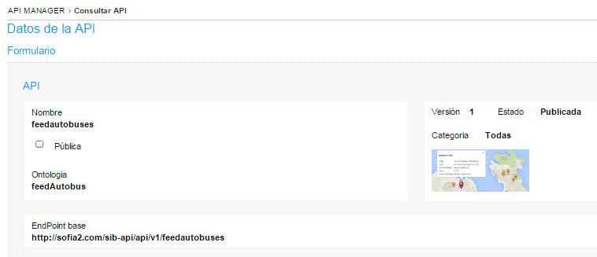
.. figure::  ./images/API2.png
 :align:   center

* **Simplicidad en el acceso a la información de la plataforma** a través de APIs REST lo que permite que esta se pueda consumir sin conocer los detalles técnicos de la Plataforma.
* **Portal integrado en el Panel de Control** que permite la búsqueda, suscripción e invocación de las APIs.

.. figure::  ./images/SuscripciónAPI.jpg
 :align:   center
 
* **Autenticación** mediante token en cabecera de cada petición HTTP. Desde la consola de administración, cada usuario, o en su caso un administrador, puede generar y regenerar sus token de autenticación. En cada petición se deberá incluir en la cabecera HTTP este token para autenticar la petición.

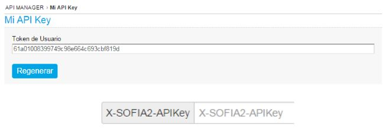
 
* **Seguridad en el acceso personalizado a las APIs**, a nivel de API y a nivel de entidad de información. Desde la consola de administración, cada usuario que exponga una entidad de información puede otorgar y revocar el permiso de operación sobre el API a otros usuarios.

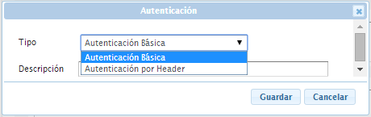

* **Control de cuotas de consumo** en el acceso a la información para usuarios. Sofia2-API Manager gestiona el consumo realizado por cada usuario en función de distintas políticas configurables desde la consola de administración.
* **Proporcionar acceso a APIS externas** incluyendo sistemas de datos abiertos.
* **Ciclo de vida de las APIS expuestas**, gestionando a través de la consola de administración la fuente de los datos, versión del API, categoría y estado de exposición del API (Creada, en Desarrollo, Publicada, Deprecada, Eliminada).
* **Documentación web de APIS** expuestas mediante página descriptiva de los comentarios incluidos durante la creación del APIS y la definición de los métodos expuestos. 

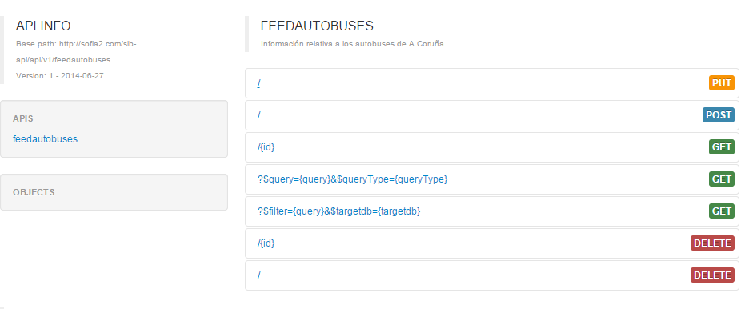
 
* **Cache de APIs configurable**, cacheando la respuesta de las peticiones durante un intervalo configurable el tiempo de respuesta para peticiones complejas sobre grandes volúmenes de datos es casi inmediato.

 
|
Holystic Viewer
---------------
Este módulo forma parte del ecosistema de la Plataforma, es desarrollado por una empresa partner de Indra y puede adquirirse o no junto a la plataforma. 

Sofia2-HolisticViewer es el módulo de visualización avanzada de la Plataforma, se trata de un sistema integral de visualización avanzada e interactiva que permite una gestión de información geolocalizada asociándola a un entorno de visualización tridimensional y multimedia:

Proporciona geovisualización en tiempo real sobre el terreno

| 
| 
Módulos Big Data:
=================
|
Sofia2 DataFlow
---------------
Permite hacer ingesta masiva de datos desde multitud de fuentes, transformaciones simples online sobre la información y ruteado hacia otro destino (módulo IoT Flow, BDTR, BDH,…). Es posible añadir plugins a la plataforma para incorporar nuevas fuentes, transformaciones y destinos.

La composición del proceso ETL (Extracción, Transformación y Carga o Load), se realiza mediante el drag&drop  de las tareas disponibles en la barra de herramientas.

.. figure::  ./images/dataflow1.png
 :align:   center
 
|
**Monitorización**:
En tiempo de ejecución, se pueden configurar reglas para capturar y visualizar datos de un pipeline en ejecución. 
Además es posible consultar las estadísticas de ejecución de cualquier pipeline en tiempo real, los datos procesados y el historial del pipeline.

**Alertas**:
La configuración de alertas y thresholds de normalidad posibilitan la ejecución de acciones automáticas como la comunicación de estos eventos y la visualización del detalle.

Haciendo foco en las **capacidades** ETL del módulo, podemos destacar las siguientes capacidades por cada fase del proceso:

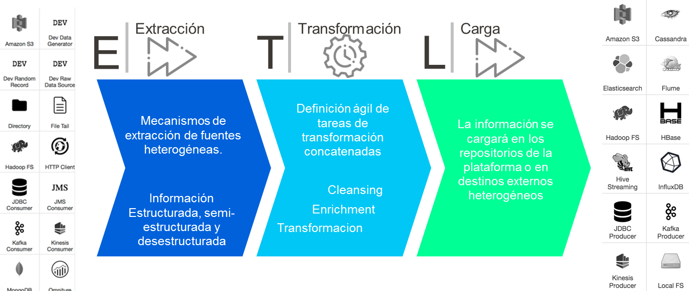
 

* **Extracción**: Disponen de 18 los orígenes de datos integrados , entre los que se encuentran como orígenes disponibles: Sofia2 (que permite seleccionar la ontología, campos, query…), Excel, AmazonS3, HadoopFS, Kafka…

* **Transformación**: Se podrán concatenar sucesivas transformaciones y actuaciones sobre los datos hasta conseguir el proceso completo. Para ello se cuenta con 20 posibles tareas:

 * **Evaluador de Expresiones**: Realiza comprobaciones y calculos que puede escribir campos nuevos o existentes.
 *	**Acciones sobre campos**: Diferentes acciones disponibles sobre los campos como: Converter, Merger, Masker, Hasher, Remover, Renamer….
 *	**Parseadores de JSON, XML y logs**: Parsea información válida según los diferentes tipos de formato de logs, y esquemas XML y JSON.
 * **Selector de Flujo**: Para seleccionar la siguiente actividad a ejecutar sobre el conjunto de datos, en función de condiciones de ejecución.
 
.. figure::  ./images/SelectorFlujoDataflow.png
 :align:   center

 
 *	**Evaluadores en distintos lenguajes**: Diferentes lenguajes disponibles para la codificación de acciones específicas sobre los datos (Python, Javascript, Jython…)
 * Otros componentes como el duplicador de Registro o el reemplazador de valores

*  **Carga**: Se disponen de más de veinte posibles destinos, a incorporar en el proceso mediante Drag&drop desde la barra de tareas. De ellos podemos destacar el componente Sofia2 (que permite seleccionar la ontología, campos y otros parámetros adicionales), AmazonS3, Cassandra, Hadoop, Kafka, Flume….
 
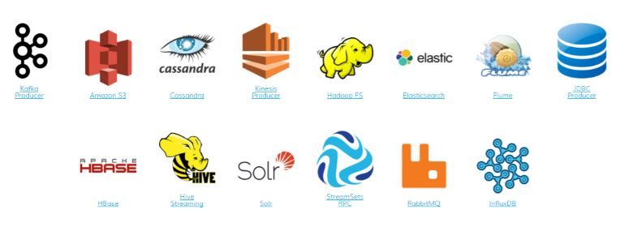

Este módulo incluye herramientas de monitorización tanto para agilizar el desarrollo como para hacer seguimiento de la ejecución del proceso una vez activado y publicado.

|
Sofia2 Notebooks
----------------
Permite realizar de manera muy sencilla e interactiva, analítica sobre datos de fuentes muy variadas, incluidas las fuentes de datos de Sofia2. De esta manera se podría, por ejemplo, realizar cargas de archivos desde HDFS a spark, cargar de datos en tablas Hive, lanzar consultas o realizar un proceso complejo de machine learning mediante las librerías de MLlib de Spark. También el posible la utilización de código R así como las numerosas librerías del lenguaje, permitiendo por ejemplos visualizar mapas de leaflet.

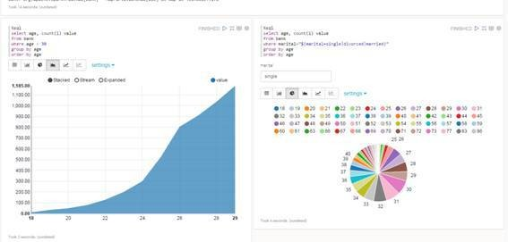
 
Sofia2 Notebooks posee la capacidad de combinar código Scala, Spark, SparkSQL, Hive, R, Shell, o muchos otros con contenido html o directivas reactivas de angular, permitiendo interacciones en tiempo real con una potente interfaz y todo ello en un entorno compartido y multiusuario.
Cada lenguaje soportado es gestionado por un intérprete, por lo que siempre que se quiera escribir código de un cierto lenguaje se tendrá que escribir un marcador propio en el párrafo.
Además permite realizar  **visualizaciones instantáneas de los datos**, pudiendo configurar de forma sencilla los gráficos y cambiar rápidamente el tipo de visualización de los mismos. También es posible la creación de gráficos avanzados gracias a librerías propias de cada lenguaje.

SparkSQL:

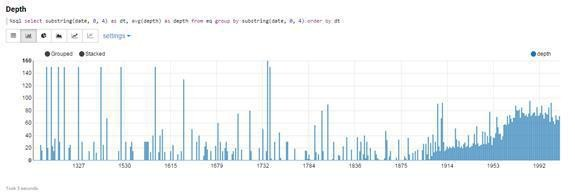

HIVE:

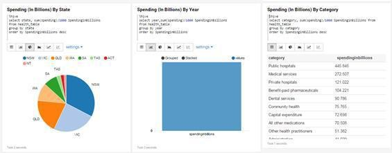

Python:

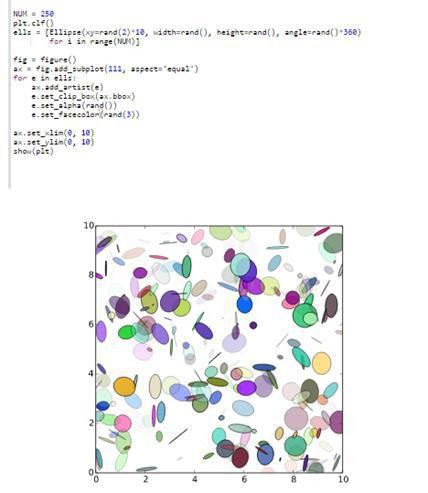

R:

.. figure::  ./images/Notebooks-R.jpg
 :align:   center

Cada Notebook se compone de párrafos, que pueden tener diferentes lenguajes, pudiendo ejecutar individualmente los párrafos y visualizando la salida de los mismos, así como el estado de la ejecución. 

Tanto los párrafos, como el notebook completo se pueden externalizar vía url, viendo en tiempo real en todos los casos, las ejecuciones de los notebooks o del párrafo en concreto.

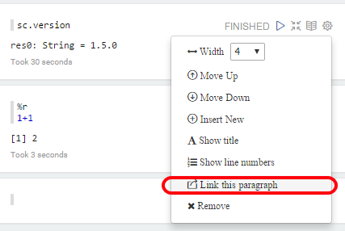

Otra característica importante es la posibilidad de **planificar la ejecución de los notebooks** mediante un expresión CRON, pudiendo ejecutar notebook repetidamente y sin pérdida de contexto, pudiendo seleccionar un intervalo de ejecución de los prediseñados o escribir uno personalizado.

Con todas estas características tenemos una **herramienta web colaborativa**, que es capaz de realizar análisis complejos la información gestionada por la plataforma IoT (tanto en tiempo real como histórica), **combinando diferentes lenguajes y generando vistas gráficas** (u otras acciones), que se pueden planificar para su ejecución periódica, refrescando automáticamente el resultado de la analítica que queda expuesto en una URL. 

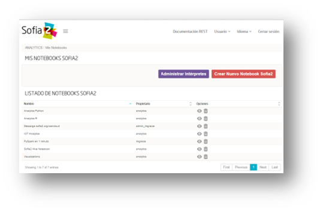

|
Sofia2 ML
---------
El modulo Machine Learning de la Plataforma permite aplicar y modelar de forma sencilla diversas técnicas de aprendizaje, entre las cuales podemos destacar las siguientes:

* **Regression**: Técnicas para estimar relaciones entre variables y determinar la importancia relativa de éstas en la predicción de nuevos valores.
* **Clustering**: Técnicas para segmentar los datos en grupos similares.
* **Classification**: Técnicas para identificar la pertenencia de un elemento a un grupo determinado.
* **Recommendation / Prediction**: Técnicas para predecir el valor o preferencia de una entidad nueva basado en históricos de preferencias o comportamientos.

A través del intérprete Sofia2 permite: 

* Almacenar los modelos creados en la plataforma. A partir de esto será posible gestionarlos desde la consola web, desde  la que también podremos invocarlos en base a parámetros y darles permisos.
* **Publicar** Scripts Sofia2Models  que disponen de métodos para recuperar el **modelo**, guardarlo, invocarlo, evaluar su calidad..
* Generar APIs REST que permitan evaluar sets de datos de entrada a través de los modelos generados. Esto facilita su invocación a través de mecanismos estándar que cuentan además con la seguridad integrada de la plataforma.
* Permite **definir flujos de trabajo visualmente**, de modo que únicamente sea necesario introducir los parámetros de configuración y datos de entrada para definir procesos analíticos.
* **Carga** de ficheros locales.
* **Parseo** de datos en diversos formatos (ARFF, XLS, XLSX, CSV, SVMLight).
* **Algoritmos**: K-means, Generalized Linear Model, Distributed RF, Naïve Bayes, Principal Component Analysis, Gradient Boosting Machine y Deep Learning.

|
Sofia2 DataLink
---------------
Actúa de interfaz con productos de analítica, ofreciendo  conectores estándar JDBC, ODBC y REST y una capa de abstracción que permite operar a través de SQL independientemente del origen de los datos. De esta manera, se facilita la integración tradicional a nivel de datos, con los repositorios BDTR y BDH indistintamente, pudiendo incluso realizar consultas en las que se combine información de ambos.

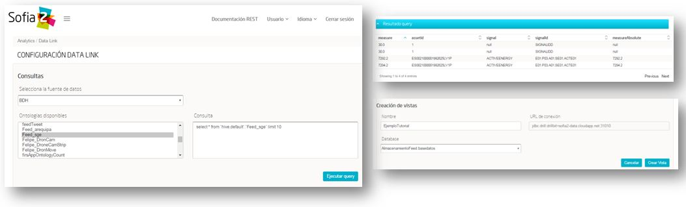

Por lo tanto, las **capacidades** que nos ofrece este módulos son las siguientes:

* Acceso **simultaneo** a múltiples fuentes de datos.
* Acceso a los datos a través de **SQL estándar**.
* Consultas sobre datos anidados en varios niveles.
* Creación de **vistas personalizadas**.
* **JOINS** entre repositorios.
* Baja latencia.

