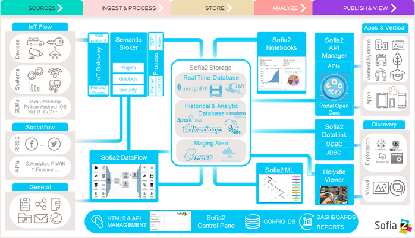

.. figure::  ./images/logo_sofia2_grande.png
 :align:   center
 
Arquitectura global
===================

Esta Vista describe la Plataforma desde el punto de Vista de los módulos funcionales que componen la Plataforma:

Módulos IoT
-----------
Éstos son los módulos necesarios para dar soporte a sistemas IoT:

* **SDKs**: La plataforma provee un set de herramientas para desarrolladores.

* **Sofia2 Control Panel**: La Plataforma ofrece una completa web de administración/configuración que permite gestionar todos los conceptos que maneja la Plataforma.

* **IoT Gateway**: capa de abstracción del protocolo de comunicación, que implementa el protocolo SSAP (Smart Space Access Protocol), sobre diferentes protocolos (MQTT, MQTTS, Websockets, WS, REST).

* **Semantic Broker**: módulo de la Plataforma que recibe, procesa y almacena toda la información de las aplicaciones, sensores y dispositivos conectados, actuando como Bus de Interoperabilidad.

* **Process**: módulo que incluye 2 motores para la definición de reglas a aplicar sobre la información que entra en la Plataforma: el motor de Reglas (Sofia2-Rules) y el motor CEP (Sofia2-CEP).

* **Sofia2 Storage**: módulo de almacenamiento de la información de la plataforma.

* **Sofia2 API Manager**: permite publicar la información gestionada por la plataforma como APIs REST y disponibilizar Servicios REST externos a la Plataforma.

* **Holystic Viewer**: módulo de visualización avanzada de la Plataforma, que soporta diferentes motores. Se trata de un sistema integral de visualización avanzada e interactiva que permite una gestión de información geolocalizada asociándola a un entorno de visualización tridimensional y multimedia. Sus capacidades de visualización avanzada resultan un plus de interés a la creación de cuadros interactivos.

Módulos Big Data
----------------
Estos módulos añaden capacidades avanzadas de procesamiento en tiempo real y de analítica Big Data sobre la plataforma:

* **Sofia2 DataFlow**: Módulo que permite definir un pipeline para la gestión de un flujo de datos desde el sistema de origen a los sistemas de destino, permitiendo definir de manera visual cómo transformar los datos a lo largo del camino. El diseño de este ETL sigue las siguiente reglas: un único modulo origen para representar el sistema de origen de la información, posibilidad de agregar múltiples procesadores intermedios para transformar los datos, y al menos un módulo de destino (pudiendo ser múltiples) para definir el grabado de la información. 

* **Sofia2 Notebooks**: Permite realizar, de manera muy sencilla e interactiva, analítica sobre datos de fuentes muy variadas, incluidas las fuentes de datos de Sofia2. Se pueden realizar cargas de archivos desde HDFS a spark, cargar de datos en tablas hive, lanzar consultas o realizar un proceso complejo de machine learning mediante las librerías de MLlib de Spark. Este módulo posee la capacidad de combinar código Scala, SparkSQL, Hive, R, Shell, o muchos otros con contenido html o directivas reactivas de angular, permitiendo interacciones en tiempo real con una potente interfaz y todo ello en un entorno compartido y multiusuario.

* **Sofia2 ML**: Permite aplicar y modelar visualmente, de forma sencilla, diversas técnicas de aprendizaje, entre las cuales podemos destacar las siguientes:
 * Regression: Técnicas para estimar relaciones entre variables y determinar la importancia relativa de éstas en la predicción de nuevos valores.
 * Clustering: Técnicas para segmentar los datos en grupos similares.
 * Classification: Técnicas para identificar la pertenencia de un elemento a un grupo determinado.
 * Recommendation / Prediction: Técnicas para predecir el valor o preferencia de una entidad nueva basado en históricos de preferencias o comportamientos.

* **Sofia2 DataLink**: Actúa de interfaz con productos de analítica, ofreciendo  conectores estándar JDBC, ODBC y REST y una capa de abstracción que permite operar a través de SQL independientemente del origen de los datos. De esta manera, se facilita la integración tradicional a nivel de datos, con los repositorios BDTR y BDH indistintamente, pudiendo incluso realizar consultas en las que se combine información de ambos.

