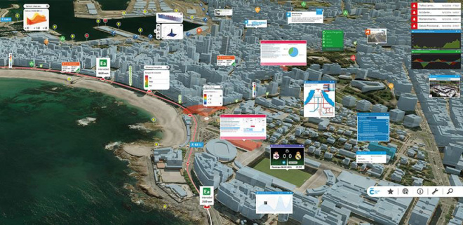
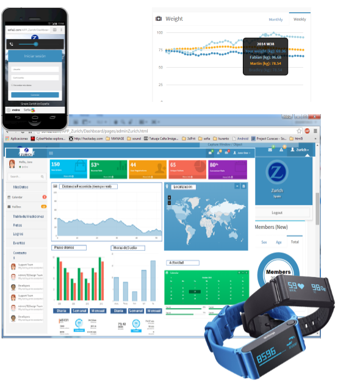
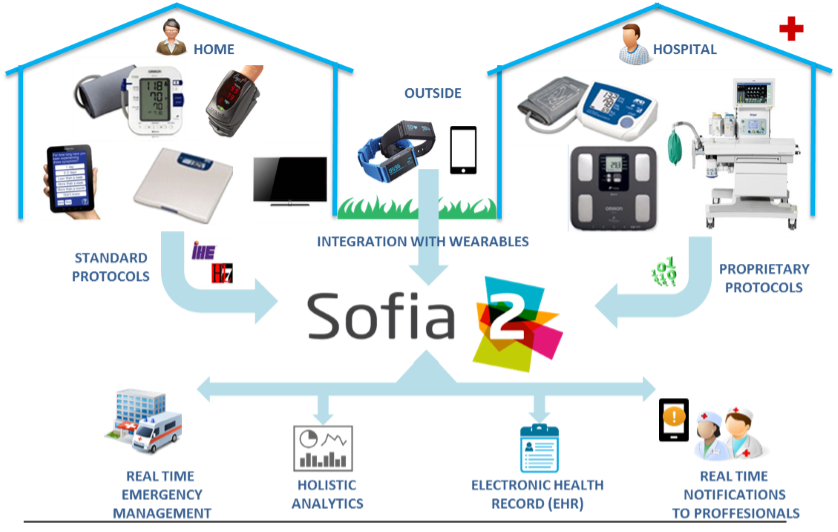

.. figure::  ./images/logo_sofia2_grande.png
 :align:   center
 
Casos de Uso
============

Smart Cities: Coruña Smart City
-------------------------------
Coruña Smart City es el proyecto de ciudad inteligente liderado por el Ayuntamiento de A Coruña y desarrollado en colaboración con Sofia2 (Minsait by Indra).

Coruña Smart City ofrece una nueva forma de acceder a la información de la ciudad.

Los ciudadanos pueden a través de canales electrónicos (ordenadores, teléfonos móviles), realizar tramitaciones administrativas o consultar informaciones útiles sobre la ciudad y sus servicios e intervenir en plataformas de participación.

Sofia2 es capaz de aportar beneficios en cuatro ámbitos principales: la gestión de la ciudad, la personalización de los servicios para el ciudadano, la sostenibilidad y competitividad de la ciudad y la disponibilidad de información centralizada en un único sistema de control.

|external-link| `Acceder al portal <https://smart.coruna.es/>`_

|ver-video| `Plataforma Smart Coruña en acción <https://www.youtube.com/watch?v=9G4ivBegc2E>`_

Smart Energy / Smart Home: ENDESA - PLATAFORMA MULTISERVICIOS ÍTACA.
--------------------------------------------------------------------

* **Sofia2 como Plataforma de adquisición de datos y control** de los dispositivos ubicados en el domicilio del cliente.

* Plataforma como core de  **eficiencia energética**.

* Comercialización por parte de ENDESA a **miles de hogares**. 

* Integración de **dispositivos de diversos fabricantes** como KPS Sofia2.

* **Generación de Alarmas** que puede crearse el propio usuario desde la aplicación móvil.

* **Visualización y control del consumo** por parte del cliente de forma online a través de móvil.

* **Programación de horarios** de uso de energía aprovechando tarifas valle.

* **Almacenamiento y tratamiento de elevados volúmenes de datos** (terabytes) provenientes de elevados números de dispositivos (≅ 100.000).

* Funcionalidades específicas para particulares, PYMEs y Grandes Empresas.

.. figure::  ./images/Endesa-smart-home.png
 :align:   center

Smart Energy para empresas: SGE ENDESA 
--------------------------------------
* **Sofia2 como Plataforma de adquisición de datos y control** de los dataloggers ubicados en grandes empresas.

* Integración de **dispositivos de diversos fabricantes** como Carlo Gavazzi, Satel, Circutor y Telecon que realizan mediciones de energías, potencias, caudales de agua, consumo de gas… 

* Comercialización por parte de ENDESA a grandes empresas como Carrefour, Banco Popular…

* **Generación de Alarmas** personalizadas con posibilidad de adaptarlas a la curva horaria de consumo.

* **Visualización y control del consumo**.

* **Programación de horarios** sobre los dispositivos.

* **Almacenamiento y tratamiento de elevados volúmenes de datos** con ejecución de algoritmos de recomendaciones.

* **Posibilidad de crear fórmulas** sobre las variables físicas en tiempo real por ejemplo para  conocer los ratios de producción frente al consumo de energía

Smart Health: ZURICH - APLICACIÓN WEARABLES A SEGUROS
-----------------------------------------------------

* **Adquisición de datos en tiempo reaL de la pulsera de actividad** (pasos diarios, calorías, tomas de tensión…) y alta de constantes en la web.

* **Cálculo online de indicadores: ranking usuario.**

* **Dashboard** para cliente y para usuario de negocio que ve información agregada.

* Agregación de información de diversas fuentes.

* Incorporación de **información de Redes Sociales**.

* **Aplicación móvil**.

* Dashboards personalizados por usuario y dashboards.

* **Almacenamiento y procesado de información masiva**, habilitando el análisis Big Data de la información.

Smart Health: SERVIZO GALEGO DE SAÚDE - HOGAR DIGITAL ASISTENCIAL (TELEASISTENCIA)
----------------------------------------------------------------------------------
El Proyecto de Hospitalización Experimental Hospital 2050, SISENS, desarrollado por Televés e Indra para el Servizo Galego de Saúde (SERGAS) consiste en un “concentrador inteligente”, desarrollado y fabricado por Televés, conectado de manera ininterrumpida a SOFIA2.

SOFIA2 actúa como una plataforma centralizadora que recoge y analiza en tiempo real toda la información proveniente de los dispositivos implantados en el hospital, independientemente de sus características o fabricantes:

* Captación de información desde diversos dispositivos: pulsiómetro,electrocardiograma,tensiómetro,termómetro, báscula, glucómetro, coaguiómetro,body composit,peak flow monitor, cardiovascular, strength,independent,medication monitor...

* Monitorización de constantes vitales en remoto,evitando desplazamientos de médicos y pacientes con enfermedades crónicas/ hospitalización domiciliaria.

* Canal bidireccional de comunicación con el paciente, con calendario, alarmas, recordatorios, buenas prácticas a través de dispositivos móviles y Smart TVs.

* Sofia2 como Plataforma de recepción de señales biométricas con reglas y alarmas en base a valores anómalos informando a médicos y/o pacientes de situaciones de riesgo.

* Almacenamiento y procesado de información masiva, habilitando el análisis Big Data de la información biométrica de los pacientes del Sergas en futuros estudios.

* Smart room en el hospital.

.. |ver-video| image:: ./images//youtube.png
   :target: <https://www.youtube.com/watch?v=9G4ivBegc2E>

