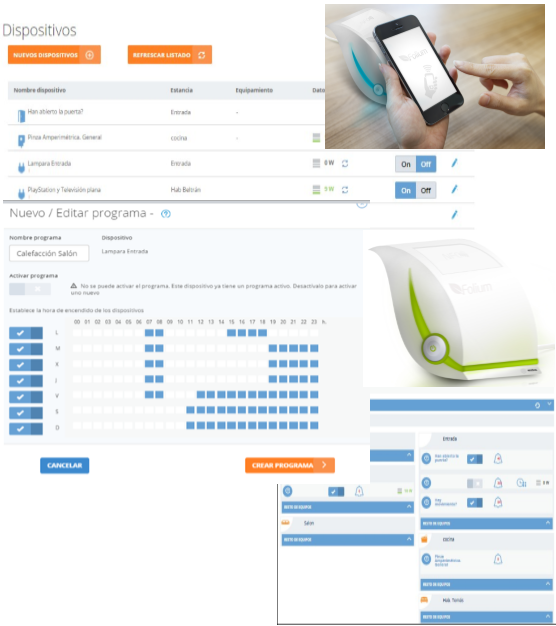

.. figure::  ./images/logo_sofia2_grande.png
 :align:   center
 
Casos de Uso
============

Smart Cities: Plataforma Smart Coruña
--------------------------------------

|ver-video| `Plataforma Smart Coruña en acción <https://www.youtube.com/watch?v=9G4ivBegc2E>`_

Smart Energy / Smart Home: ENDESA - PLATAFORMA MULTISERVICIOS ÍTACA.
--------------------------------------------------------------------

* **Sofia2 como Plataforma de adquisición de datos y control** de los dispositivos ubicados en el domicilio del cliente.

* Plataforma como core de  **eficiencia energética**.

* Comercialización por parte de ENDESA a **miles de hogares**. 

* Integración de **dispositivos de diversos fabricantes** como KPS Sofia2.

* **Generación de Alarmas** que puede crearse el propio usuario desde la aplicación móvil.

* **Visualización y control del consumo** por parte del cliente de forma online a través de móvil.

* **Programación de horarios** de uso de energía aprovechando tarifas valle.

* **Almacenamiento y tratamiento de elevados volúmenes de datos** (terabytes) provenientes de elevados números de dispositivos (≅ 100.000).

* Funcionalidades específicas para particulares, PYMEs y Grandes Empresas.

.. |ver-video| image:: ./images//youtube.png
   :target: <https://www.youtube.com/watch?v=9G4ivBegc2E>
