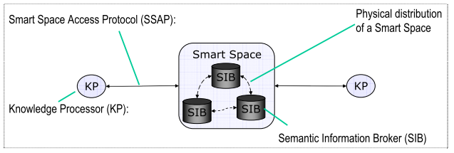

.. figure::  ./images/logo_sofia2_grande.png
 :align:   center
 

Conceptos de la Plataforma Sofia2
=================================

La Plataforma **Sofia2** se conceptualiza con estos 4 conceptos:

-  **Smart Space**

-  **SIB**

-  **KP**

-  **SSAP**

|image4|

Smart Space
-----------

-  Es el entorno virtual donde diferentes aplicaciones interoperan para ofrecer una funcionalidad compleja.

-  El núcleo de un Smart Space es el **SIB**.

-  En un Smart Space suele existir un único SIB (que puede ser un cluster), aunque en casos concretos pueden existir federaciones de SIBs.

-  Los Smart Spaces pueden comunicarse entre ellos estableciendo relaciones de confianza.

SIB (Semantic Information Broker) 
----------------------------------

-  Es el núcleo de la Plataforma.

-  Recibe, procesa y almacena toda la información de las aplicaciones conectadas la plataforma SOFIA, actuando de Bus de Interoperabilidad

-  En él se reflejan todos los conceptos existentes en el dominio (reflejados en las ontologías) y su estado actual (instancias particulares de ontologías).

-  En SOFIA\ :sup:`2` se propone el uso de JSON para el intercambio de información (SSAP) y para la definición de las ontologías.

    {"body":

    "{"query":"{SensorHumedad.medida:{$gt:18}}"}",

    "direction":"REQUEST",

    "ontology":"SensorHumedad",

    "messageType":"QUERY",

    "messageId":121,

    "sessionKey":"88bf5ee7-84d4-4956-98a3-ff290222fd64"

    }

-  Existen implementaciones en diversos lenguajes y plataformas. Indra suministra un SIB JEE que corre sobre cualquier Servidor Web JEE (Tomcat, JBoss,…)

-  Gateway soporta manejadores de transporte TCP/IP, HTTP, REST, Bluetooth y Zigbee

-  **Ofrecer conectores** para comunicación desde diversos clientes:

   -  REST: para clientes Javascript, smartphones,..

   -  MQTT para comunicaciones bidireccionales y dispositivos limitados

   -  Web Services/JMS para aplicaciones empresariales

   -  Otros como Bluetooth, Zigbee,..

-  SIB extensible a través de plugins.

KP (Knowledge Processor)
------------------------

-  Es cada una de las aplicaciones que interopera en el Smart Space a través del SIB.

-  Cada aplicación trabaja con instancias de los conceptos relevantes del dominio (ontología) para la que están diseñada

-  Implementaciones en diversos lenguajes como Java, Javascript, Arduino,…

-  Hay 3 tipos de KPs:

   -  **Producer**: KP que solo inserta información en el SIB.

   -  **Consumer**:KP que solo recupera información del SIB.

   -  **Prosumer**: KP que inserta y recupera información del SIB indistintamente

-  En SOFIA\ :sup:`2` se propone el envío de mensajes SSAP en JSON que son más ligeros y adecuados a dispositivos embebidos.

SSAP (Smart Space Access Protocol)
----------------------------------

-  Es el lenguaje de mensajería estándar para comunicar entre los SIBs y los KPs.

-  Lenguaje es independiente de la red subyacente (GPRS, 3G, WIFI, BlueTooth, HFC, Zigbee)

-  Existen dos implementaciones:

   -  **SSAP-XML**: formato XML (mayor ancho de banda)

   -  **SSAP-JSON**: mensajes adaptados a este protocolo, pensado para comunicaciones con dispositivos móviles, navegadores,…

-  Mensajes de 3 tipos:

   -  **REQUEST**: petición, enviada desde el KP al SIB

   -  **RESPONSE**: Respuesta, enviada desde el SIB al KP en respuesta a un mensaje de REQUEST.

   -  **INDICATION**: Notificación, enviada desde el SIB al KP ante un evento al que el KP está subscrito.

-  Las operaciones que se realizan entre el SIB y los KP son las siguientes

   -  **JOIN:** conexión de un KP a un SIB (implica autenticación, autorización y creación de sesión en el Smart Space)

   -  **LEAVE:** desconexión de un KP del SIB

   -  **INSERT/UPDATE/DELETE**: permite a los KPs la inserción/actualización/borrado de información realizada sobre el SIB

   -  **QUERY:** permite a los KPs recuperar información del SIB: Puede ir sobre la Base de Datos de Tiempo Real e Histórica.

   -  **SUBSCRIBE**: permite a los KPs suscribirse a la ejecución de una consulta cada X segundos o bien al desencadenado de un evento en el SIB

   -  **INDICATION**: resultado enviado por SIB a uno o varios KPs para resolver una suscripción

   -  **UNSUBSCRIBE**: Da de baja una suscripción realizada

   -  **CONFIG:** permite al KP solicitar la configuración asociada a su instancia.

   -  Notificar cambios desde el SIB a suscriptores

Ontologías
----------

Las **ontologías** son descripciones semánticas de un conjunto de clases, representan las entidades de mi sistema.

En Sofia2, estas ontologías están representadas en formato JSON-Schema, por ejemplo, una ontología que usa KP que representa a un sensor de temperatura sería la siguiente:

"SensorTemperatura": {|image5|

      "coordenadaGps": {|image6|

        "altitud": 0,

        "latitud": 40.512274,

        "longitud": -3.675679

      },

      "identificador": "S\_Temperatura\_00001",

      "medida": 19,

      "timestamp": 1373887443001,

      "unidad": "C"

    }

  },

Estas ontologías JSON se dan de alta en la plataforma y tienen un esquema JSON que le permite validar si la información semántica enviada por el KP cumple las reglas de forma de dicha ontología:

El esquema JSON que cumple la ontología SensorTemperatura indicada en el ejemplo anterior es el siguiente:

{

    "$schema": "`**http://json-schema.org/draft-03/schema#** <http://json-schema.org/draft-03/schema>`__",

    "title": "SensorTemperatura Schema",

    "type": "object",

    "properties": {

        "\_id": {

            "type": "object",

            "$ref": "#/identificador"

        },

        "SensorTemperatura": {

            "type": "string",

            "$ref": "#/datos"

        }

    },

    "identificador": {

        "title": "id",

        "description": "Id insertado del SensorTemperatura",

        "type": "object",

        "properties": {

            "$oid": {

                "type": "string",

                "required": false

            }

        }

    }, 

    "datos": {

        "title": "datos",

        "description": "Info SensorTemperatura",

        "type": "object",

        "properties": {

            "identificador": {

                "type": "string",

                "required": true

            },

            "timestamp": {

                "type": "integer",

                "minimum": 0,

                "required": true

            },

            "medida": {

                "type": "number",

                "required": true

            },

            "unidad": {

                "type": "string",

                "required": true

            },

            "coordenadaGps": {

                "required": true,

                "$ref": "#/gps"

            }

        }

    },         

        "gps": {

            "title": "gps",

            "description": "Gps SensorTemperatura",

            "type": "object",

            "properties": {

                "altitud": {

                    "type": "number",

                    "required": false

                },

                "latitud": {

                    "type": "number",

                    "required": true

                },

                "longitud": {

                    "type": "number",

                    "required": true

                }

            }

        },

        "additionalItems": false

    }

Cuando una ontología es guardada en la BDTR, la plataforma le añade meta información relativa al contexto de uso de dicha ontología, esta información la vemos marcada en amarillo en el siguiente ejemplo

{|image7|

    "\_id": {|image8|

      "$oid": "51e3dbd465701fd8e0f69828"

    },

    "contextData": {|image9|

      "session\_key": "08bf50c8-6ea6-41dc-99ac-5d12a6f517a3",

      "user\_id": 1,

      "kp\_id": 9,

      "kp\_identificador": "gatewaysensores",

      "timestamp": "1373887444356"

    },

    "SensorTemperatura": {|image10|

      "coordenadaGps": {|image11|

        "altitud": 0,

        "latitud": 40.512274,

        "longitud": -3.675679

      },

      "identificador": "S\_Temperatura\_00001",

      "medida": 19,

      "timestamp": 1373887443001,

      "unidad": "C"

    }

  },

Como vemos en el contextData aparece la clave de sesión que ha establecido el KP con SIB, el identificador del usuario que usa el KP, el identificador del KP, el identificador de la instancia del KP conectada y una marca de tiempo en la que se insertó la información.

.. |image0| image:: ./media/basico/image2.png
   :width: 2.15417in
   :height: 0.98472in
.. |image1| image:: ./media/basico/image3.png
   :width: 1.40764in
   :height: 0.45556in
.. |image2| image:: ./media/basico/image6.png
   :width: 3.78472in
   :height: 1.13819in
.. |image3| image:: ./media/basico/image2.png
   :width: 2.09236in
   :height: 0.96944in

