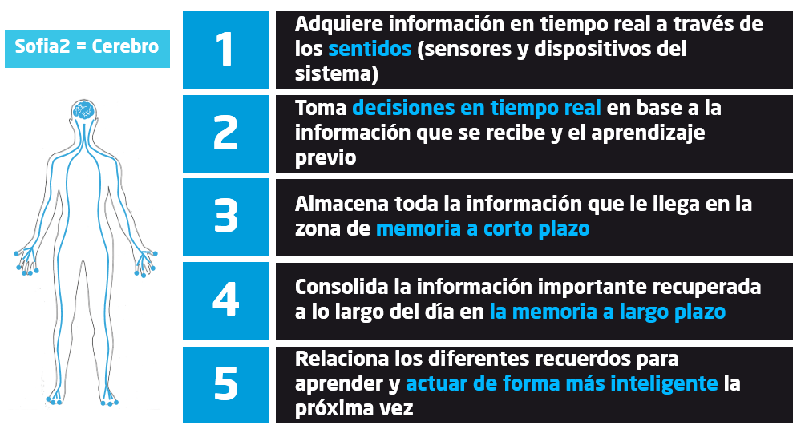

.. figure::  ./images/logo_sofia2_grande.png
 :align:   center
 
Qué es Sofia2
=============

Es una **Plataforma IoT & Big Data** pensada para facilitar y acelerar la construcción de nuevos sistemas y soluciones digitales y así lograr la transformación y disrupción de los negocios.

Permite poner información real a disposición de aplicaciones inteligentes (**Internet of Things**).

Su propósito es lograr la interoperabilidad entre diferentes aplicaciones que comparten **conceptos semánticos.**.

Sofia2 (FEEP Enablement IoT Platform) forma parte de la Plataforma `FEEP Enablement Platform de Indra/Minsait <http://www.minsait.com/es/what-we-do/feep-enablement-platform>`_

|cerebro|

|ver-video| `Sofia2 como Smart Platform. <https://www.youtube.com/watch?v=BWZPfR0EfmY>`_

.. |ver-video| image:: ./images/youtube.png
   :target: https://www.youtube.com/watch?v=BWZPfR0EfmY

