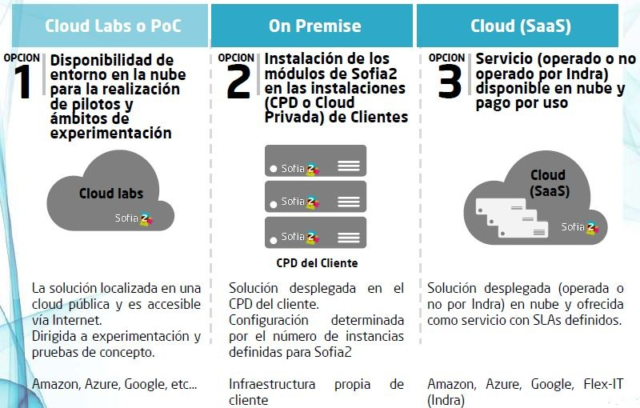

.. figure::  ./images/logo_sofia2_grande.png
 :align:   center
 
Despliegue
==========

La plataforma está preparada para su despliegue según la conveniencia del proyecto o cliente, soportando: 

El número de nodos o VMs necesarias para desplegar la Plataforma depende del número de módulos que se usarán de la Plataforma y el uso que se les dará a estos. 

Por ejemplo si la Plataforma va a soportar un gran volumen de dispositivos es importante que el IoT Gateway+Semantic Broker estén preparados para soportar esta carga, mientras que si la carga analítica de la plataforma es alta es importante dimensionar bien los módulos que soportan esto. 

