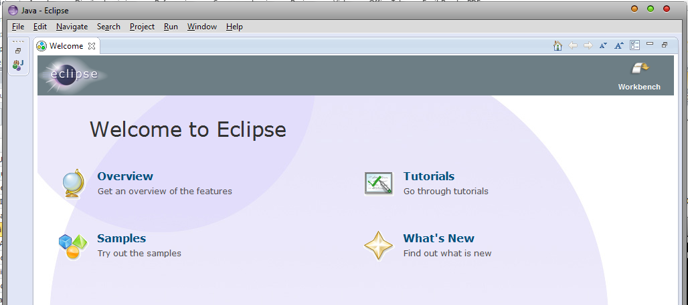
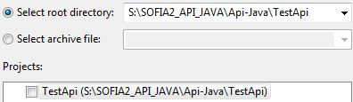
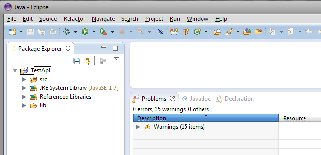
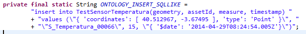
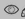

.. figure::  ./../../images/logo_sofia2_grande.png
 :align:   center

DATA MODEL FIWARE/GSMA EN SOFIA2
================================

Introducción
------------

La asociación GSMA (asociación de operadores móviles) está trabajando en un `IoT Big Data Harmonised Data Model <http://www.gsma.com/connectedliving/wp-content/uploads/2016/11/CLP.26-v1.0.pdf>`__,

|image2|

que define estas entidades:

+-----------------------+-----------------------+-----------------------+------------------------+
| AgriCrop              | AirQualityObserved    | MachineModel          | VehicleType            |
+-----------------------+-----------------------+-----------------------+------------------------+
| AgriGreenHouse        | Building              | MachineOperation      | WaterQualityObserved   |
+-----------------------+-----------------------+-----------------------+------------------------+
| AgriParcel            | BuildingOperation     | PointOfInterest       | WeatherForecast        |
+-----------------------+-----------------------+-----------------------+------------------------+
| AgriParcelOperation   | BuildingType          | Road                  | WeatherObserved        |
+-----------------------+-----------------------+-----------------------+------------------------+
| AgriParcelRecord      | Device                | RoadSegment           |                        |
+-----------------------+-----------------------+-----------------------+------------------------+
| AgriPest              | DeviceModel           | Subscriber            |                        |
+-----------------------+-----------------------+-----------------------+------------------------+
| AgriProduct           | DeviceOperation       | SubscriptionService   |                        |
+-----------------------+-----------------------+-----------------------+------------------------+
| AgriProductType       | EnvironmentObserved   | Vehicle               |                        |
+-----------------------+-----------------------+-----------------------+------------------------+
| AgriSoil              | Machine               | VehicleFault          |                        |
+-----------------------+-----------------------+-----------------------+------------------------+

Por otro lado en la iniciativa FIWARE se han inspirado en el Data Model GSMA para crear los \ `FIWARE Data Models <https://www.fiware.org/data-models>`__, donde además se han seleccionado un conjunto de Entidades sobre estas de GSMA:

-  **Alarms**. Events related to risk or warning conditions which require action taking.

-  **Parks & Gardens**. Data models intended to make an efficient, effective and sustainable management of green areas.

-  **Environment**. Enable to monitor air quality and other environmental conditions for a healthier living.

-  **Point of Interest**. Specific point locations that someone may find useful or interesting. For instance, weather stations, touristic landmarks, etc.

-  **Civic Issue tracking**. Data models for civic issue tracking interoperable with the de-facto standard Open311.

-  **Street Lighting**. Modeling street lights and all their controlling equipment towards energy-efficient and effective urban illuminance.

-  **Device**. IoT devices (sensors, actuators, wearables, etc.) with their characteristics and dynamic status.

-  **Transportation**. Transportation data models for smart mobility and efficient management of municipal services.

-  **Indicators**. Key performance indicators intended to measure the success of an organization or of a particular activity in which it engages.

-  **Waste** **Management**. Enable efficient, recycling friendly, municipal or industrial waste management using containers, litters, etc.

-  **Parking**. Real time and static parking data (on street and off street) interoperable with the EU standard DATEX II.

-  **Weather**. Weather observed, weather forecasted or warnings about potential extreme weather conditions.

Entidades Sofia2
----------------

La Plataforma sofia2 gestiona dos tipos de entidades:

-  **Assets**. Un asset es todo elemento (físico o virtual) capaz de generar o consumir información de carácter sensorial y gestionarla a través de la Plataforma SOFIA2

-  **Ontologías**. Los assets generan información y dicha información se modela por medio de ontologías (JSON) en la Plataforma.

(Recomendamos al respecto leer el \ `documento Gobierno de Ontologías <http://sofia2.com/docs/SOFIA2-Gobierno%20Ontologias.pdf>`__ o el \ `conjunto de posts al respecto <https://about.sofia2.com/?s=gobierno%20de%20ontolog%C3%ADas>`__).

Los Data Models GSMA y FIWARE se definen en JSON por lo que \ **su representación como Ontología Sofia2 es inmediata**. Para ello, haremos uso de las plantillas predefinidas que soportan los anteriores modelos.

Plantillas (Modelo GSMA/FIWARE)
-------------------------------

En Sofia2 se soportan las entidades GSMA vía Plantillas (una plantilla sirve para crear ontologías partiendo de una definición):

|image3|

Esquemas JSON (JSON-SChema)
^^^^^^^^^^^^^^^^^^^^^^^^^^^

Para la definición de Plantillas se utiliza una simplificación del estándar de datos AMON (`http://amee.github.io/AMON/ <http://amee.github.io/AMON/>`__ ). Estas, se basan en el formato JSON-Schema, el cual ofrece un contrato para definir los datos requeridos para una aplicación dada y la forma de interactuar con él. Los tipos de datos que encontraremos en un JSON-Schema son:

-  string : Cadena de texto

-  number: Numérico

-  object: Objeto

-  char: Caracteres Unicode válidos

-  array: Colección de valore

-  null: Nulo

-  boolean: Valores true o false

Para hacernos una idea veamos un ejemplo de un esquema JSON sencillo:

|image4|

Que validaría como válidos JSONs como este:

|image5|

Y como inválido este por no tener el atributo price:

|image6|

Atributos de un esquema JSON
~~~~~~~~~~~~~~~~~~~~~~~~~~~~

Podemos ver la referencia completa de la especificación JSON aquí: `http://json-schema.org/latest/json-schema-core.html <http://json-schema.org/latest/json-schema-core.html>`__

|image7|

Los atributos más utilizados en un esquema JSON son:

-  **“$schema”**: Nos permite indicar la versión del Schema JSON que queremos usar: 0.4 o 0.3, SOFIA2 se apoya en la versión 0.4 (`http://json-schema.org/draft-04/schema# <http://json-schema.org/draft-04/schema>`__)

-  **“title”**: indicar un título con el que identificar el esquema.

-  **“description”**: Se puede utilizar este atributo para incluir una descripción de lo que va a representar el esquema JSON.

-  **“type”**: Para indicar el tipo que va a representar el esquema.

-  **“properties”**: Este atributo es un objeto con las definiciones de propiedades que definen los valores estáticos de una instancia de objeto. Es una lista no ordenada de propiedades. Los nombres de las propiedades se deben cumplir y el valor de las propiedades se definen a partir de un esquema, que debe cumplirse también.

-  **“patternProperties”**: Este atributo es un objeto con las definiciones de propiedades que definen los valores de una instancia de objeto. Es una lista desordenada de propiedades. Los nombres de las propiedades son patrones de expresiones regulares, las instancias de las propiedades deben cumplir con el patrón definido y el valor de la propiedad con el esquema que define esa propiedad.

-  **“additionalProperties”**: Permite indicar si la instancia JSON puede contener propiedades que no hayan sido definidas en el esquema. Tiene dos posibles valores (true o false), para indicar si se admite cualquier propiedad o no. Si no se añade la propiedad, se podrá incluir cualquier otra propiedad.

-  **“required”**: Permite indicar todas las propiedades que son obligatorias para una instancia JSON y que como mínimo debe incluir. Las propiedades se incluirán entre corchetes y separadas por el carácter “,”.

    (Este propiedad es obligatoria incluirla en el esquema).

-  **“$ref”**: Define una URI de un esquema que contienen la completa representación para esa propiedad.

Para ampliar la información sobre cómo funcionan los JSON-Schema podemos consultar el documento `Modelado de Ontologías <http://sofia2.com/docs/SOFIA2-Definicion%20de%20Ontologias%20en%20SOFIA2.pdf>`__

Veamos a continuación el esquema que siguen algunas de las plantillas existentes en Sofia2 que soportan el modelo GSMA:

GSMA-Air Quality Observed
^^^^^^^^^^^^^^^^^^^^^^^^^

Con esta plantilla caracterizaremos la observación de las condiciones de calidad del aire en un determinado lugar y tiempo.

El JSON-Schema que seguiremos para definir el modelo de datos es el siguiente:

{

"$schema": "http://json-schema.org/draft-04/schema#",

"title": "Air Quality Observed",

"type": "object",

"required": [

"id",

"type",

"address",

"dateObserved",

"location",

"source",

"precipitation",

"relativeHumidity",

"temperature",

"windDirection",

"windSpeed",

"measurand",

"CO",

"NO",

"NO2",

"NOx",

"SO2",

"refPointOfInterest"

],

"properties": {

"id": {

"type": "string"

},

"type": {

"type": "string"

},

"address": {

"type": "object",

"properties": {

"addressCountry": {

"type": "string"

},

"addressLocality": {

"type": "string"

},

"streetAddress": {

"type": "string"

}

},

"required": [

"addressCountry",

"addressLocality",

"streetAddress"

]

},

"dateObserved": {

"type": "string"

},

"location": {

"type": "object",

"properties": {

"type": {

"type": "string"

},

"coordinates": {

"type": "array",

"items": {

"type": "number"

}

}

},

"required": [

"type",

"coordinates"

]

},

"source": {

"type": "string"

},

"precipitation": {

"type": "integer"

},

"relativeHumidity": {

"type": "number"

},

"temperature": {

"type": "number"

},

"windDirection": {

"type": "integer"

},

"windSpeed": {

"type": "number"

},

"measurand": {

"type": "array",

"items": {

"type": "string"

}

},

"CO": {

"type": "integer"

},

"NO": {

"type": "integer"

},

"NO2": {

"type": "integer"

},

"NOx": {

"type": "integer"

},

"SO2": {

"type": "integer"

},

"refPointOfInterest": {

"type": "string"

}

}

}

**Ejemplo de Uso:**

|image8|

`Ver en FIWARE-DATAMODELS <http://fiware-datamodels.readthedocs.io/en/latest/Environment/AirQualityObserved/doc/spec/index.html>`__

GSMA-Air Quality Station
^^^^^^^^^^^^^^^^^^^^^^^^

Con esta plantilla caracterizaremos un punto de interés: Una Estación de Calidad del Aire.

El JSON-Schema que seguiremos para definir el modelo de datos es el siguiente:

{

"$schema": "http://json-schema.org/draft-04/schema#",

"title": "Air Quality Station",

"type": "object",

"properties": {

"address": {

"type": "object",

"properties": {

"addressCountry": {

"type": "string"

},

"addressLocality": {

"type": "string"

},

"streetAddress": {

"type": "string"

}

},

"required": [

"addressCountry",

"addressLocality",

"streetAddress"

]

},

"category": {

"type": "string"

},

"location": {

"type": "object",

"properties": {

"type": {

"type": "string"

},

"coordinates": {

"type": "array",

"items": {

"type": "number"

}

}

},

"required": [

"type",

"coordinates"

]

},

"name": {

"type": "string"

},

"source": {

"type": "string"

},

"type": {

"type": "string"

},

"id": {

"type": "string"

}

},

"required": [

"address",

"category",

"location",

"name",

"source",

"type",

"id"

]

}

**Ejemplo de Uso:**

|image9|

`Ver en FIWARE-DATAMODELS <http://fiware-datamodels.readthedocs.io/en/latest/PointOfInterest/AirQualityStation/doc/spec/index.html>`__

GSMA-Device
^^^^^^^^^^^

Con esta plantilla caracterizaremos un Device (Dispositivo). Una Estación de Calidad del Aire. Un dispositivo es un objeto tangible que contiene alguna lógica y es productor y/o consumidor de datos. Siempre se supone que un dispositivo es capaz de comunicarse electrónicamente a través de una red.

El JSON-Schema que seguiremos para definir el modelo de datos es el siguiente:

{

"$schema": "http://json-schema.org/draft-04/schema#",

"title": "Device",

"type": "object",

"properties": {

"id": {

"type": "string"

},

"type": {

"type": "string"

},

"category": {

"type": "array",

"items": {

"type": "string"

}

},

"controlledProperty": {

"type": "array",

"items": {

"type": "string"

}

},

"controlledAsset": {

"type": "array",

"items": {

"type": "string"

}

},

"ipAddress": {

"type": "string"

},

"mcc": {

"type": "string"

},

"mnc": {

"type": "string"

},

"batteryLevel": {

"type": "number"

},

"serialNumer": {

"type": "string"

},

"refDeviceModel": {

"type": "string"

},

"value": {

"type": "string"

},

"deviceState": {

"type": "string"

},

"dateFirstUsed": {

"type": "string"

}

},

"required": [

"id",

"type",

"category",

"controlledProperty",

"controlledAsset",

"ipAddress",

"mcc",

"mnc",

"batteryLevel",

"serialNumer",

"refDeviceModel",

"value",

"deviceState",

"dateFirstUsed"

]

}

**Ejemplo de Uso:**

|image10|

`Ver en FIWARE-DATAMODELS <http://fiware-datamodels.readthedocs.io/en/latest/Device/Device/doc/spec/index.html>`__

GSMA-Key Performance Indicator
^^^^^^^^^^^^^^^^^^^^^^^^^^^^^^

Con esta plantilla caracterizaremos un Key Performance Indicator (KPI), o lo que es lo mismo, un Indicador Clave de Rendimiento, un tipo de medición del desempeño. Los KPIs evalúan el éxito de una organización o de una actividad particular en la que se involucra.

El JSON-Schema que seguiremos para definir el modelo de datos es el siguiente:

{

"$schema": "http://json-schema.org/draft-04/schema#",

"title": "Key Performance Indicator",

"type": "object",

"properties": {

"id": {

"type": "string"

},

"type": {

"type": "string"

},

"name": {

"type": "string"

},

"description": {

"type": "string"

},

"category": {

"type": "array",

"items": {

"type": "string"

}

},

"organization": {

"type": "object",

"properties": {

"name": {

"type": "string"

}

},

"required": [

"name"

]

},

"provider": {

"type": "object",

"properties": {

"name": {

"type": "string"

}

},

"required": [

"name"

]

},

"kpiValue": {

"type": "integer"

},

"currentStanding": {

"type": "string"

},

"calculationPeriod": {

"type": "object",

"properties": {

"from": {

"type": "string"

},

"to": {

"type": "string"

}

},

"required": [

"from",

"to"

]

},

"calculationMethod": {

"type": "string"

},

"calculationFrequency": {

"type": "string"

},

"dateModified": {

"type": "string"

},

"dateNextCalculation": {

"type": "string"

},

"address": {

"type": "object",

"properties": {

"addressLocality": {

"type": "string"

},

"addressCountry": {

"type": "string"

}

},

"required": [

"addressLocality",

"addressCountry"

]

}

},

"required": [

"id",

"type",

"name",

"description",

"category",

"organization",

"provider",

"kpiValue",

"currentStanding",

"calculationPeriod",

"calculationMethod",

"calculationFrequency",

"dateModified",

"dateNextCalculation",

"address"

]

}

**Ejemplo de Uso:**

|image11|

`Ver en FIWARE-DATAMODELS <http://fiware-datamodels.readthedocs.io/en/latest/KeyPerformanceIndicator/doc/spec/index.html>`__

GSMA-Parking Access
^^^^^^^^^^^^^^^^^^^

Con esta plantilla caracterizaremos un punto de acceso a un parking, normalmente un parking fuera de la calle.

El JSON-Schema que seguiremos para definir el modelo de datos es el siguiente:

{

"$schema": "http://json-schema.org/draft-04/schema#",

"title": "Parking Access",

"type": "object",

"properties": {

"id": {

"type": "string"

},

"type": {

"type": "string"

},

"name": {

"type": "string"

},

"location": {

"type": "object",

"properties": {

"coordinates": {

"type": "array",

"items": {

"type": "number"

}

},

"type": {

"type": "string"

}

},

"required": [

"coordinates",

"type"

]

},

"category": {

"type": "array",

"items": {

"type": "string"

}

},

"refOffStreetParking": {

"type": "string"

},

"features": {

"type": "array",

"items": {

"type": "string"

}

}

},

"required": [

"id",

"type",

"name",

"location",

"category",

"refOffStreetParking",

"features"

]

}

**Ejemplo de Uso:**

|image12|

`Ver en FIWARE-DATAMODELS <http://fiware-datamodels.readthedocs.io/en/latest/Parking/ParkingAccess/doc/spec/index.html>`__

GSMA-Streetlight
^^^^^^^^^^^^^^^^

Con esta plantilla caracterizaremos un punto de iluminación urbano.

El JSON-Schema que seguiremos para definir el modelo de datos es el siguiente:

{

"$schema": "http://json-schema.org/draft-04/schema#",

"title": "Streetlight",

"type": "object",

"properties": {

"id": {

"type": "string"

},

"type": {

"type": "string"

},

"location": {

"type": "object",

"properties": {

"type": {

"type": "string"

},

"coordinates": {

"type": "array",

"items": {

"type": "number"

}

}

},

"required": [

"type",

"coordinates"

]

},

"areaServed": {

"type": "string"

},

"status": {

"type": "string"

},

"refStreetlightGroup": {

"type": "string"

},

"refStreetlightModel": {

"type": "string"

},

"circuit": {

"type": "string"

},

"lanternHeight": {

"type": "integer"

},

"locationCategory": {

"type": "string"

},

"powerState": {

"type": "string"

},

"controllingMethod": {

"type": "string"

},

"dateLastLampChange": {

"type": "string"

}

},

"required": [

"id",

"type",

"location",

"areaServed",

"status",

"refStreetlightGroup",

"refStreetlightModel",

"circuit",

"lanternHeight",

"locationCategory",

"powerState",

"controllingMethod",

"dateLastLampChange"

]

}

**Ejemplo de Uso:**

|image13|

`Ver en FIWARE-DATAMODELS <http://fiware-datamodels.readthedocs.io/en/latest/StreetLighting/Streetlight/doc/spec/index.html>`__

GSMA-Weather Observed
^^^^^^^^^^^^^^^^^^^^^

Con esta plantilla caracterizaremos la observación de las condiciones climáticas en un lugar y tiempo determinados.

El JSON-Schema que seguiremos para definir el modelo de datos es el siguiente:

{

"$schema": "http://json-schema.org/draft-04/schema#",

"title": "Weather Observed",

"type": "object",

"properties": {

"id": {

"type": "string"

},

"type": {

"type": "string"

},

"address": {

"type": "object",

"properties": {

"addressLocality": {

"type": "string"

},

"addressCountry": {

"type": "string"

}

},

"required": [

"addressLocality",

"addressCountry"

]

},

"atmosfericPressure": {

"type": "number"

},

"dataProvider": {

"type": "string"

},

"dateObserved": {

"type": "string"

},

"location": {

"type": "object",

"properties": {

"type": {

"type": "string"

},

"coordinates": {

"type": "array",

"items": {

"type": "number"

}

}

},

"required": [

"type",

"coordinates"

]

},

"precipitation": {

"type": "integer"

},

"pressureTendency": {

"type": "number"

},

"relativeHumidity": {

"type": "integer"

},

"source": {

"type": "string"

},

"stationCode": {

"type": "string"

},

"stationName": {

"type": "string"

},

"temperature": {

"type": "number"

},

"windDirection": {

"type": "integer"

},

"windSpeed": {

"type": "integer"

}

},

"required": [

"id",

"type",

"address",

"atmosfericPressure",

"dataProvider",

"dateObserved",

"location",

"precipitation",

"pressureTendency",

"relativeHumidity",

"source",

"stationCode",

"stationName",

"temperature",

"windDirection",

"windSpeed"

]

}

**Ejemplo de Uso:**

|image14|

`Ver en FIWARE-DATAMODELS <http://fiware-datamodels.readthedocs.io/en/latest/Weather/WeatherObserved/doc/spec/index.html>`__

GSMA-Weather Station
^^^^^^^^^^^^^^^^^^^^

Con esta plantilla caracterizaremos el punto de interés: Estación meteorológica.

El JSON-Schema que seguiremos para definir el modelo de datos es el siguiente:

{

"$schema": "http://json-schema.org/draft-04/schema#",

"title": "Weather Station",

"type": "object",

"properties": {

"category": {

"type": "string"

},

"location": {

"type": "object",

"properties": {

"type": {

"type": "string"

},

"coordinates": {

"type": "array",

"items": {

"type": "number"

}

}

},

"required": [

"type",

"coordinates"

]

},

"name": {

"type": "string"

},

"postalAddress": {

"type": "object",

"properties": {

"addressCountry": {

"type": "string"

},

"addressLocality": {

"type": "string"

},

"addressRegion": {

"type": "string"

}

},

"required": [

"addressCountry",

"addressLocality",

"addressRegion"

]

},

"source": {

"type": "string"

},

"type": {

"type": "string"

},

"id": {

"type": "string"

}

},

"required": [

"category",

"location",

"name",

"postalAddress",

"source",

"type",

"id"

]

}

**Ejemplo de Uso:**

|image15|

`Ver en FIWARE-DATAMODELS <http://fiware-datamodels.readthedocs.io/en/latest/PointOfInterest/WeatherStation/doc/spec/index.html>`__

HANDS ON
--------

5.1. CREACIÓN DE ONTOLOGÍAS (MODELO GSMA/FIWARE)
^^^^^^^^^^^^^^^^^^^^^^^^^^^^^^^^^^^^^^^^^^^^^^^^

A continuación veremos cómo Sofia2 permite trabajar con estas entidades. Pongamos el ejemplo de la entidad \ **WeatherObserved **\ :

`Su aspecto es este: <http://fiware-datamodels.readthedocs.io/en/latest/Weather/WeatherObserved/doc/spec/index.html>`__

|image16|

1. Comenzaremos por acceder al Panel de Control de Sofia2. Para ello podremos crear un usuario o acceder desde \ `aquí <https://sofia2.com/console/login>`__.

|image17|

Una vez hecho el LOGIN, si nuestro rol es USUARIO,

|image18|

deberé solicitar el 

|image42|

para poder crear Ontologías.

2. Una vez mi usuario tiene rol COLABORADOR podré crear la Ontología que representa la Entidad WeatherObserved.

En el menú \ **Ontologías>Crear Ontología>crear Ontología mediante JSON**

|image19|

Selecciono un nombre como \ **GSMA\_WeatherObserved\_Ontology**

|image20|

Voy a la sección de Esquema, selecciono la categoría GSMA:

|image21|

y selecciono como Plantilla:

|image22|

Finalmente selecciono \ **Crear**

Con esto ya tengo creada mi Ontología conforme el Modelo Data Model GSMA.

**3. **\ Lo siguiente que haré será cargar unos datos para poder hacer consultas.

Puedo hacer esto desde el simulador de datos para simular instancias de la ontología, pero también puedo acceder a la gestión CRUD para crear datos desde un formulario. Desde \ **Ontologías>Gestión CRUD de Instancias:**

Selecciono \ |image23| en la tabla:

|image24|

Si me fijo en el ejemplo que ponía antes: \ `WeatherObserved <http://fiware-datamodels.readthedocs.io/en/latest/Weather/WeatherObserved/doc/spec/index.html>`__

{

"id": "Spain-WeatherObserved-2422-2016-11-30T08:00:00",

"type": "WeatherObserved",

"address": { "addressLocality": "Valladolid", "addressCountry": "ES" },

"atmosfericPressure": 938.9,

"dataProvider": "TEF",

"dateObserved": "2016-11-30T07:00:00.00Z",

"location": { "type": "Point", "coordinates": [ -4.754444444, 41.640833333 ] },

"precipitation": 0,

"pressureTendency": 0.5,

"relativeHumidity": 1,

"source": "http://www.aemet.es",

"stationCode": "2422",

"stationName": "Valladolid",

"temperature": 3.3,

"windDirection": -45,

"windSpeed": 2

}

Y lo voy copiando en el formulario:

|image25|

Sigo:

|image26|

**…**

Al final del formulario puedo ver lo que se va a guardar:

|image27|

Y finalmente seleccionaré  |image28|

Si voy al comienzo de la pantalla veré que ya se ha insertado:

|image29|

5.2. CONSULTA DE LOS DATOS DE LA ONTOLOGÍA CREADA (MODELO GSMA/FIWARE)
^^^^^^^^^^^^^^^^^^^^^^^^^^^^^^^^^^^^^^^^^^^^^^^^^^^^^^^^^^^^^^^^^^^^^^

Una vez cargado este dato ya podré consultarlo desde los mecanismos de Sofia2:

A través de los conectores, publicarlo como API, en el Visor Open Data… Veamos:

Voy a \ **Herramientas>Consola BDTR y BDH.**

Selecciono mi Ontología y Generar Query (o la pongo: \ **select \* from GSMA\_WeatherObserved\_Ontology limit 3**)

|image30|

Que me devuelve los datos de la instancia insertada (además de los datos de Contexto como usuario, KP, momento de inserción), en este caso podemos ver los datos introducidos:

|image31|

Esta información ya es accesible a través del SIB de Sofia2, a través de cualquiera de las APIs que ofrece.

5.3. PUBLICAR ONTOLOGÍA COMO API RESTFUL
^^^^^^^^^^^^^^^^^^^^^^^^^^^^^^^^^^^^^^^^

También puedo publicar esta Ontología como un API RESTFul para acceder a ella en una url de tipo:

`http://sofia2.com/sib-api/api/v1/gsma\_weatherobserved\_ontologyes <http://sofia2.com/sib-api/api/v1/gsma_weatherobserved_ontologyes>`__

Para eso iré a \ **API Manager>APIs> Crear API:**

|image32|

Habilitaré los métodos:

GET:

|image33|

POST para INSERT, PUT para UPDATE y CUSTOM QUERY

En la CUSTOM QUERY quiero poder sacar los datos para una estación, por tanto la consulta es como esta:

**select \* from GSMA\_WeatherObserved\_Ontology where stationName=’Valladolid’**

En el UI debe registrarse así:

|image34|

Es decir, el parámetro debe ir entre { } y con un $delante:

**select \* from GSMA\_WeatherObserved\_Ontology where stationName={$stationName}**

Tras esto, puedo probar mi API desde la opción \ **Mis suscripciones>Test&Doc**

|image35|

(antes debo extraer la API Key desde \ **Mi API Key)**

|image36|

En la ventana de invocación en la parte de Headers pondré mi API Key:

|image37|

Luego seleccionaré

|image38|

Y en Query Parameters pondré Valladolid

|image39|

Al invocarlo veo esto:

|image40|

Esta misma invocación se puede realizar vía curl con una invocación de este estilo (escapamos el $por %24):

curl -v –H "-X-SOFIA2-APIKey:<my\_token>" "`**http://sofia2.com/sib-api/api/v1/gsma\_weatherobserved\_ontologyes/getByStationName?%24stationName=Valladolid** <http://sofia2.com/sib-api/api/v1/gsma_weatherobserved_ontologyes/getByStationName?%24stationName=Valladolid>`__"

|image41|

.. |image0| image:: ./media/image1.png
   :width: 2.15625in
   :height: 0.98958in
.. |image1| image:: ./media/image2.png
   :width: 1.40764in
   :height: 0.45556in
.. |image2| image:: ./media/image5.jpeg
   :width: 3.27083in
   :height: 2.42783in
.. |image3| image:: ./media/image6.png
   :width: 6.88125in
   :height: 1.07014in
.. |image4| image:: ./media/image7.png
   :width: 6.89059in
   :height: 3.20870in
.. |image5| image:: ./media/image8.png
   :width: 6.87292in
   :height: 0.34028in
.. |image6| image:: ./media/image6.png
   :width: 6.89531in
   :height: 3.18473in
.. |image7| image:: ./media/image9.png
   :width: 6.87775in
   :height: 1.13056in
.. |image8| image:: ./media/image10.png
   :width: 5.86711in
   :height: 6.50000in
.. |image9| image:: ./media/image11.png
   :width: 5.66279in
   :height: 4.25567in
.. |image10| image:: ./media/image12.png
   :width: 6.30276in
   :height: 3.53488in

.. |image12| image:: ./media/image14.png
   :width: 6.25290in
   :height: 2.77907in
.. |image13| image:: ./media/image15.png
   :width: 6.08750in
   :height: 3.62791in
.. |image14| image:: ./media/image16.png
   :width: 6.47484in
   :height: 5.93023in
.. |image15| image:: ./media/image17.png
   :width: 3.91860in
   :height: 3.91860in

.. |image18| image:: ./media/image20.png
   :width: 1.32292in
   :height: 0.34375in
.. |image19| image:: ./media/image21.jpeg
   :width: 3.59375in
   :height: 2.27508in
.. |image20| image:: ./media/image22.jpeg
   :width: 7.00347in
   :height: 1.06250in
.. |image21| image:: ./media/image23.png
   :width: 6.30003in
   :height: 2.32292in
.. |image22| image:: ./media/image24.png
   :width: 5.91667in
   :height: 2.89583in

.. |image24| image:: ./media/image26.jpeg
   :width: 6.87500in
   :height: 0.60417in
.. |image25| image:: ./media/image27.jpeg
   :width: 3.67708in
   :height: 2.35679in
.. |image26| image:: ./media/image28.jpeg
   :width: 2.89583in
   :height: 4.15323in
.. |image27| image:: ./media/image29.jpeg
   :width: 6.87500in
   :height: 1.23958in
.. |image28| image:: ./media/image30.png
   :width: 0.60417in
   :height: 0.30208in
.. |image29| image:: ./media/image31.jpeg
   :width: 6.87500in
   :height: 0.84375in
.. |image30| image:: ./media/image32.jpeg
   :width: 6.65625in
   :height: 1.90625in
.. |image31| image:: ./media/image33.png
   :width: 4.42708in
   :height: 6.57355in
.. |image32| image:: ./media/image34.jpeg
   :width: 6.87500in
   :height: 4.11458in
.. |image33| image:: ./media/image35.png
   :width: 2.56250in
   :height: 1.40625in
.. |image34| image:: ./media/image36.png
   :width: 5.18750in
   :height: 2.92906in
.. |image35| image:: ./media/image37.jpeg
   :width: 6.87500in
   :height: 1.58333in
.. |image36| image:: ./media/image38.jpeg
   :width: 2.80208in
   :height: 1.46875in
.. |image37| image:: ./media/image39.png
   :width: 1.95833in
   :height: 0.77028in
.. |image38| image:: ./media/image40.png
   :width: 2.66016in
   :height: 0.37500in
.. |image39| image:: ./media/image41.png
   :width: 2.31250in
   :height: 0.70042in

.. |image41| image:: ./media/image43.png
   :width: 6.58721in
   :height: 2.14583in
