.. figure::  ./../../images/logo_sofia2_grande.png
 :align:   center
 

Primeros Pasos con Sofia2
=========================

El siguiente flujo muestra los principales pasos a seguir para trabajar con el flujo IoT en Sofia2

|image1|

A continuación vamos a describir cada paso sobre la plataforma Sofia2, mediante un sencillo ejemplo con un termostato de temperatura y humedad.

**Nota:** Hay que tener en cuenta que lo que vamos a describir es un flujo IoT sencillo sobre Sofia2. En función del tipo de proyecto, algunos pasos pueden omitirse. Además, esta guía cubre un subconjunto de la funcionalidad de Sofia2, y no se describen todas las herramientas proporcionadas por la plataforma, por lo que solo tiene que ser tenida en cuenta como una primera toma de contacto con Sofia2, para descubrir y afianzar conceptos, de manera que posteriormente sea más fácil profundizar en la totalidad de capacidades de Sofia2.

Modela los datos: 
------------------

|image2|

La plataforma Sofia2 funciona en torno a los datos enviados por los dispositivos o aplicaciones conectados. Cualquier evento, medida, comando... se gestiona en la plataforma como un dato, que es almacenado, puede ser consultado y además puede desencadenar ciertas acciones (notificaciones, ejecución de reglas/flujos…).

Por lo que cada tipo de datos utilizados por un dispositivo o aplicación, se debe modelar y dar de alta en la plataforma la correspondiente entidad, denomina Ontología. Una Ontología tiene los siguientes propósitos:

-  Definir semánticamente el tipo de datos, con sus atributos y restricciones.

-  Definir el soporte físico (Colecciones, Tablas...) para el almacenamiento de datos tanto en base de datos de tiempo real como en histórico.

-  Definir las reglas de seguridad en el acceso a la información contenida en la ontología.

En la consola de administración de Sofia2 existen diferentes alternativas para crear una ontología. En este caso utilizaremos la opción de **Crear ontología paso a paso**. Para ello, entramos en la consola de administración y seleccionamos **Ontologías > Crear Ontología**

|image3|

    Y a continuación **Creación Paso a Paso:**

|image4|

    Modelaremos una ontología para simular un termostato. Por lo que le daremos un **nombre** y la marcaremos como **Activa**:

|image5|

    A continuación elegiremos la plantilla a partir de la que modelaremos la ontología. Una plantilla permite crear una ontología con unos atributos por defecto. En función del proyecto es una opción muy interesante, ya que la plantilla contiene una definición base de las ontologías a crear.

    En nuestro caso elegiremos una **plantilla vacía**, para dar de alta nosotros mismos los campos de la ontología:

|image6|

    A continuación damos de alta dos propiedades: **temp** y **hum** para representar las medidas de temperatura y humedad enviadas por el termostato. Y además marcamos el campo **additionalProperties** como **false**, para indicar la restricción de que no se admitirán otras propiedades para este tipo de datos:

|image7|

    Pulsamos **Generar Esquema** para generar el JSONSchema que define el tipo de datos de la ontología:

|image8|

    Y finalmente podemos Generar una Instancia con un dato de ejemplo para el tipo de datos definido por esta ontología, y darla de alta en la plataforma pulsando **Crear:**

|image9|

**Resumen: **

Al finalizar este paso, habremos dado de alta en Sofia2 una ontología, caracterizada por:

-  Definir el tipo de datos **LecturaTermostato**, Que tendrá dos atributos requeridos: **temp** y **hum**. De forma que la plataforma solo admitirá Instancias que contengan esas dos informaciones. Esto es datos en formato JSON del tipo: {“LecturaTermostato:”:{“temp”: 28.6, “hum”: 5}}

-  Definición en Base de datos de tiempo real del soporte de almacenamiento para la ontología. En una instalación de referencia (Con MongoDB como BDTR) esto se materializa en una colección llamada **LecturaTermostato¸** que será donde se almacenen en tiempo real los datos.

-  Definición en Base de datos histórica del soporte de almacenamiento de datos históricos para la ontología. En una instalación de referencia (Con Hive sobre Hadoop como BDH) esto se materializa en una tabla Hive llamada **LecturaTermostato¸** que será donde se almacenen los datos cuando su ventana de tiempo real finalice.

-  Definición de permisos sobre la ontología. En este caso solo tiene permiso el propietario, ya que fue declarada como privada. No obstante, desde el menú de ontologías, el propietario puede dar permisos (Lectura, Escritura o Total) a usuarios concretos, o a grupos de usuarios con los que tenga proyectos comunes (`*https://about.sofia2.com/2016/09/07/concepto-de-grupo/* <https://about.sofia2.com/2016/09/07/concepto-de-grupo/>`__).

Gráficamente hemos intervenido en los siguientes componentes de la plataforma:

|image10|

Conecta tu dispositivo
----------------------

|image11|

    La conexión de dispositivos es el modo de conectar la plataforma al mundo físico. Hay que tener en cuenta que por “\ **dispositivo**\ ” se entiende **cualquier aplicación o sistema**, que independientemente de su tamaño (Desde un simple sensor, hasta un sistema empresarial) es capaz de enviar/consumir información con la plataforma a través del Gateway IoT de Sofia2.

|image12|

    Como nota, cabe destacar que este **no es único modo para cargar datos en Sofia2** ni de conectar otros sistemas. En función del tipo de necesidad existen otras **alternativas**: **Api Manager, Ficheros Excel, Tablas Hive, Fuentes Open Data, Escuchas activas a Apis de Internet, e incluso plugins** de interconexión a medida.

    La conexión de un dispositivo a la plataforma consta de dos pasos:

-  **Alta del dispositivo en la plataforma**

-  **Conexión física del dispositivo a través de cualquiera de los gateways IoT (MQTT, REST, Ajax, Websocket)**

Alta del dispositivo en la plataforma:
~~~~~~~~~~~~~~~~~~~~~~~~~~~~~~~~~~~~~~

    Consiste en el registro en Sofia2 de una nueva aplicación, que utilizará la plataforma como backend. Permite que cuando la aplicación haga una solicitud para enviar/consultar datos con la plataforma, está la identifique, verifique sus credenciales así como si tiene permiso de acceso a la información solicitada.

    En Sofia2, una aplicación se conoce como **ThinKP,** de manera que para dar de alta el dispositivo es necesario registrar un nuevo ThinKP. Para ello, en el menú de la consola de administración **THINKPS SOFIA2 > Mis ThinKPs**

|image13|

    Y seleccionar **Nuevo ThinKP:**

|image14|

    Dar un nombre y descripción al **ThinKP** así como seleccionar las **ontologías** que va a utilizar y pulsar **Crear.** Finalizado este proceso ya tendremos la aplicación dada de alta en Sofia2.

    En nuestro caso daremos de alta un ThinKP llamado **AppTermostato**, que representará a los termostatos físicos que conectaremos a la plataforma.

|image15|

               

    Y por defecto se habrá creado un **token de autenticación** que podemos consultar en la pestaña **Mis Tokens**

|image16|

    Este token de autenticación se utilizará por los dispositivos y aplicaciones para **autenticarse** en la plataforma Sofia2 y de este modo establecer una conexión con la misma para enviar/consultar información.

    Un ThinKP puede tener **tantos tokens activos como sea necesario**. La gestión de Tokens se hace desde la consola de administración en la pestaña **Mis Tokens** pudiendo generar nuevos tokens e invalidar otros ya existentes.

    En esta sección cabe destacar también la pestaña **Mis Instancias**  en este caso vacía ya que todavía no hemos conectado ninguna aplicación física a la plataforma:

|image17|

    Una **Instancia de un ThinKP** representa a **una aplicación en ejecución**, de manera que **un ThinKP lógico** (en nuestro caso AppTermostato) **puede tener varias Instancias en ejecución** (Por ejemplo TermostatoDormitorio, TermostatoSalón, TermostatoCocina…) de manera que no es necesario registrar todas las instancias de forma individual en la plataforma, sino que cada instancia, al iniciar conexión indicará de que instancia en concreto se trata.

Conexión física del dispositivo a través de cualquiera de los gateways IoT: 
~~~~~~~~~~~~~~~~~~~~~~~~~~~~~~~~~~~~~~~~~~~~~~~~~~~~~~~~~~~~~~~~~~~~~~~~~~~~

En este punto ya podemos conectar aplicaciones reales a Sofia2. Recordemos:

-  Hemos creado la entidad de datos (ontología) que almacenará la información que enviaremos.

-  Hemos registrado un ThinKP que representa nuestra aplicación y que dispone del token de autenticación necesario para conectarse a la plataforma.

Existen dos opciones a la hora de mandar información a Sofia2 para que sea almacenada:

-  Desarrollar una aplicación que se ejecutará en el dispositivo y que a través del protocolo SSAP, enviará/consultará información al IoT Broker de Sofia2.

-  A través del Simulador en tiempo real de instancias de ontología, se trata de una opción no programática disponible en la consola de administración de Sofia2.

A continuación se explican ambas opciones respectivamente.

Antes de pasar a desarrollar la aplicación, introduciremos el **Protocolo SSAP**. Se trata del **protocolo de mensajería** utilizado para **conectar los dispositivos con el IoT Broker de Sofia2**. En concreto es el protocolo que comunica las fuentes IoT con el Broker de Sofia2:

|image18|

    **SSAP** un protocolo lógico, basado en formato JSON, que define un conjunto de mensajes para que las aplicaciones puedan comunicarse con el IoT Broker de Sofia2. Es independiente del protocolo de transporte físico (MQTT, Ajax/Push, Websocket, REST…), es decir, los mensajes SSAP se encapsulan por el protocolo físico elegido.

    Permite:

-  Abrir/Cerrar sesión con el SIB.

-  Insertar nueva información (tanto de ontologías como de estado de la aplicación)

-  Consultar/Actualizar Información.

-  Suscribirse/Desuscribirse a eventos.

    Para más información sobre el protocolo SAAP, consultar el blog de Sofia2

-  `*https://about.sofia2.com/2014/04/14/conociendo-el-protocolo-de-interoperabilidad-de-sofia2-ssap/* <https://about.sofia2.com/2014/04/14/conociendo-el-protocolo-de-interoperabilidad-de-sofia2-ssap/>`__

-  `*https://about.sofia2.com/2014/10/09/mensaje-ssap-bulk/* <https://about.sofia2.com/2014/10/09/mensaje-ssap-bulk/>`__

-  `*https://about.sofia2.com/2017/02/21/mejoras-en-protocolo-ssap/* <https://about.sofia2.com/2017/02/21/mejoras-en-protocolo-ssap/>`__

-  `*https://about.sofia2.com/2014/04/27/conociendo-las-apis-de-sofia-2-api-restful/* <https://about.sofia2.com/2014/04/27/conociendo-las-apis-de-sofia-2-api-restful/>`__

    Lo siguiente es pasar a desarrollar la aplicación que se ejecutará en el dispositivo y que a través del protocolo SSAP, enviará/consultará información al IoT Broker de Sofia2.

    Para desarrollar una aplicación abstrayéndose de las complejidades de los protocolos físicos de conexión, así como simplificar el tratamiento de mensajes SSAP, Sofia2 pone a disposición de los desarrolladores un ejemplo de KP Java que se puede descargar a través de la consola de administración, para ello seleccionamos **Vistra Tradicional** en la pantalla principal:

|image19|

|image20|\ Se cargará una vista distinta de la página principal de la consola de administración, dónde tendremos que seleccionar la opción **Descargar ejemplo Kp Java**:

Automáticamente empezará la descarga de un zip que tendremos que descomprimir y cargar en el Eclipse.

|image21|

En nuestro caso vamos producir datos, para ello tenemos que configurar la clase **ProductorTemperatura** asignando el token y la instancia KP correspondiente:

|image22|

Además hay que configurar la instancia que queremos insertar\ **:**

|image23|

A continuación se muestra el código de la Aplicación:

|image24|

Como vemos en el código, la aplicación sigue el siguiente flujo:

-  Envío de mensaje **SSAP JOIN**, para **autenticar con la plataforma** y recibir una **sessionKey** si la autenticación del ThinKP es correcta.

-  Generación y envío de un mensaje **SSAP INSERT** para enviar **datos a una ontología**.

-  Comprobación de que se ha insertado correctamente en la ontología.

Como se ha destacado anteriormente, existe una opción alternativa no programática para la inserción de datos. Sofia2 dispone de una funcionalidad implementada en la consola de administración que nos permite simular datos para insertarlos en una ontología. Accediendo a **ONTOLOGIAS > Simulador Tiempo Real Instancias de Ontología:**

|image25|

|image26|\ Si seleccionamos **Crear Simulador** nos mostrará la siguiente pantalla:

|image27|\ Para nuestro caso hemos creado un simulador **numericosCurso** que simula datos numéricos del 5 al 20 con una precisión de 2 decimales y que insertará datos cada 5 segundos. Una vez Añadido el generador al listado seleccionamos la ontología en la cual queremos insertar y asignamos a cada campo de la ontología el generador correspondiente. En nuestro caso utilizaremos el mismo generador para rellenar los campos de temperatura y humedad:

Por último seleccionamos **Crear Simulador** para crearlo o directamente **Empezar** para empezar a insertar datos simulados en la ontología.

**Nota:** hay que tener en cuenta que el simulador se ejecuta en el propio navegador del cliente, por lo tanto si se cierra la ventana del navegador se interrumpirá la simulación.

    **Resumen: **

    Al finalizar este paso, habremos registrado y conectado a Sofia2 una aplicación (ThinKP), que podría ejecutarse en un dispositivo para enviar datos:

-  **Alta** en Sofia2 del **ThinKP** **AppTermostato**, y consulta del token generado automáticamente.

-  **Desarrollo** de la aplicación **ProductorTemperatura** con el ejemplo Java

-  **Ejecución** de la **App** para abrir sesión en Sofia2, enviar datos a la ontología **LecturaTermostato**.

    Además, como alternativa, habremos creado un simulador de datos, que generará datos aleatorios para insertar en la ontología **LecturaTermostato.**

    Gráficamente hemos intervenido en los siguientes componentes de la plataforma:

|image28|

Verifica el funcionamiento
--------------------------

|image29|
---------

    La consola de administración de Sofia2, ofrece diferentes alternativas para comprobar cómo está funcionando nuestro dispositivo.

    Podemos consultar las instancias registradas en **Mis ThinKPs > AppTermostato** y abriendo la pestaña **Mis Instancias.** Comprobamos que ahora si aparece la instancia que hemos conectado en la ejecución del Test:

|image30|

También podemos consultar la información enviada por el dispositivo a las distintas ontologías desde la sección **Herramientas > Consola BDTR y BDH**

|image31|

Donde se pueden ejecutar consultas sobre las distintas ontologías, tanto en formato SQL como en formato Nativo de la Base de datos subyacente. En nuestro caso, consultaremos en la BDTR la ontología **LecturaTermostato**, para comprobar que el último dato almacenado es el que hemos introducido desde nuestra App (Test Java del paso anterior):

|image32|\ |image33|

**Resumen: **

Al finalizar este paso, habremos consultado que nuestro dispositivo está correctamente conectado a Sofia2 y enviando información, así como que podemos lanzar consultas a las Bases de datos para verificar que los datos enviados son correctos.

Crear aplicaciones
------------------

|image34|

    Una vez que existen datos en la plataforma y a medida que los dispositivos u otras aplicaciones se conectan con Sofia2 es posible crear aplicaciones que interoperen entre sí y exploten la información existente.

Crea tu dashboard visualmente
~~~~~~~~~~~~~~~~~~~~~~~~~~~~~

|image35|

    Los **dashboards** nos permiten visualizar gráficamente la información almacenada por los dispositivos u otras aplicaciones en Sofia2.

    Para desarrollar un dashboard primero tenemos que crear los **gadgets** que lo van a formar, ya que un **dashboard es un conjunto de gadgets** unificados en una misma pantalla.

    En la consola de administración de Sofia2 existen diferentes alternativas para crear un gadget. En este caso utilizaremos el **Wizard**, que nos permite crear un gadget de forma guiada. Para ello, entramos en la consola de administración y seleccionamos **Visualización > Mis Gadgets**

|image36|

    Y seleccionamos **Crear Gadget:**

|image37|

    Lo primero es darle **nombre** al gadget, es conveniente que el nombre del gadget guarde relación con el tipo de información que se quiere mostrar, en nuestro caso vamos a representar la temperatura.

    El siguiente paso es seleccionar la **ontología** de la cual vamos a **extraer el campo** que queremos **representar**:

|image38|

    Seleccionamos el **tipo de gadget** (tipo de componente HTML) y el campo de la ontología que queremos representar en el gadget. En este caso, crearemos un gadget que mostrará el atributo temperatura en un componente de tipo **Gauge**:

|image39|

    A continuación se elige el tipo de conexión. Los gadget componentes son dinámicos, una vez se asocian a un atributo de una ontología, cada vez que un dispositivo u otro sistema inserta una nueva instancia de la ontología, el componente se actualiza con el nuevo valor del atributo en dicha instancia. Para ello existen dos modos de conexión para acceder al valor del atributo:

-  **Streaming**: Es un modo de suscripción en el que se obtener los datos en tiempo real en el momento que cambian.

-  **Query**: Es un modo de consulta periódica en el que se lanza periódicamente una query y se actualiza el valor de componente con el resultado.

    En este caso vamos a seleccionar la opción **Query**:

|image40|

    A continuación seleccionamos la base de datos sobre la cual se va a ejecutar la query. En este caso utilizaremos la **Base de Datos de Tiempo Real**, además configuramos el periodo de ejecución de la consulta.

|image41|

    Por último introducimos la query correspondiente. Al tratarse del modo de conexión “query” deberemos volver a seleccionar el campo de la ontología que se va a representar, así como el tipo de gadget (Gauge)

|image42|

    Una vez configurado el gadget, se mostrará en la parte inferior de la página un ejemplo de cómo quedaría nuestro gauge, para comprobar que es lo que estábamos buscando, y si es así, lo **guardamos**:

    |image43|

    Repetir los pasos para crear el gadget para representar la humedad, en este caso vamos a seleccionar un gadget tipo **área**:

    |image44|

    Una vez hemos creado nuestros gadgets, pasamos a crear el **dashboard**, para ello seleccionamos la opción de menú **Visualización > Mis Dashboards** de la consola de administración y pulsamos **Crear Dashboard.**

|image45|

    La herramienta de creación de dashboards de la plataforma Sofia2 permite seleccionar estilos predefinidos (Default Theme, Blue Green Theme…) o puedes personalizar tu dashboard (Custom Style). Vamos a seleccionar el estilo **Dask Blue Theme** y le asignamos el nombre **LecturaTermostato**:

|image46|

    A continuación creamos una nueva página del dashboard pulsando en **Nueva Página**. Nos aparecerá el dashboard en blanco por lo que ahora añadiremos los gadgets creados anteriormente. Pulsamos el símbolo **+** que aparece en la esquina superior izquierda. Se mostrará un listado con los gadgets creados hasta el momento, seleccionaremos los que queremos representar:

|image47|

    Una vez añadidos los gadgets, podemos situarlos donde prefiramos dentro de la página, cuando el dashboard presente el formato deseado sólo tenemos que pulsar en **Guardar** y ya tendremos guardado nuestro dashboard.

|image48|

    Desde la consola de administración si accedemos a ** Visualización > Mis Dashboards** veremos nuestro dashboard, si pinchamos en el primer botón de la columna **Opciones**, obtendremos una URL en la cual se podrá ver el dashboard.

|image49|

    **Resumen: **

    Al finalizar este paso, habremos construido un **dashboard** que mostrará gráficamente mediante **dos gadgets** los datos enviados por nuestro dispositivo:

-  Alta de Gadgets asociándolos a los datos recuperados de una query que se ejecuta periódicamente

-  Desarrollo de dashboard que integra los Gadgets

    Gráficamente hemos intervenido en los siguientes componentes de la plataforma:

|image50|

Crear reglas de forma guiada
~~~~~~~~~~~~~~~~~~~~~~~~~~~~

    |image51|

La plataforma Sofia2 permite crear reglas que se ejecuten en respuesta a la recepción de datos o periódicamente según una expresión Cron. Existen diferentes alternativas para crear una regla, en este caso vamos a utilizar el **Wizard de Creación de Reglas**. Podemos acceder a esta funcionalidad desde la consola de administración en **Reglas >Wizard Creación de Reglas**.

|image52|

-  Accederemos a un wizard dónde en primer lugar debemos seleccionar el tipo de regla que queremos generar, seleccionaremos **Generar regla script Ontología**. Se trata de una regla que se ejecuta cada vez que en la plataforma se recibe una instancia de una determinada ontología.

   |image53|

-  

    Pulsamos **Siguiente** e introducimos el nombre que identificará la regla, un timeout para finalizar su ejecución en caso de que se alargue indefinidamente y seleccionamos la ontología, en respuesta a cuyas entradas queremos que se ejecute la regla:

|image54|

    Por último programamos nuestra regla, en este caso se va a evaluar el dato temperatura de la ontología y en el caso de que la temperatura supere un determinado umbral se enviará un correo de alerta, para ello en la pestaña **If** programaremos la condición para que se dispare la regla o no:

|image55|

Mientras que en la pestaña **Then** programaremos la acción a realizar una vez se haya verificado la condición, que en este caso es mandar un email:

|image56|

    Una vez guardada y activada la regla cada vez que llegue un evento a la ontología se comprobará el parámetro temperatura y se lanzará o no la regla.

    En Sofia2 tenemos otras herramientas más visuales para la creación de este tipo de reglas, cómo es **Node-RED**. Node-RED es un motor de flujos con enfoque IoT que permite definir gráficamente flujos de servicios, a través de protocolos estándares como REST, MQTT, Websocket… además de ofrecer integración con APIs de terceros, tales como Twitter, Facebook, Yahoo!...

    En primer lugar, para poder acceder a la herramienta Node-RED integrada en Sofia2 es necesario crearse un dominio, sólo se puede crear un dominio a la hora de crear un proyecto y únicamente podrá haber un dominio por proyecto, es en este dominio donde se arrancará una instancia de Node-RED en la cual podremos empezar a crear nuestros flujos. Si accedemos a **PROYECTOS > Mis Proyectos**:

    |image57|

    Y seleccionamos **Crear Proyecto** accedemos a la siguiente pantalla:

    |image58|

    |image59|\ En primer lugar hay que nombrar al proyecto, veremos que el campo identificador se rellena automáticamente. Una vez nombrado el proyecto nos vamos a **MOTOR DE FLUJOS** dónde marcaremos que queremos que se cree un dominio asociado a este proyecto.

    Una vez creado el proyecto junto con su dominio, nos vamos a **REGLAS > Mis Flujos**

    |image60|

    |image61|\ Dónde veremos que aparece una lista con nuestros dominios disponibles:

    Como se puede observar el dominio se encuentra parado, procedemos a arrancarlo seleccionando el *play* que se encuentra en la columna **Opciones**. Al estar trabajando con rol Colaborador nos saldrá un mensaje de aviso de que nuestro dominio se va a arrancar en modo demo, esto quiere decir que pasado un tiempo determinado el dominio se parará sólo dando la posibilidad al usuario de poder volver a arrancarlo.

    Una vez arrancado el dominio, es decir una vez levantada la instancia Node-RED, podremos acceder al editor visual, para ello seleccionamos el dominio en el cual queremos trabajar:\ |image62|

    |image63|\ Y seleccionamos en **Ver Flujos**:

    |image64|\ Vamos a construir un flujo que haga exactamente lo mismo que la regla script creada anteriormente. En el Node-RED que está integrado con la plataforma tenemos unos nodos propios para interactuar con la misma, uno de estos nodos en el **ssap-process-request**, este nodo nos permite escuchar eventos de una determinada ontología asociada a un ThinKP y nos proporciona como dato de salida la instancia que se acaba de insertar. Arrastramos el nodo al editor, haciendo doble click sobre el nodo se desplegará un listado de parámetros necesarios para configurar el nodo:

    - **Message adress**: la dirección del flujo, en este caso es de tipo INPUT

    - **Type Message**: eventos que queremos escuchar, en este caso INSERT

    - **Ontology**: ontología sobre la cual queremos escuchar.

    - **ThinKP**: ThinKP al cual está asociado la ontología anteriormente seleccionada.

    - **KP instance**: Instancia del ThinKP.

    Lo siguiente es extraer el dato temperatura que se acaba de insertar, para ello arrastramos al editor un nodo **function**, este nodo nos permite tratar los datos programando en javascript, en nuestro caso extraeremos el dato temperatura de la instancia recibida y lo pasaremos al siguiente nodo dentro del payload del mensaje:

|image65|

    Ahora tenemos que evaluar si el dato temperatura supera el umbral definido, para ello utilizaremos el nodo **switch**:

    |image66|

    Por último, en el caso de que se supere dicho umbral se mandará un correo electrónico a través del nodo **e-mail**:

    |image67|

    |image68|\ Una vez montado el flujo lo desplegamos seleccionando la opción **Deploy** situada en la parte superior derecha del editor. Visualmente el flujo quedaría de la siguiente manera:

    Dicho flujo se desencadenará cada vez que se realice una inserción en la ontología **LecturaTermostato** desde el ThinKP correspondiente.

    **Resumen:**

    En este apartado se ha creado una regla en la plataforma de dos formas distintas, desde el motor de Scripting y desde el Motor de Flujos, que se ejecutará cuando se reciba desde el dispositivo información hacia una ontología. Esto permite evaluar la información en el momento que se procesa en Sofia2 y disparar acciones programadas en plataforma en respuesta a dichos eventos de entrada.

    Visualmente en este apartado hemos interactuado con los siguientes módulos de la plataforma:

|image69|

Exponer información con un API REST
~~~~~~~~~~~~~~~~~~~~~~~~~~~~~~~~~~~

|image70|
~~~~~~~~~

    Sofia2 permite publicar nuestras ontologías como APIs REST. Esto es especialmente interesante en la integración con otros sistemas, ya que toda la información, tanto de tiempo real, como histórica, queda disponible para ser consultada y actualizada como si de un recurso HTTP se tratase, manteniendo los mismos principios de autenticación y autorización del resto de la plataforma.

    Para exponer una ontología como un API REST, accedemos a la opción de menú **API Manager > APIs** de la consola de administración y seleccionamos **Crear API**:

|image71|

    Le asignamos el **Nombre** a nuestra API y la marcamos como **Pública**. **Desmarcamos** la opción “\ **API Externa**\ ”, ya que es una opción para invocar a APIs de terceros, y seleccionamos la **ontología que queremos publicar**. Vamos a establecer una cache de 5 minutos para los resultados de las consultas y un límite de 5 consultas al API por minuto.

    Podemos observar como ya se muestra el EndPoint HTTP de acceso a la API que expone nuestra ontología:

|image72|

    Por último nos aparecen las operaciones que queremos que API REST exponga (e incluso crear operaciones a medida con la opción CUSTOM):

|image73|

    Crearemos dos operaciones **CUSTOM**, uno por cada tipo de dato que almacenamos, Humedad y Temperatura.

|image74|

    El resultado final será algo parecido a lo siguiente:

|image75|

    Una vez creada la API la pasamos **Publicada** pulsando en el botón Publicar del listado de API.

|image76|

Cada usuario dispone de un **API Key** que lo identifica en la plataforma a efectos de **autenticación y autorización sobre APIs**. Es posible consultar y regenerar el API Key desde la pestaña Mis API Key

|image77|

    Para utilizar un API es necesario suscribirse a él, salvo el propietario, que queda suscrito por defecto. En la pestaña **Mis Suscripciones** podemos consultar todas las APIs a las que tenemos acceso, así como consultar su documentación e invocarlas utilizando un cliente REST integrado en la consola de administración

    |image78|

    Pulsando **Test & Doc** accedemos a la documentación y cliente REST del API

|image79|

    Al pulsar sobre cada opción nos aparece la meta información del servicio.

    Para utilizar el cliente REST del API debemos introducir el Token de usuario del **API Key** en la cabecera **X-SOFIA2-APIKey**

|image80|

    Y ejecutando Submit, obtendremos el resultado de la consulta que habíamos definido en la operación Custom anteriormente.

    |image81|

    En la pestaña **Request Info** podemos ver el URL de invocación de la operación, que será el End Point que se creó cuando generamos el API más la operación.

|image82|

**Resumen: **

    Al finalizar este paso, habremos **publicado un API REST** con dos operaciones Custom, para acceder vía métodos HTTP, a los datos almacenados por nuestro dispositivo.

-  Alta del API REST con dos métodos Custom sobre nuestra ontología.

-  Consulta de la documentación del API REST

-  Invocación a un método del API REST mediante cliente integrado en la plataforma.

    Visualmente en este apartado hemos interactuado con los siguientes módulos de la plataforma:

|image83|

.. |image0| image:: ./media/image1.jpg
   :width: 8.39623in
   :height: 11.69811in

.. |image3| image:: ./media/image5.png
   :width: 7.26415in
   :height: 1.89679in
.. |image4| image:: ./media/image6.png
   :width: 6.03774in
   :height: 3.77233in
.. |image5| image:: ./media/image7.png
   :width: 7.81132in
   :height: 3.90566in
.. |image6| image:: ./media/image8.png
   :width: 7.66938in
   :height: 5.57547in
.. |image7| image:: ./media/image9.png
   :width: 7.65094in
   :height: 4.52327in
.. |image8| image:: ./media/image10.png
   :width: 7.60503in
   :height: 5.27796in
.. |image9| image:: ./media/image11.png
   :width: 7.70755in
   :height: 2.32701in
.. |image10| image:: ./media/image12.png
   :width: 6.98113in
   :height: 4.07039in
.. |image11| image:: ./media/image13.png
   :width: 1.81146in
   :height: 2.19811in
.. |image12| image:: ./media/image14.png
   :width: 1.62292in
   :height: 2.08472in
.. |image13| image:: ./media/image15.png
   :width: 7.61282in
   :height: 1.99057in
.. |image14| image:: ./media/image16.png
   :width: 7.67475in
   :height: 3.03774in
.. |image15| image:: ./media/image17.png
   :width: 7.90566in
   :height: 3.63445in
.. |image16| image:: ./media/image18.png
   :width: 7.89427in
   :height: 1.71777in
.. |image17| image:: ./media/image19.png
   :width: 7.80047in
   :height: 1.74821in
.. |image18| image:: ./media/image20.png
   :width: 6.69564in
   :height: 3.84298in
.. |image19| image:: ./media/image21.png
   :width: 7.91667in
   :height: 2.79167in
.. |image20| image:: ./media/image22.png
   :width: 7.80208in
   :height: 3.48958in
.. |image21| image:: ./media/image23.png
   :width: 3.40625in
   :height: 2.28125in
.. |image22| image:: ./media/image24.png
   :width: 6.46875in
   :height: 1.11458in
.. |image23| image:: ./media/image25.png
   :width: 6.12500in
   :height: 0.28125in
.. |image24| image:: ./media/image26.png
   :width: 7.95833in
   :height: 4.99722in
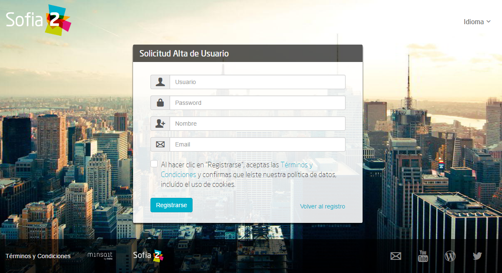
.. |image26| image:: ./media/image28.png
   :width: 7.94792in
   :height: 5.47917in
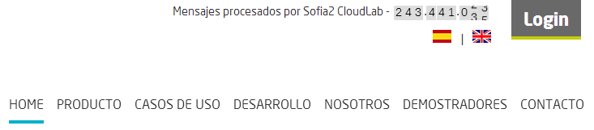
.. |image28| image:: ./media/image30.png
   :width: 6.95655in
   :height: 4.08491in
.. |image29| image:: ./media/image31.png
   :width: 1.99057in
   :height: 2.43396in
.. |image30| image:: ./media/image32.png
   :width: 7.76415in
   :height: 1.92952in
.. |image31| image:: ./media/image33.png
   :width: 2.34303in
   :height: 3.84906in
.. |image32| image:: ./media/image34.png
   :width: 7.68424in
   :height: 4.94071in
.. |image33| image:: ./media/image35.png
   :width: 7.69130in
   :height: 3.11431in
.. |image34| image:: ./media/image36.png
   :width: 2.03750in
   :height: 2.40556in
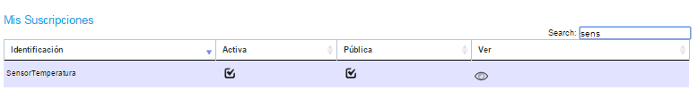
.. |image36| image:: ./media/image38.png
   :width: 7.54572in
   :height: 2.31132in
.. |image37| image:: ./media/image39.png
   :width: 7.82851in
   :height: 2.18008in
.. |image38| image:: ./media/image40.png
   :width: 7.80808in
   :height: 1.99182in
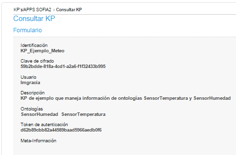
.. |image40| image:: ./media/image42.png
   :width: 7.03274in
   :height: 2.50288in

.. |image42| image:: ./media/image44.png
   :width: 7.72642in
   :height: 5.39635in
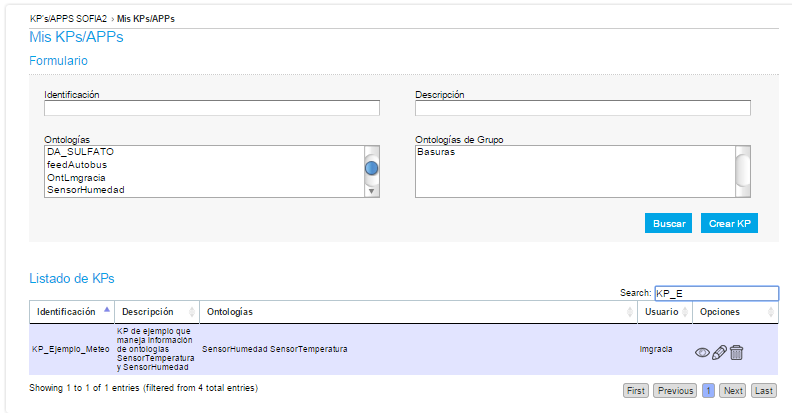
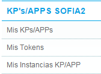
.. |image45| image:: ./media/image47.png
   :width: 7.83019in
   :height: 2.45312in

.. |image47| image:: ./media/image49.png
   :width: 7.81888in
   :height: 2.35553in
.. |image48| image:: ./media/image50.png
   :width: 7.74144in
   :height: 2.71453in
.. |image49| image:: ./media/image51.png
   :width: 7.71698in
   :height: 2.91453in
.. |image50| image:: ./media/image52.jpeg
   :width: 7.43377in
   :height: 4.31443in
.. |image51| image:: ./media/image53.png
   :width: 2.09810in
   :height: 2.44279in
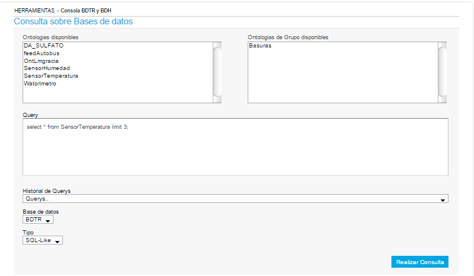
.. |image53| image:: ./media/image55.png
   :width: 7.70755in
   :height: 3.17322in
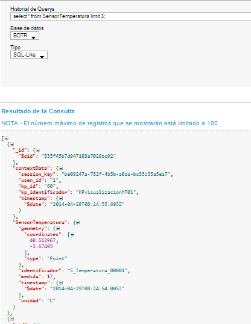
.. |image55| image:: ./media/image57.png
   :width: 7.75000in
   :height: 2.85417in
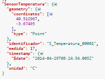
.. |image57| image:: ./media/image59.png
   :width: 3.26042in
   :height: 3.25000in
.. |image58| image:: ./media/image60.png
   :width: 7.90625in
   :height: 4.61458in
.. |image59| image:: ./media/image61.png
   :width: 7.73403in
   :height: 0.78264in
.. |image60| image:: ./media/image62.png
   :width: 2.70833in
   :height: 2.69792in
.. |image61| image:: ./media/image63.png
   :width: 7.65069in
   :height: 2.63889in
.. |image62| image:: ./media/image64.png
   :width: 7.84375in
   :height: 4.01042in
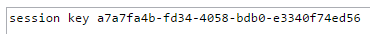
.. |image64| image:: ./media/image66.png
   :width: 7.60903in
   :height: 4.61458in
.. |image65| image:: ./media/image67.png
   :width: 7.34861in
   :height: 2.61944in
.. |image66| image:: ./media/image68.png
   :width: 5.46875in
   :height: 2.66667in
.. |image67| image:: ./media/image69.png
   :width: 4.41667in
   :height: 3.56250in
.. |image68| image:: ./media/image70.png
   :width: 7.51528in
   :height: 1.93403in
.. |image69| image:: ./media/image71.png
   :width: 7.10377in
   :height: 4.16249in
.. |image70| image:: ./media/image72.png
   :width: 2.00943in
   :height: 2.59252in
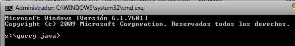
.. |image72| image:: ./media/image74.png
   :width: 7.82738in
   :height: 4.70348in
.. |image73| image:: ./media/image75.png
   :width: 7.72854in
   :height: 5.29102in
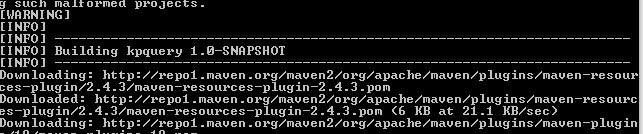
.. |image75| image:: ./media/image77.png
   :width: 7.72317in
   :height: 1.73585in
.. |image76| image:: ./media/image78.png
   :width: 4.53750in
   :height: 1.83958in
.. |image77| image:: ./media/image79.png
   :width: 7.72263in
   :height: 1.99481in

.. |image81| image:: ./media/image83.png
   :width: 4.49028in
   :height: 7.28333in
.. |image82| image:: ./media/image84.png
   :width: 5.31111in
   :height: 1.09444in
.. |image83| image:: ./media/image85.png
   :width: 7.71667in
   :height: 4.49028in
