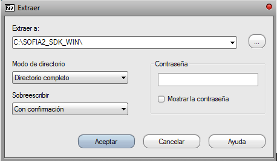
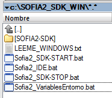
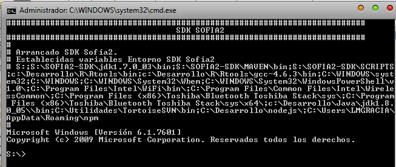
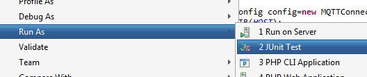
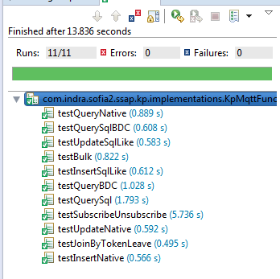

.. figure::  ./../../images/logo_sofia2_grande.png
 :align:   center
 

Taller Analytics
================

Introducción
------------

El objetivo de este taller es crear un sistema de recomendación en base a los ratings de los usuarios. Utilizaremos uno de los Dataset de `**Movielens** <https://movielens.org/>`__ que ya reside en la plataforma. Lo haremos en dos pasos:

-  Ingesta y preparación de los datos mediante Pipelines.

-  Creación del modelo mediante Notebook.

Ingesta de los datos
--------------------

Creación Pipeline
^^^^^^^^^^^^^^^^^

Vamos a realizar la ingesta de los datos de películas con el Dataflow. Lo primero que hay que hacer es crear un Pipeline desde cero. Dentro de las opciones de Menú de Analytics, “Mis Pipelines”, y dentro de esta pantalla, hay que pulsar el botón de Crear. Aparecerá una ventana en la que introducir el nombre del Pipeline, una descripción y un temporizador, que para esta práctica no aplica:

|image2|

Al crear el pipeline accede directamente al espacio de trabajo en el que crearemos el flujo de información.

Definir Componente Origen
^^^^^^^^^^^^^^^^^^^^^^^^^

Los datos ya están descargados en la máquina de Sofia2. Concretamente, la ruta es “/datadrive/ftp/movielens”. En este directorio deberían existir dos ficheros: *movies.dat* y *ratings.dat*. Para este pipeline nos interesan los datos de las películas.

Primero, es necesario crear un Origen de los datos. Como los ficheros ya residen en la máquina de Sofia2, el componente que se necesita es Directory. Pulsa sobre el componente y aparecerá en el espacio de trabajo. Verás que salen alertas de errores. No te preocupes, al crear el componente vacío, los parámetros de configuración obligatorios están vacíos. Eso es justamente lo que hay que hacer en el siguiente paso.

Pulsa sobre el componente y accederás a su configuración. Para el origen de directorio local, los parámetros de configuración obligatorios son:

|image3|

|image4|\ Ya está configurado el origen. Para empezar, es muy recomendable echar un vistazo a los datos que se van a leer. Para ello, podemos configurar un destino “Dummy” y previsualizar la información. Para esto, accede a los componentes destino y elige “Trash”. Como antes, al pulsar sobre el icono, aparece el componente en el espacio de trabajo. Une origen y destino, y ya casi está preparado este flujo. Como observarás, todavía hay errores de configuración. Esto es porque en la configuración general hay que definir la gestión de registros erróneos. Pulsa en cualquier sitio que no sea un componente dentro del espacio de trabajo. La ventana inferior mostrará la configuración general, y verás que la alerta aparece en la pestaña “Error Records”.

Dentro de esas opciones elige “Discard”. Con esto, ya no debería haber errores, pero aún así vamos a validar el flujo. En las opciones del menú de la barra superior, pulsa sobre el botón “Validate”:

|image5|

Si todo es correcto, mostrará un mensaje de OK.

Ya podemos hacer la previsualización. Dentro del menú anterior, el botón justo a la izquierda de Validate es “Preview”. Pulsa sobre él y aparecerá una ventana con unos datos de configuración. Lo único que realmente hay que tener en cuenta para este caso es el check de “Write to destinations”. Si está marcado, además de previsualizar los datos los escribirá en destino. Desmárcalo si es que está marcado y pulsa sobre “Run Preview”:

|image6|

En input data puedes ver lo que lee en cada registro y en cada uno de los componentes. Si pulsas sobre el componente directory, verás lo que genera y si pulsas sobre Trash lo que recibe. En este caso es lo mismo.

Procesado de los datos
^^^^^^^^^^^^^^^^^^^^^^

Ahora vamos a hacer la preparación de los datos. Como has podido observar en el preview del paso anterior, los campos están separados por “::”. El Dataflow, interpreta los separadores como un solo carácter, por lo que no se puede definir como delimitador “::”. Esto es lo siguiente que haremos.

|image7|

| |image8|
| Ahora hay que configurarlo. Este componente es muy simple. Pulsa sobre él, y en su configuración accede a la pestaña “Rename”. En “Fields to Rename” hay que introducir el campo origen y el nombre al que cambiarlo. Escribe como “From Field” /text y como “To |image9|\ Field” /datos.

Puedes probar a previsualizar para comprobar que efectivamente está renombrando el campo.

|image10|\ |image11|

Esta línea lo que hace es reemplazar “::” por “%”. Hemos elegido ese delimitador porque los típicos que suelen ser “;”, “,” y “\|” aparecen en el dataset como parte de los campos. Lanza de nuevo el preview y comprueba que se ha realizado el cambio correctamente.

Destino componente destino
^^^^^^^^^^^^^^^^^^^^^^^^^^

|image12|\ |image13|

*Output Files:* Es la definición de los ficheros de salida, rutas, formato, etc.

**File Type**: Text Files

**Data Format**: Text

**Files Prefix**: movie

**Directory Template**: /user/cloudera-scm/movielens/alias\_alumno/

*Text*: Es la configuración del formato elegido en la pestaña anterior.

**Text Field Path**: /datos

Lanza el preview de nuevo y comprueba que los datos llegan correctamente al destino:

| |image14|
| Si todo parece correcto, pulsa sobre el botón de “Start”, a la derecha del botón de validación que has usado anteriormente. Verás que se abre otra ventana con las estadísticas de los datos que se van leyendo, tiempos de proceso de cada componente, etc. Cuando veas que ya no está leyendo datos, significa que ya ha recorrido todo los ficheros de entrada. Como nosotros no necesitamos más datos que esos, podemos parar el pipeline.

¿Sabrías hacer lo mismo para el fichero de Ratings?

¿Sabrías generar el fichero en el HDFS como delimitado, definiendo los nombres de los campos separados por “;”?

NOTEBOOK
--------

Con ayuda de los notebooks de Sofia2 vamos a generar el modelo de recomendación de películas usando los datos que hemos cargado en la plataforma en el ejercicio anterior. Proponemos llevarlo a cabo con Spark usando Scala, y más concretamente implementaremos el ALS.

Definición de las rutas de los datos de entrada
^^^^^^^^^^^^^^^^^^^^^^^^^^^^^^^^^^^^^^^^^^^^^^^

    |image15|\ El primer paso es leer los datos de películas y ratings, y para eso primero hay que que definir la ruta de los datos. Define las variables *ratings path* y *movies\_path* con las correspondientes rutas donde hayas hecho la carga a la plataforma.

Estructurar los datos
^^^^^^^^^^^^^^^^^^^^^

Lo siguiente es guardar la información de películas y puntuaciones. Vamos a leer dicha información mediante RDDs de Spark.

Hay que definir un formato concreto tanto para las películas: (movieId, movieName) como para los rating: (timestamp % 10, Rating(userId, movieId, rating)).

También aprovechamos a importar las librerías de Mlib que se van a usar en el ejemplo. En concreto se necesitan `**ALS** <https://spark.apache.org/docs/1.1.0/api/java/org/apache/spark/mllib/recommendation/ALS.html>`__, `**Rating** <https://spark.apache.org/docs/1.1.0/api/java/org/apache/spark/mllib/recommendation/Rating.html>`__ y `**MatrixFactorizationModel** <https://spark.apache.org/docs/1.4.0/api/java/org/apache/spark/mllib/recommendation/MatrixFactorizationModel.html>`__.

|image16|

Comprobaciones de los datos
^^^^^^^^^^^^^^^^^^^^^^^^^^^

|image17|\ Ahora, comprueba que efectivamente se han leído los datos. ¿Cuántas puntuaciones has descargado? ¿Cuántas películas hay en el catálogo? ¿Cuántas películas se han puntuado? ¿Y cuántos usuarios lo han hecho?

Dividir el dataset
^^^^^^^^^^^^^^^^^^

Antes de construir el modelo hay que dividir el dataset en partes más pequeñas, una para entrenamiento(60%), otra para validación(20%) y otra más para testing(20%).

|image18|

Función para evaluar el modelo
^^^^^^^^^^^^^^^^^^^^^^^^^^^^^^

|image19|\ Una vez divididos los datos, definamos la función que evaluará el rendimiento del modelo. En concreto usaremos `**Root Mean Squared Error (RMSE)** <https://en.wikipedia.org/wiki/Root-mean-square_deviation>`__ y esta es la versión en Scala:

Elección del modelo
^^^^^^^^^^^^^^^^^^^

|image20|\ Ahora puedes usar esta función para definir los parámetros para el algoritmo de entrenamiento. El algortimo ALS requiere 3 parámetros: el rango de la matriz de factores, el número de iteraciones y una lambda. Vamos a definir diferentes valores para estos parámetros y probar diferentes combinaciones de ellos para determinar cuál de ellas es la mejor:

¿Cuál crees que es el mejor modelo?

|image21|\ Ahora vamos a lanzar nuestra función sobre los datos de Test.

Ejecutar las recomendaciones
^^^^^^^^^^^^^^^^^^^^^^^^^^^^

Una vez elegido el mejor modelo ya solo quedan las recomendaciones de películas por usuario. La idea es preguntar por el usuario, que para el Dataset usado es un numérico. Vamos a hacerlo tipo formulario, de tal forma que primero pregunte por el usuario, se inserte en un campo de texto y por último lance la recomendación. Para preguntar por el usuario:

|image22|

Ahora, ya solo queda lanzar la recomendación. Para este ejemplo, definimos que se muestren las 10 mejores recomendaciones para el usuario insertado en el campo de texto.

|image23|

.. |image0| image:: ./media/image2.png
.. |image1| image:: ./media/image3.png
.. |image2| image:: ./media/image6.png
.. |image3| image:: ./media/image7.png

.. |image5| image:: ./media/image9.png

.. |image8| image:: ./media/image12.png
.. |image9| image:: ./media/image13.png
.. |image10| image:: ./media/image14.png
.. |image11| image:: ./media/image15.emf
.. |image12| image:: ./media/image16.emf
.. |image13| image:: ./media/image17.png
.. |image14| image:: ./media/image18.png
.. |image15| image:: ./media/image19.png
.. |image16| image:: ./media/image20.png

.. |image19| image:: ./media/image23.png
.. |image20| image:: ./media/image24.png
.. |image21| image:: ./media/image25.png
.. |image22| image:: ./media/image26.png
.. |image23| image:: ./media/image27.png
