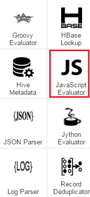
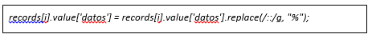

.. figure::  ./../../images/logo_sofia2_grande.png
 :align:   center
 

Taller Analytics
================

Introducción
------------

El objetivo de este taller es crear un sistema de recomendación en base a los ratings de los usuarios. Utilizaremos uno de los Dataset de `Movielens <https://movielens.org/>`__ que ya reside en la plataforma. Lo haremos en dos pasos:

-  Ingesta y preparación de los datos mediante Pipelines.

-  Creación del modelo mediante Notebook.

Ingesta de los datos
--------------------

Creación Pipeline
^^^^^^^^^^^^^^^^^

Vamos a realizar la ingesta de los datos de películas con el Dataflow. Lo primero que hay que hacer es crear un Pipeline desde cero. Dentro de las opciones de Menú de Analytics, “Mis Pipelines”, y dentro de esta pantalla, hay que pulsar el botón de Crear. Aparecerá una ventana en la que introducir el nombre del Pipeline, una descripción y un temporizador, que para esta práctica no aplica:

|image2|

Al crear el pipeline accede directamente al espacio de trabajo en el que crearemos el flujo de información.

Definir Componente Origen
^^^^^^^^^^^^^^^^^^^^^^^^^

Los datos ya están descargados en la máquina de Sofia2. Dependiendo del entorno está en una ruta u otra. Para sofia2.com la ruta es “/datadrive/movielens” mientras que para sofia2-analytic la ruta “/datadrive/ftp/movielens”. En este directorio deberían existir dos ficheros: movies.dat y ratings.dat. Para este pipeline nos interesan los datos de las películas.

Si no estuvieran en la máquina, hay que descargarlos para este taller.

Primero, es necesario crear un Origen de los datos. Como los ficheros ya residen en la máquina de Sofia2, el componente que se necesita es Directory. 	Pulsa sobre el componente y aparecerá en el espacio de   trabajo. 

|image3|

Verás que salen alertas de errores. No te preocupes, al crear el componente vacío, los parámetros de configuración obligatorios están vacíos. Eso es justamente lo que hay que hacer en el siguiente paso.

Pulsa sobre el componente y accederás a su configuración. Para el origen de directorio local, los parámetros de configuración obligatorios son:

**Files → Data Format:** Representa el formato de los datos de entrada. Hay diferentes opciones, pero la que se necesita en este ejemplo es Text.

**Files → Files Directory:** Es el directorio de entrada, donde residen los ficheros a leer. En nuestro caso, esta ruta es /datadrive/ftp/movielens. (Si trabajas desde Sofia2.com/console la ruta es /datadrive/movielens).

**Files → Name Pattern:** Es la expresión regular con la que buscará los ficheros a cargar dentro del directorio configurado en el parámetro anterior.

Nos interesa leer un solo fichero, por lo que hay que asignar a este campo en movies.dat.

Dependiendo del formato de entrada elegido, se activa la pestaña correspondiente en la ventana de configuración. Verás que en este caso, la pestaña activa es Text. Solo tiene un parámetro que es Max Line *Length* que tiene un valor por defecto que no vamos a modificar. 

Ya está configurado el origen. Para empezar, es muy recomendable echar un vistazo a los datos que se van a leer. Para ello, podemos configurar un destino “Dummy” y previsualizar la información. Para esto, accede a los componentes destino y elige “Trash”. Como antes, al pulsar sobre el icono, aparece el componente en el espacio de trabajo. Une origen y destino, y ya casi está preparado este flujo. 

Como observarás, todavía hay errores de configuración. Esto es porque en la configuración general hay que definir la gestión de registros erróneos. Pulsa en cualquier sitio que no sea un componente dentro del espacio de trabajo. La ventana inferior mostrará la configuración general, y verás que la alerta aparece en la pestaña “Error Records”.

|image4|

Dentro de esas opciones elige “Discard”. Con esto, ya no debería haber errores, pero aún así vamos a validar el flujo. En las opciones del menú de la barra superior, pulsa sobre el botón “Validate”:

|image5|

Si todo es correcto, mostrará un mensaje de OK.

Ya podemos hacer la previsualización. Dentro del menú anterior, el botón justo a la izquierda de Validate es “Preview”. Pulsa sobre él y aparecerá una ventana con unos datos de configuración. Lo único que realmente hay que tener en cuenta para este caso es el check de “Write to destinations”. Si está marcado, además de previsualizar los datos los escribirá en destino. Desmárcalo si es que está marcado y pulsa sobre “Run Preview”:

|image6|

En input data puedes ver lo que lee en cada registro y en cada uno de los componentes. Si pulsas sobre el componente directory, verás lo que genera y si pulsas sobre Trash lo que recibe. En este caso es lo mismo.

Procesado de los datos
^^^^^^^^^^^^^^^^^^^^^^

Ahora vamos a hacer la preparación de los datos. Como has podido observar en el preview del paso anterior, los campos están separados por “::”. El Dataflow, interpreta los separadores como un solo carácter, por lo que no se puede definir como delimitador “::”. Esto es lo siguiente que haremos.

|image7|

Por comodidad, vamos a incluir, antes del cambio de delimitador, un renombrado de campos. En el preview, al desplegar cada registro 	aparecen los campos definidos. Al leer como formato Text, para cada línea se genera un campo que por defecto se llama “text”. Este es el que vamos a renombrar. Para ello, dentro de “Processors”, pulsa sobre “Field Renamer”.  Crea un flujo como el siguiente: 

|image8|

Ahora hay que configurarlo. Este componente es muy simple. Pulsa sobre él, y en su configuración accede a la pestaña “Rename”. En “Fields to Rename” hay que introducir el campo origen y el nombre al que cambiarlo. Escribe como “From Field” /text y como “To Field” /datos.

|image9|

Puedes probar a previsualizar para comprobar que efectivamente está renombrando el campo.

|image10|

Ahora ya podemos crear el componente que sustituye el delimitador. Para llevar a cabo esta tarea se pueden usar diferentes processors, concretamente todos los que son “Evaluators”. Nosotros lo haremos	con el de JavaScript. Como siempre, pulsa sobre el componente y crea un flujo como el siguiente:

|image11|

Accede a la configuración del componente, y entra en la pestaña Javascript. Verás un editor de texto que se llama “script”, que ya tiene código predefinido dentro. Es la plantilla sobre la que definiremos nuestros cambios. Dentro del bucle for, añade la siguiente línea de código: 

|image12|

Esta línea lo que hace es reemplazar “::” por “%”. Hemos elegido ese delimitador porque los típicos que suelen ser “;”, “,” y “\|” aparecen en el dataset como parte de los campos. Lanza de nuevo el preview y comprueba que se ha realizado el cambio correctamente.

Definir componente destino
^^^^^^^^^^^^^^^^^^^^^^^^^^

|image13|

De nuevo, pulsa sobre el componente y crea un flujo como el siguiente:

|image24|

Accede a la configuración del destino. Hay que modificar 3 pestañas:

* **Hadoop FS:** Corresponde a las conexiones y rutas del HDFS

 * **Hadoop FS URI**: hdfs://localhost:8020. Nota: Si realizamos el taller desde Sofia2.com/console cambiaremos ‘localhost:8020’ por ‘sofia2-hadoop.cloudapp.net:8020’
 * **HDFS User**: cloudera-scm

* **Output Files:** Es la definición de los ficheros de salida, rutas, formato, etc.

 * **File Type**: Text Files
 * **Data Format**: Text
 * **Files Prefix**: movie
 * **Directory Template**: /user/cloudera-scm/movielens/alias\_alumno/

* **Text**: Es la configuración del formato elegido en la pestaña anterior.

 * **Text Field Path**: /datos

Lanza el preview de nuevo y comprueba que los datos llegan correctamente al destino:

|image14|

Si todo parece correcto, pulsa sobre el botón de “Start”, a la derecha del botón de validación que has usado anteriormente. Verás que se abre otra ventana con las estadísticas de los datos que se van leyendo, tiempos de proceso de cada componente, etc. Cuando veas que ya no está leyendo datos, significa que ya ha recorrido todo los ficheros de entrada. Como nosotros no necesitamos más datos que esos, podemos parar el pipeline.

¿Sabrías hacer lo mismo para el fichero de Ratings?

¿Sabrías generar el fichero en el HDFS como delimitado, definiendo los nombres de los campos separados por “;”?

Nota: Si generas el fichero con punto y coma como delimitador, ten en cuenta que en los siguientes pasos tendrás que usar ese mismo delimitador y no el “%” como aparece en el documento.

NOTEBOOK
--------

Con ayuda de los notebooks de Sofia2 vamos a generar el modelo de recomendación de películas usando los datos que hemos cargado en la plataforma en el ejercicio anterior. Proponemos llevarlo a cabo con Spark usando Scala, y más concretamente implementaremos el ALS.

Definición de las rutas de los datos de entrada
^^^^^^^^^^^^^^^^^^^^^^^^^^^^^^^^^^^^^^^^^^^^^^^

El primer paso es leer los datos de películas y ratings, y para eso primero hay que que definir la ruta de los datos. Define las variables *ratings path* y *movies\_path* con las correspondientes rutas donde hayas hecho la carga a la plataforma.

|image15|
    

Nota: Si realizamos el taller desde Sofia2.com/console cambiaremos ‘sofia2-analytic:8020’ por ‘localhost:8020’

Estructurar los datos
^^^^^^^^^^^^^^^^^^^^^

Lo siguiente es guardar la información de películas y puntuaciones. Vamos a leer dicha información mediante RDDs de Spark.

Hay que definir un formato concreto tanto para las películas: (movieId, movieName) como para los rating: (timestamp % 10, Rating(userId, movieId, rating)).

También aprovechamos a importar las librerías de Mlib que se van a usar en el ejemplo. En concreto se necesitan `ALS
<https://spark.apache.org/docs/1.1.0/api/java/org/apache/spark/mllib/recommendation/ALS.html>`__, `Rating <https://spark.apache.org/docs/1.1.0/api/java/org/apache/spark/mllib/recommendation/Rating.html>`__ y `MatrixFactorizationModel <https://spark.apache.org/docs/1.4.0/api/java/org/apache/spark/mllib/recommendation/MatrixFactorizationModel.html>`__.

|image16|

Comprobaciones de los datos
^^^^^^^^^^^^^^^^^^^^^^^^^^^

Ahora, comprueba que efectivamente se han leído los datos. ¿Cuántas puntuaciones has descargado? ¿Cuántas películas hay en el catálogo? ¿Cuántas películas se han puntuado? ¿Y cuántos usuarios lo han hecho?

|image17|

Dividir el dataset
^^^^^^^^^^^^^^^^^^

Antes de construir el modelo hay que dividir el dataset en partes más pequeñas, una para entrenamiento(60%), otra para validación(20%) y otra más para testing(20%).

|image18|

Función para evaluar el modelo
^^^^^^^^^^^^^^^^^^^^^^^^^^^^^^

Una vez divididos los datos, definamos la función que evaluará el rendimiento del modelo. En concreto usaremos `Root Mean Squared Error (RMSE) <https://en.wikipedia.org/wiki/Root-mean-square_deviation>`__ y esta es la versión en Scala:

|image19|

Elección del modelo
^^^^^^^^^^^^^^^^^^^

Ahora puedes usar esta función para definir los parámetros para el algoritmo de entrenamiento. El algortimo ALS requiere 3 parámetros: el rango de la matriz de factores, el número de iteraciones y una lambda. Vamos a definir diferentes valores para estos parámetros y probar diferentes combinaciones de ellos para determinar cuál de ellas es la mejor:

|image20|

¿Cuál crees que es el mejor modelo?

Ahora vamos a lanzar nuestra función sobre los datos de Test.

|image21|

Ejecutar las recomendaciones para un usuario
^^^^^^^^^^^^^^^^^^^^^^^^^^^^^^^^^^^^^^^^^^^^

Una vez elegido el mejor modelo ya solo quedan las recomendaciones de películas por usuario. La idea es preguntar por el usuario, que para el Dataset usado es un numérico. Vamos a hacerlo tipo formulario, de tal forma que primero pregunte por el usuario, se inserte en un campo de texto y por último lance la recomendación. Para preguntar por el usuario:

|image22|

Para este ejemplo, definimos que se muestren las 10 mejores recomendaciones para el usuario insertado en el campo de texto.

|image23|

Persistir las recomendaciones 
^^^^^^^^^^^^^^^^^^^^^^^^^^^^^

Ahora solo nos queda guardar las mejores recomendaciones para cada usuario en ontología. La idea es guardar registros de la forma: UserId, MovieName, MovieGenre. 

|image24|

Creamos la tabla HIVE con los datos almacenados en el DataFrame. Modifica el nombre de la tabla de la imagen “recomendaciones_arturo” por un identificador único, por ejemplo, recomendaciones_tunombre.

|image25|

Generar Ontología 
^^^^^^^^^^^^^^^^^

Vamos a generar una ontología a partir de la tabla HIVE que hemos creado en el punto anterior. Para ello, entra en la opción de menú de Analytics y selecciona “UTIL HIVE_To_Ontology”.  Se abre una ventana en la que aparece una lista de las tablas disponibles. La tabla que acabas de crear no debería aparecer. Esto sucede, porque la tabla es HIVE y esa lista muestra las entidades de IMPALA. Por lo tanto, hay que dar visibilidad a la tabla. Para ello, pulsa sobre el botón “Visualizar tablas HIVE”:

|image26|

Se abrirá otra ventana, en la que debería aparecer nuestra tabla. Selecciónala y pulsa sobre “Regenerar Metadatos”: 

|image27|

Una vez ejecutado, vuelve a la ventana anterior con el botón “Cancelar”. Ahora aparece nuestra tabla en la lista:

|image28|

Una vez elegida la tabla, pulsa sobre “Generar Esquema” y finalmente pulsa en “Crear”. 

Una vez hecho esto, aparece una ventana con los datos de la ontología recién creada. Solo falta un paso más, que consiste en activar la ontología. Desde esta misma ventana, pulsa el botón “Modificar”, que está al final de la página.  Se abrirá otra ventana en la que hay que marcar el CheckBox “Activa” (marcado en rojo en la siguiente imagen):

|image29|

Finalmente, se genera la instancia y se pulsa sobre “Guardar”. Pero para poder trabajar con ella, tenemos que asociarle un ThinKP válido. Si ya tienes uno creado puedes asociarlo a esta ontología en “Mis ThinKPs” -> Editar (tienes que elegir el ThinKP), añadiendo la ontología en cuestión a la lista asociada al ThinKP. Para este taller, vamos a crear uno nuevo.

Accede al menú “ThinKPs Sofia2” -> “Mis ThinKPs” y pulsa sobre “Nuevo ThinKP”:

|image30|

Se abre una ventana en la que hay que rellenar “Identificación” con el nombre del nuevo ThinKP, y elegir las ontologías a las que tendrá acceso al ThinKP. 

Nota: Al elegir las ontologías para el ThinKP, para marcar más de una, usa el Ctrl y Shift.

|image31|

Una vez rellenados los datos, pulsa sobre “Crear” y aparecerá una ventana resumen del ThinKP:

|image32|

Ahora ya está preparada la ontología para trabajar con ella. Entra en la consola dentro del menú “Herramientas” y lanza alguna consulta sobre la ontología recién creada. 

Nota: Es recomendable restringir los resultados de las consultas en la consola de Sofia2 con “limit numero_registros” (p.e. select * from ontología limit 5)

VISUALIZACIÓN
-------------

Para terminar vamos a crear un dashboard sobre la ontología creada.

Crear Gadgets 
^^^^^^^^^^^^^

Primero crearemos los gadgets que se mostrarán en el dashboard. Accede a la opción de Menú -> Mis Gadgets. Dentro de la nueva ventana, pulsa el botón “Crear Gadget”. 

El primer Gadget que crearemos es uno de tipo tabla. Elige esa opción del catálogo. Tendrás que rellenar los datos necesarios para su creación: 

-	**Nombre:** p.e. recomendador_tabla_tunombre
-	**KP:** el ThinKP que hayas creado en los pasos anteriores
-	**Obtener Datos por query**

 *	**Base de Datos:** BDH
 *	**Máximos valores a representar:** 100 
 *	**Obtener datos cada (segundos):** 0

-	**Consulta**

 *	**Ontología:** elige la ontología que hayas creado para este taller
 *	**Consulta:** select User, Movie, Genre from nombre_ontologia

Debería quedar algo así: 

|image33|

Pulsa sobre el botón de añadir, junto a la query. Se desplegarán más opciones que tienes que rellenar con el nombre del campo a mostrar junto con su transformación (no es obligatoria) y el alias que aparecerá en el Gagdet. Añade los campos User, Movie y Genre. 

|image34|

Si todo es correcto, debajo de este bloque debería aparecer una previsualización de la tabla. Para terminar pulsa sobre “Crear”. 
Vamos a por el segundo Gagdet. Ve al menú de creación de Gadgets y elige en el catálogo el tipo “Pie”. De nuevo tenemos que rellenar una serie de atributos:

-	**Nombre:** recomendador_pie_tunombre
-	**KP:** el mismo ThinKP que para la tabla

-	**Obtener datos por query:**
 *	**Base de datos:** BDH
 *	**Máximos valores a representar:** 100
 *	**Obtener datos cada (segundos):** 0

-	**Consulta**
 *	**Ontología:** elige la ontología que hayas creado para este taller
 *	**Consulta:** select Genre, count(distinct Movie) as num from nombre_ontologia group by Genre
 
 |image35|
 
 
 Como en la tabla, tenemos que rellenar las medidas:
 
-	**Categoría:** Genre
-	**Valor:** num

Una vez añadidas las medidas, aparecerá una previsualización del gráfico:

 

.. |image3| image:: ./media/image163.png

