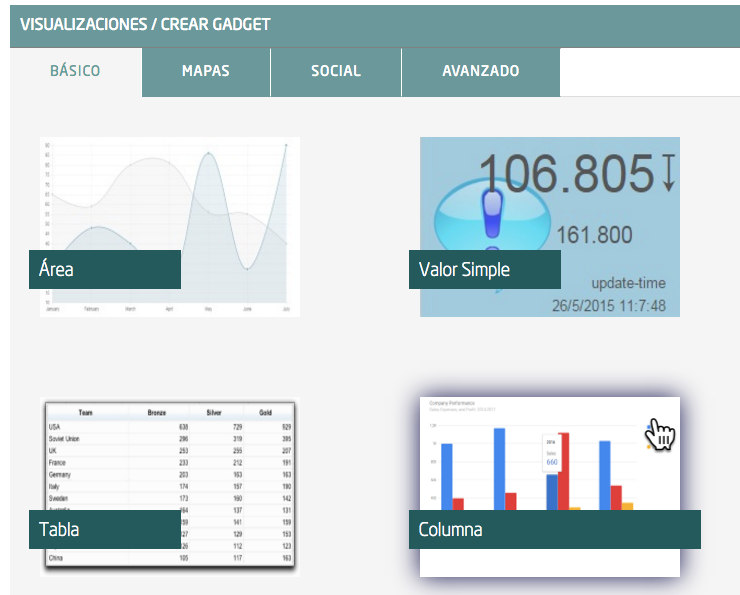
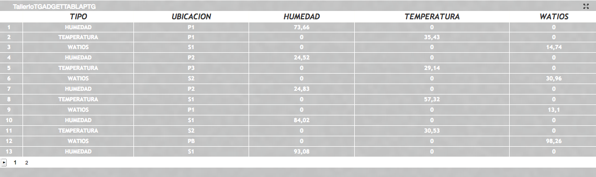
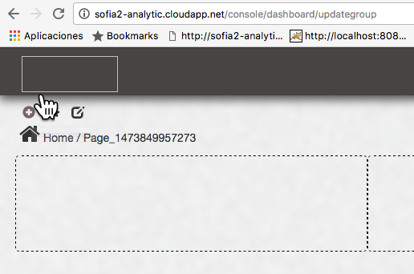
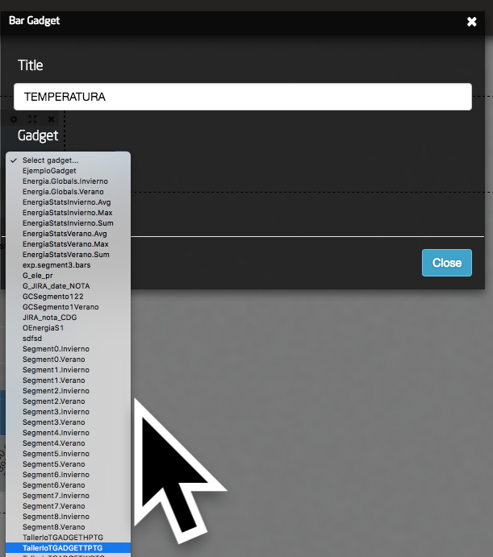
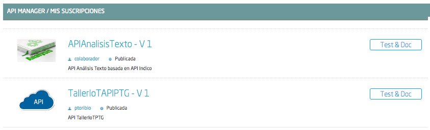

.. figure::  ./../../images/logo_sofia2_grande.png
 :align:   center

Taller IoT Sofia2
=================

Introducción
------------

El objetivo de este taller es la realización de un ejemplo real sobre el que poder evaluar las capacidades de la plataforma Sofia2.

Para ello vamos a simular un edificio que dispone de varias plantas, y tres dispositivos para la lectura de consumo energético, temperatura y humedad en cada una de ellas, para terminar, crearemos un cuadro de mando para visualizar esta información y publicaremos los datos en un API para ser consumido de manera sencilla por cualquier aplicación.

Modelo de datos
---------------

El Modelo
^^^^^^^^^

El pilar sobre el que se sustenta un proyecto IoT es su modelo de datos, este debe contener toda la información relevante, tanto para un uso inmediato como para posteriores análisis de la información.

Es importante que los dispositivos no tengan que enviar información irrelevante que únicamente genere un coste en las comunicaciones.

En la generación de un modelo equilibrado radica la complejidad del diseño del modelo de datos.

Ontología
^^^^^^^^^

En Sofia2 el modelo de datos recibe el nombre de Ontología, podemos definir ésta de una manera muy superficial como un esquema JSON que definirá de forma explícita los datos que almacenará.

La consola de administración centralizada de sofia2 `http://sofia2-analytic.cloudapp.net/console/ <http://sofia2-analytic.cloudapp.net/console/>`__ dispone de varios métodos para crear una ontología (editor gráfico, modo texto, asistente y desde origen de datos).

|image73|

Vamos a utilizar la Creación Guiada de Ontología.

|image74|

Lo primero que tenemos que hacer es darle un nombre a nuestra ontología, la llamaremos TallerIoT<Nuestras iniciales Nombre, 1 Apellido 2 Apellido>.

Marcamos la ontología como activa y es una buena práctica indicar la descripción de la finalidad que tiene nuestra ontología.

|image75|

Podemos obviar los detales de Configuración BDTR y BDH y dependencia entre ontologías, pues no tiene relevancia para este taller.

Ahora vamos a añadir los campos de nuestro modelo de datos, vamos a trabajar con un modelo muy sencillo que contendrá la siguiente información:

============  =======  =============
ID            String   requerido
UBICACION     String   requerido
TEMPERATURA   Number   no requerido
WATIOS        Number   no requerido
HUMEDAD       Number   no requerido
TIPO          String   requerido
============  =======  =============

|image76|

Establecemos la propiedad Additional Properties a false para evitar que nuestra ontología pueda contener otro tipo de información. Y pulsamos el botón generar ontología.

|image77|

En el apartado Esquema, nos aparecerá la definición del JSON-Schema que define nuestra ontología y que tiene que cumplir todas las instancias de ontología que utilicemos.

|image78|

Si pulsamos el botón Generar Instancia nos mostrará un ejemplo de una instancia de ontología.

|image79|

Por último, pulsamos el botón Crear.

ThinKP
------

Una vez que hemos definido el modelo de datos y lo hemos plasmado en una ontología, tenemos que crear el ThinKP, la configuración lógica de los dispositivos que van a interactuar con nuestra ontología.

Para ello accedemos al menú Mis ThinKPs y pulsamos sobre el botón Nuevo ThinKP.

|image80|

Le damos un nombre a nuestro ThinKP, le llamaremos TallerIoT<Nuestras iniciales Nombre, 1 Apellido 2 Apellido>.

|image81|

Podemos darle una descripción. Y debemos de seleccionar la ontología que hemos creado en el punto 3. Que debe llamarse TallerIoT<Nuestras iniciales Nombre, 1 Apellido 2 Apellido>

|image82|

Una vez dada esta información podemos pulsar el botón Crear, nos aparecerá la pantalla de detalle del ThinKP.

|image83|

Siempre podremos acceder a nuestros Token mediante la pestaña Mis Tokens.

|image84|

Seleccionamos el icono de edición de nuestro ThinKP (lápiz). 

|image85|

Seleccionamos la pestaña Mis Tokens. Nos aparecerá un listado con los Tokens que tiene asignados y las opciones para activar/desactivar, dar de baja y añadir nuevos Tokens. 
|image86|

Simular datos de entrada
------------------------

Configuración del simulador
^^^^^^^^^^^^^^^^^^^^^^^^^^^

Puesto que no tenemos un dispositivo real que inserte información en nuestra ontología, vamos a hacer uso de las herramientas de Sofia2 para insertar datos simulados, para ello accedemos al menú Simulador Tiempo Real Instancias de Ontología.

|image87|

Pulsamos el botón Crear Simulador, lo primero que vamos a crear son los Generadores de Instancias que vamos a usar, un Generador de Instancias, es una definición de datos de prueba.

Vamos a crear los siguientes generadores:

-  Primero el generador del campo ID para nuestro supuesto Watorimetro, como nombre le ponemos TallerIoTWAT<Nuestras iniciales Nombre, 1 Apellido 2 Apellido>, como tipo de Generador Fixed String y como valor, el mismo que el nombre que le hemos dado.

|image88|

-  Ahora el generador del campo ID para nuestro supuesto Termostato, como nombre le ponemos TallerIoTTERMOSTATO<Nuestras iniciales Nombre, 1 Apellido 2 Apellido>, como tipo de Generador Fixed String y como valor el mismo que el nombre que le hemos dado.

-  Para terminar con el ID, el generador del campo ID para nuestro supuesto Medidor de Humedad, como nombre le ponemos TallerIoTH<Nuestras iniciales Nombre, 1 Apellido 2 Apellido>, como tipo de Generador Fixed String y como valor el mismo que el nombre que le hemos dado.

-  Como generador de valores vamos a crear un único generador que utilizaremos tanto para simular la temperatura, la humedad y los watios consumidos, lo llamaremos TallerIoTVALOR<Nuestras iniciales Nombre, 1 Apellido 2 Apellido> como tipo de Generador Random Number, valores desde 1 hasta 100 y decimales de precisión 2.

-  Para la ubicación vamos a crear un generador de tipo Random String, con el listado de palabras HALL, PB, P1, P2, P3, S1 y S2, simulando los pisos de un edificio. Y le vamos a llamar TallerIoTUBICACION<Nuestras iniciales Nombre, 1 Apellido 2 Apellido>

-  Por último, vamos a crear los tipos de generador para el campo TIPO, que serán de tipo Fixed String y se llamarán TallerIoTTIPOH<Nuestras iniciales Nombre, 1 Apellido 2 Apellido> y valor HUMEDAD, TallerIoTTIPOT<Nuestras iniciales Nombre, 1 Apellido 2 Apellido> y valor TEMPERATURA y TallerIoTTIPOW<Nuestras iniciales Nombre, 1 Apellido 2 Apellido> y valor WATIOS.

Una vez definidos los Generadores vamos a crear tres simuladores, el medidor de termperatura, el de humedad y el de watios, para ello en el campo identificación ponemos el nombre TallerIoTSIMULADORT<Nuestras iniciales Nombre, 1 Apellido 2 Apellido>, TallerIoTSIMULADORH<Nuestras iniciales Nombre, 1 Apellido 2 Apellido> y TallerIoTSIMULADORW<Nuestras iniciales Nombre, 1 Apellido 2 Apellido>

|image89|

En la pestaña de ontología, seleccionamos nuestra ontología TallerIoT<Nuestras iniciales Nombre, 1 Apellido 2 Apellido>

|image90|

Creamos la configuración para el Simulador de Temperatura.

|image91|

Creamos la configuración para el Simulador de humedad

|image92|

Creamos la configuración para el simulador del Watorimetro.

|image93|

Ejecución de Simulador
^^^^^^^^^^^^^^^^^^^^^^

Abrimos tres nuevas pestañas en el explorador, y accedemos en cada una de ellas a uno de los tres simuladores. Y pulsamos el botón ¡Empezar! en cada uno de ellos

|image94|

Abrimos una cuarta pestaña y accedemos a la opción del menú Consola BDTR y BDH

|image95|

Seleccionamos nuestra ontología

|image96|

Nos aparecerá una consulta por defecto, para realizar las consultas sobre BDTR usando el lenguaje SQL-Like.

|image97|

Si pulsamos el botón realizar consulta, nos devolverá los datos contenidos en la Base de Datos, debemos de ser conscientes que la plataforma por configuración nos devolverá como mucho 100 Registros.

|image98|

Detenemos nuestros tres simuladores, pulsando sobre el botón ¡Parar!.

|image99|

Cuadro de mando
---------------

El siguiente paso es crear un cuadro de mando usando las capacidades de presentación gráfica de la plataforma.
    

Crear Gadget
^^^^^^^^^^^^

Accedemos a la opción de menú Mis Gadgets y pulsamos sobre Crear Gadget, seleccionamos crear Gadget y el tipo Columna

|image100|

Como nombre le asignamos TallerIoTGADGETH<Nuestras iniciales Nombre, 1 Apellido 2 Apellido> y seleccionamos el ThinKP que creamos.

|image101|

Seleccionamos la pestaña Obtener datos por query, usando la sentencia select \* from TallerIoTPTG where TallerIoTPTG.TIPO ='HUMEDAD'; y como medidas Para el Eje X contextData.timestamp, este último debemos transformarlo usando new Date($0) y para el Eje Y HUMEDAD.

|image102|

Haremos lo mismo para crear el gráfico de consumo de Watios, al que llamaremos TallerIoTGADGETW<Nuestras iniciales Nombre, 1 Apellido 2 Apellido> en este caso con la consulta select \* from TallerIoTPTG where TallerIoTPTG.TIPO ='WATIOS' y en el Eje Y WATIOS

|image103|

Y para crear el gráfico de temperatura, al que llamaremos TallerIoTGADGETT<Nuestras iniciales Nombre, 1 Apellido 2 Apellido> en este caso con la consulta select \* from TallerIoTPTG where TallerIoTPTG.TIPO ='TEMPERATURA' y en el Eje Y TEMPERATURA

|image104|

Por cada uno de los Gadget anteriores, creará un gráfico como el siguiente

|image105|

Por último, crearmos un Gadget de tipo tabla, le llamaremos TallerIoTGADGETTABLA<Nuestras iniciales Nombre, 1 Apellido 2 Apellido>, seleccionaremos la pestaña Obtener datos en directo y añadiremos las siguientes columnas:

|image106|

El resultado de este Gadget es una tabla como la siguiente:

|image107|

Crear Dashboard
^^^^^^^^^^^^^^^

Una vez que hemos creado los Gadget, ahora vamos a crear un Dashboard que los use, para ello accedemos a la opción de menú Mis Dashboards y pulsamos sobre Crear Dashboard.

|image108|

Llamaremos al dashboard TallerIoTDASHBOARD<Nuestras iniciales Nombre, 1 Apellido 2 Apellido> y lo marcarmos como público. Pulsamos el botón de Nueva Página.

|image109|

Habilitamos el modo de edición.

|image110|

Pulsamos sobre el símbolo + que nos permitirá añadir un nuevo Gadget.

|image111|

Seleccionamos el tipo de Gadget que queremos añadir, en nuestro caso son tres de tipo Bar y uno de tipo Table.
    
|image112|

Una vez añadido el tipo de Gadget, pulsamos sobre el botón configuración.

|image113|

Seleccionamos el Gadget que queremos añadir a nuestro Dashboard.

|image114|

El resultado final será el Dashboard con todos los Gadget que hemos añadido.

|image115|

En el listado de Gadget si pulsamos sobre el símbolo del enlace,

|image116|

nos aparece un cuadro de diálogo con una URL en la que accedemos directamente al Dashboard y que podemos publicar.

Publicar Ontología como API
---------------------------

Sofia2 permite publicar nuestras ontologías como Api RST, para ello accedemos a la opción de menú Mis Apis.

|image117|

Pulsamos sobre el botón Crear Api. Le asignamos el nombre TallerIoTAPI<Nuestras iniciales Nombre, 1 Apellido 2 Apellido>, lo marcamos como público. Desmarcamos la opción API Externa y seleccionamos nuestra ontología.

|image118|

Vamos a establecer una cache de 5 minutos para los resultados de las consultas. Y un límite de 5 consultas al API por minuto.

Se nos muestra el EndPoint de acceso al API.

|image119|

Debemos indicar una descripción y un valor para el campo Meta Inf. Por último nos aparecen las operaciones que podemos crear.

|image120|

Vamos a crear tres CUSTOM, uno por cada tipo de dato que almacenamos, Humedad, Temperatura y Watios.

|image121|

El resultado final debe de ser las siguientes tres API.

|image122|

Marcamos al API como Publicada pulsando el botón Publicar del listado de API.

|image123|

Accedemos al menú Mis API Key, donde debemos copiar el Token de Usuaro, el cual necesitamos para invocar las API.

|image124|

Accedemos al menú Mis Suscripciones, donde aparecerán las API que tenemos publicadas.

|image125|

Al pulsar en Test & Doc accedemos a una página de pruebas de las API, donde en la parte derecha aparecen las operaciones que hemos expuesto.

\\Humedad

\\Watios

\\Temperatura

|image126|

Al púlsar sobre cada opción nos aparece la meta información del servicio y la opción en la parte inferior de ejecutar con el botón Submit, debemos en la cabecera X-SOFIA2-APIKey pegar el Token de Usuario que copiamos en el punto anterior.

|image127|

Al ejcutarlo obtendremos el resultado de la consulta que habíamos definido.

|image128|

En la pestaña Request Info podemos ver el URL de invocación de la operación, que será el End Point que se creó cuando generamos el API más la operación.

|image129|

ANEXO
-----

Los siguientes pasos del taller, nos permiten trabajar sobre dos capacidades avanzadas de Sofia2 las cuales dotan a la plataforma de la capacidad de reaccionar a eventos pudiendo analizar los datos de entrada y actuar ante ellos.

Crear Regla CEP
^^^^^^^^^^^^^^^

Accedemos a la opción de menú Mis Eventos CEP y pulsamos sobre Crear Evento

|image130|

Como Identificacion le asignaremos TallerIoTEVENTO<Nuestras iniciales Nombre, 1 Apellido 2 Apellido>, seleccionaremos nuestra ontología y pulsaremos el botón Cargar campos.

|image131|

Seleccionamos los campos TEMPERATURA, TIPO y UBICACIÓN y pulsamos el boton Crear.

Fijémonos en la columna Nombre Evento CEP, ese será el nombre que deberemos usar en el siguiente punto.

|image132|

Ahora accedemos al menu Mis Reglas CEP y pulsamos sobre el botón Crear Regla.

|image133|

Seleccionamos el Evento que hemos creado.

|image134|

En el from establecemos los parametros de cumplimiento de la regla.

|image135|

En el select los campos que queremos recuperar cuando se lance la regla CEP.

|image136|

En el Insert Into la regla que queremos generar, en nuestro caso TallerIoTREGLA<Nuestras iniciales Nombre, 1 Apellido 2 Apellido>. Una vez introducidas las tres casillas, pulsamos el botón Crear.

|image137|

Ya hemos creado una Regla que generará un evento cada vez que llegue una instancia de ontología con el valor TEMPRATURA mayor a 30 y que sea de tipo TEMPERATURA.

|image138|

Crear Regla SCRIPT
^^^^^^^^^^^^^^^^^^

Accedemos a la opción de menú Mis Reglas Script y pulsamos sobre Crear Script.

|image139|

Asignamos al Script el nombre TallerIoTSCRIPT<Nuestras iniciales Nombre, 1 Apellido 2 Apellido>. Le asignamos un timeout de 5 segundos, elegimos el tipo de Script CEP y seleccionamos la regla que hemos creado antes. Ahora cuando se lance el evento asociado a nuestra regla, se ejecutará este Script. Por último, elegimos el lenguaje del Script Groovy.

|image140|

Forzamos la ejecución del bloque Then añadiendo un return true; en el bloque de evaluación if.

|image141|

En la guia `http://sofia2.com/docs/SOFIA2-Guia%20de%20Uso%20Motor%20Scripting.pdf <http://sofia2.com/docs/SOFIA2-Guia%20de%20Uso%20Motor%20Scripting.pdf>`__ encontraremos más información sobre el uso de Script y las API que disponibiliza.

Ejercicio Final
^^^^^^^^^^^^^^^

En el bloque then añadiremos la lógica que queramos que se ejecute cuando se produzcan los eventos del CEP.

El siguiente código envia un email avisando de que hemos excedido los 30 grados.

|image142|

Si queremos recuperar los datos del Evento, la proyección que hicimos a traves de la clausula select de la Regla CEP, disponemos del Objeto inEvents.

|image143|

Y a traves del atributo getValuesJson podemos recuperar cada uno de los atributos del Evento, que eran VALOR y UBICACIÓN.

Para terminar, os propongo crear una nueva ontología, la llamaremos TallerIoTAlarma<Nuestras iniciales Nombre, 1 Apellido 2 Apellido>, esta deberá contener los campos UBICACIÓN String y VALOR Number, ambos requeridos.

Podemos usar el mismo ThinKP que creamos en el punto 4 y asignarle también esta ontología, y por último usar las API Script para realizar una inserción en la ontología Alarma cuando se produzca un evento.

A continuación, un ejemplo de como insertar una ontología desde las Reglas Script:

|image144|

En `http://sofia2.com/desarrollador.html#documentacion <http://sofia2.com/desarrollador.html#documentacion>`__ disponéis de toda la documentación de la plataforma.

La guia `http://sofia2.com/docs/SOFIA2-APIs%20Script.pdf <http://sofia2.com/docs/SOFIA2-APIs%20Script.pdf>`__ describe las API disponibilizadas.

.. |image0| image:: ./media/image2.png
   :width: 2.15625in
   :height: 0.98958in
.. |image1| image:: ./media/image3.png
   :width: 1.40764in
   :height: 0.45556in
.. |image2| image:: ./media/image6.png
   :width: 5.25000in
   :height: 3.31250in
.. |image3| image:: ./media/image7.png
   :width: 5.92708in
   :height: 3.73958in
.. |image4| image:: ./media/image8.png
   :width: 5.87500in
   :height: 2.29167in

.. |image6| image:: ./media/image10.png
   :width: 5.89583in
   :height: 0.96875in
.. |image7| image:: ./media/image11.png
   :width: 5.90625in
   :height: 4.07292in
.. |image8| image:: ./media/image12.png
   :width: 5.89583in
   :height: 1.68750in
.. |image9| image:: ./media/image13.png
   :width: 5.90625in
   :height: 3.72917in
.. |image10| image:: ./media/image14.png
   :width: 5.89583in
   :height: 2.07292in
.. |image11| image:: ./media/image15.png
   :width: 5.89583in
   :height: 0.90625in
.. |image12| image:: ./media/image16.png
   :width: 5.90625in
   :height: 3.19792in
.. |image13| image:: ./media/image17.png
   :width: 5.90625in
   :height: 3.72917in
.. |image14| image:: ./media/image18.png
   :width: 5.90625in
   :height: 2.80208in
.. |image15| image:: ./media/image19.png
   :width: 5.90625in
   :height: 3.72917in

.. |image17| image:: ./media/image21.png
   :width: 5.89583in
   :height: 0.75000in
.. |image18| image:: ./media/image22.png
   :width: 5.90625in
   :height: 0.90625in
.. |image19| image:: ./media/image23.png
   :width: 2.86458in
   :height: 4.27083in

.. |image21| image:: ./media/image25.png
   :width: 2.73958in
   :height: 4.18750in

.. |image23| image:: ./media/image27.png
   :width: 5.89583in
   :height: 3.27083in
.. |image24| image:: ./media/image28.png
   :width: 5.90625in
   :height: 2.08333in
.. |image25| image:: ./media/image29.png
   :width: 5.90625in
   :height: 2.20833in

.. |image27| image:: ./media/image31.png
   :width: 5.89583in
   :height: 1.44792in
.. |image28| image:: ./media/image32.png
   :width: 5.90625in
   :height: 4.75000in
.. |image29| image:: ./media/image33.png
   :width: 5.90625in
   :height: 1.37500in

.. |image31| image:: ./media/image35.png
   :width: 5.89583in
   :height: 2.57292in
.. |image32| image:: ./media/image36.png
   :width: 5.90625in
   :height: 2.36458in
.. |image33| image:: ./media/image37.png
   :width: 5.89583in
   :height: 1.52083in
.. |image34| image:: ./media/image38.png
   :width: 3.60417in
   :height: 3.37500in
.. |image35| image:: ./media/image39.png
   :width: 5.89583in
   :height: 1.75000in
.. |image36| image:: ./media/image40.png
   :width: 5.89583in
   :height: 3.27083in
.. |image37| image:: ./media/image41.png
   :width: 5.90625in
   :height: 2.28125in
.. |image38| image:: ./media/image42.png
   :width: 3.70833in
   :height: 1.70833in
.. |image39| image:: ./media/image43.png
   :width: 3.77083in
   :height: 2.48958in

.. |image41| image:: ./media/image45.png
   :width: 4.70833in
   :height: 3.14583in
.. |image42| image:: ./media/image46.png
   :width: 4.65625in
   :height: 5.27083in
.. |image43| image:: ./media/image47.png
   :width: 5.90625in
   :height: 3.32292in
.. |image44| image:: ./media/image48.png
   :width: 5.90625in
   :height: 1.30208in
.. |image45| image:: ./media/image49.png
   :width: 5.89583in
   :height: 3.27083in
.. |image46| image:: ./media/image50.png
   :width: 5.89583in
   :height: 2.00000in
.. |image47| image:: ./media/image51.png
   :width: 5.65625in
   :height: 1.20833in

.. |image49| image:: ./media/image53.png
   :width: 5.40625in
   :height: 3.83333in
.. |image50| image:: ./media/image54.png
   :width: 5.89583in
   :height: 3.45833in

.. |image52| image:: ./media/image56.png
   :width: 5.89583in
   :height: 1.05208in
.. |image53| image:: ./media/image57.png
   :width: 5.89583in
   :height: 1.79167in
.. |image54| image:: ./media/image58.png
   :width: 5.90625in
   :height: 1.17708in
.. |image55| image:: ./media/image59.png
   :width: 5.89583in
   :height: 3.16667in
.. |image56| image:: ./media/image60.png
   :width: 5.89583in
   :height: 1.04167in

.. |image60| image:: ./media/image64.png
   :width: 6.50000in
   :height: 2.65625in
.. |image61| image:: ./media/image65.png
   :width: 6.50000in
   :height: 1.28125in

.. |image63| image:: ./media/image67.png
   :width: 6.48958in
   :height: 1.05208in
.. |image64| image:: ./media/image68.png
   :width: 6.48958in
   :height: 1.02083in

.. |image69| image:: ./media/image73.png
   :width: 6.50000in
   :height: 2.18750in
.. |image70| image:: ./media/image74.png
   :width: 6.02083in
   :height: 2.00000in
.. |image71| image:: ./media/image75.png
   :width: 6.00000in
   :height: 1.04167in
.. |image72| image:: ./media/image76.png
   :width: 6.48958in
   :height: 1.03125in
   

.. |image81| image:: ./media/image98.png
   :width: 6.48958in
   :height: 1.03125in

   
.. |image87| image:: ./media/image104.png
   :width: 6.48958in
   :height: 1.03125in
.. |image88| image:: ./media/image105.png
   :width: 6.48958in
   :height: 1.03125in

.. |image94| image:: ./media/image111.png
   :width: 6.48958in
   :height: 1.03125in

.. |image109| image:: ./media/image126.png
   :width: 6.48958in
   :height: 1.03125in

.. |image120| image:: ./media/image137.png
   :width: 6.48958in
   :height: 1.03125in

   
   
   
   
   

   
