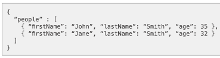
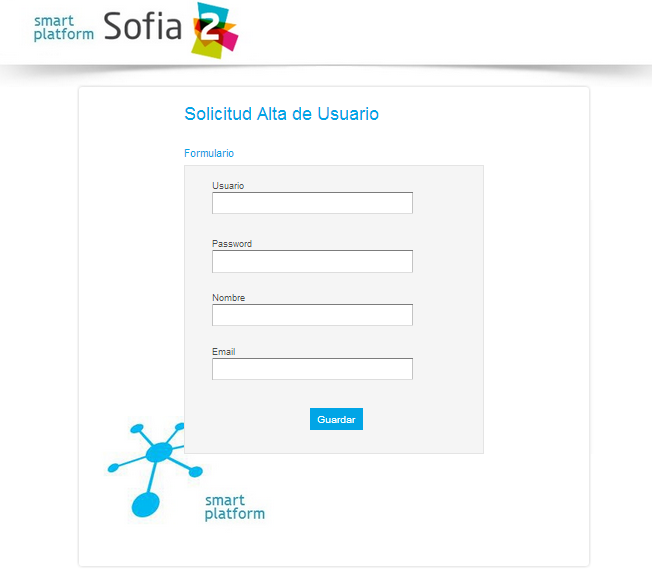
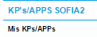
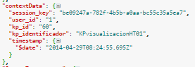
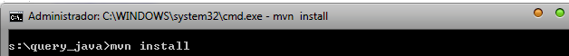

.. figure::  ./../../images/logo_sofia2_grande.png
 :align:   center
 

Cómo desarrollar sobre la plataforma Sofia2
===========================================

Para poder desarrollar aplicaciones SOFIA2 es necesaria la instalación del SDK de SOFIA2 conforme se indica en el punto  `Descarga e Instalación del SDK de SOFIA2  <primeros_pasos.html#descarga-e-instalacion-del-sdk-de-sofia2>`_

Una vez instalado el SDK de SOFIA2 los **pasos para desarrollar sobre la plataforma SOFIA** son los siguientes:

Registro en la plataforma SOFIA2
--------------------------------

La plataforma SOFIA es un entorno de interoperabilidad controlado.

Diferentes KPs intercambiarán información para interoperar.

Cada KP tiene un usuario propietario, pudiendo un mismo usuario ser propietario de varios KPs.

Alta de usuario en la plataforma
^^^^^^^^^^^^^^^^^^^^^^^^^^^^^^^^

    Un usuario puede darse de alta en la plataforma por sí mismo o por un administrador.

-  **Alta por sí mismo**: En la URL `http://sofia2.com/console/ <http://sofia2.com/console/>`__ la pantalla de **login** proporciona el enlace *crear una cuenta nueva.*

 Que redirecciona a un formulario de alta de usuario:

.. figure:: ./media/image27.png 
 :align:   center

    Dándose de alta por sí mismo, el usuario tendrá rol **USUARIO** en la plataforma, sin gozar de permisos especiales, cosa que deberá hacerse posteriormente por un administrador.

-  **Alta por administrador**: El administrador dispone en la plataforma de una sección de **Gestión de Usuarios**. Desde esta sección se proporciona al administrador de un formulario para dar de alta nuevos usuarios a la plataforma, con el rol necesario:

    |image40|

    Una vez dado de alta el usuario en la plataforma, este tendrá acceso a la misma, en función a su rol. Asimismo, como veremos más adelante, los KPs de los que el usuario sea propietario podrán establecer una sesión lógica para enviar/recibir información.

Ontologización de la información
--------------------------------

    La plataforma SOFIA propone como clave de la interoperabilidad de aplicaciones, la definición ontológica de la información que intercambian las aplicaciones.

    Una ontología es una clasificación de la información, que estandariza las propiedades de los conceptos del dominio con los que interoperarán los distintos KPs, de manera que distintos KPs trabajando con las mismas ontologías pueden intercambiar información a través de la plataforma de una manera totalmente desacoplada, mediante el intercambio de instancias de tales ontologías.

    SOFIA2 propone el intercambio de información entre KPs en formato JSON. De modo que una ontología en SOFIA2 es la especificación unívoca de un formato JSON de información, por lo que estas ontologías se definen de acuerdo a un schema JSON `**http://json-schema.org/** <http://json-schema.org/>`__.

Identificación de los conceptos de la información
^^^^^^^^^^^^^^^^^^^^^^^^^^^^^^^^^^^^^^^^^^^^^^^^^

    Consiste en identificar las entidades que agruparán los datos que intercambiarán los KPs a través de la plataforma.

    Un concepto agrupará uno o varios datos relacionados y de interés para los KP, de manera que un KP productor de información recolectará todos estos datos, los agrupará conforme a la especificación hecha en la ontología que describa tal concepto y los enviará de esta manera, normalizados a la plataforma. Mientras que un KP consumidor de información, recibirá estos datos normalizados y los explotará.

    Por ejemplo, en un SmartSpace de sensorización de una SmartCity, conceptos relevantes para ser ontologizados serian:

-  SensorTemperatura

-  SensorHumedad

-  SensorCO2

-  SensorMovimiento

-  Semaforo

-  AspersorRiego

    ·····

Identificación de los atributos de los conceptos
~~~~~~~~~~~~~~~~~~~~~~~~~~~~~~~~~~~~~~~~~~~~~~~~

    Consiste en identificar los datos agrupados por los conceptos de información y que serán relevantes para los KPs

    Por ejemplo para el concepto SensorTemperatura, se podrían considerar los siguientes atributos:

-  **IdentificadorSensor**: string

-  **Timestamp**: integer

-  **Medida**: double

-  **Unidad**: string

-  **Localización GPS**: Object

   -  **Altitud**: double

   -  **Latitud**: double

   -  **Longitud**:double

Modelado en formato JSONSchema
~~~~~~~~~~~~~~~~~~~~~~~~~~~~~~

    Identificados los datos a intercambiar, el siguiente paso es estandarizarlos para que tengan una definición unívoca para los KPs en la plataforma. En esto consiste la ontologización de la información, donde cada concepto relevante se define de acuerdo a un schema JSON.

    Por ejemplo, el concepto SensorTemperatura con los atributos identificados anteriormente se definiría en formato JSONSchema del siguiente modo:

+---------------------------------------------------------+
| **SensorTemperatura.json**                              |
+---------------------------------------------------------+
| {                                                       |
|                                                         |
| "$schema": "http://json-schema.org/draft-03/schema#",   |
|                                                         |
| "title": "SensorTemperatura Schema",                    |
|                                                         |
| "type": "object",                                       |
|                                                         |
| "properties": {                                         |
|                                                         |
| "\_id": {                                               |
|                                                         |
| "type": "object",                                       |
|                                                         |
| "$ref": "#/identificador"                               |
|                                                         |
| },                                                      |
|                                                         |
| "SensorTemperatura": {                                  |
|                                                         |
| "type": "string",                                       |
|                                                         |
| "$ref": "#/datos"                                       |
|                                                         |
| }                                                       |
|                                                         |
| },                                                      |
|                                                         |
| "identificador": {                                      |
|                                                         |
| "title": "id",                                          |
|                                                         |
| "description": "Id insertado del SensorTemperatura",    |
|                                                         |
| "type": "object",                                       |
|                                                         |
| "properties": {                                         |
|                                                         |
| "$oid": {                                               |
|                                                         |
| "type": "string",                                       |
|                                                         |
| "required": false                                       |
|                                                         |
| }                                                       |
|                                                         |
| }                                                       |
|                                                         |
| },                                                      |
|                                                         |
| "datos": {                                              |
|                                                         |
| "title": "datos",                                       |
|                                                         |
| "description": "Info SensorTemperatura",                |
|                                                         |
| "type": "object",                                       |
|                                                         |
| "properties": {                                         |
|                                                         |
| "identificador": {                                      |
|                                                         |
| "type": "string",                                       |
|                                                         |
| "required": true                                        |
|                                                         |
| },                                                      |
|                                                         |
| "timestamp": {                                          |
|                                                         |
| "type": "integer",                                      |
|                                                         |
| "minimum": 0,                                           |
|                                                         |
| "required": true                                        |
|                                                         |
| },                                                      |
|                                                         |
| "medida": {                                             |
|                                                         |
| "type": "number",                                       |
|                                                         |
| "required": true                                        |
|                                                         |
| },                                                      |
|                                                         |
| "unidad": {                                             |
|                                                         |
| "type": "string",                                       |
|                                                         |
| "required": true                                        |
|                                                         |
| },                                                      |
|                                                         |
| "LocalizacionGps": {                                    |
|                                                         |
| "required": true,                                       |
|                                                         |
| "$ref": "#/gps"                                         |
|                                                         |
| }                                                       |
|                                                         |
| }                                                       |
|                                                         |
| },                                                      |
|                                                         |
| "gps": {                                                |
|                                                         |
| "title": "gps",                                         |
|                                                         |
| "description": "Gps SensorTemperatura",                 |
|                                                         |
| "type": "object",                                       |
|                                                         |
| "properties": {                                         |
|                                                         |
| "altitud": {                                            |
|                                                         |
| "type": "number",                                       |
|                                                         |
| "required": false                                       |
|                                                         |
| },                                                      |
|                                                         |
| "latitud": {                                            |
|                                                         |
| "type": "number",                                       |
|                                                         |
| "required": true                                        |
|                                                         |
| },                                                      |
|                                                         |
| "longitud": {                                           |
|                                                         |
| "type": "number",                                       |
|                                                         |
| "required": true                                        |
|                                                         |
| }                                                       |
|                                                         |
| }                                                       |
|                                                         |
| },                                                      |
|                                                         |
| "additionalItems": false                                |
|                                                         |
| }                                                       |
+---------------------------------------------------------+

    Por lo que la información que los KPs produzcan/consuman de este tipo de sensor quedará normalizada al siguiente formato:

+---------------------------------------+
| **SensorTemperatura-instance.json**   |
+---------------------------------------+
| {                                     |
|                                       |
| "SensorTemperatura": {                |
|                                       |
| "*identificador*":"ST-TA3231-1",      |
|                                       |
| "*timestamp*":1357930309163,          |
|                                       |
| "*medida*":25.1,                      |
|                                       |
| "*unidad*":"C",                       |
|                                       |
| "localizacionGps":{                   |
|                                       |
| "*altitud*":0.0,                      |
|                                       |
| "*latitud*":40.512967,                |
|                                       |
| "*longitud*":-3.67495                 |
|                                       |
| }                                     |
|                                       |
| }                                     |
|                                       |
| }                                     |
+---------------------------------------+

Alta de la ontología en la plataforma
~~~~~~~~~~~~~~~~~~~~~~~~~~~~~~~~~~~~~

    Una ontología deberá ser registrada en la plataforma para quedar operativa y poder ser utilizada por los KPs para insertar/consumir la información descrita por la misma.

    Para ello se dispone en la plataforma de un apartado de **Gestión de Ontologías**, donde editar y dar de alta nuevas ontologías, así como su administración posterior:

|image41|

Desde la `**Guía de Uso de la Consola Web** <http://scfront.cloudapp.net/docs/SOFIA2-Guia%20de%20Uso%20de%20Consola%20Web.pdf>`__ publicada se puede consultar el detalle de la operativa relacionada con la Gestión de Ontologías.

 Desarrollo de Clientes SOFIA2 (KPs)
------------------------------------

 Un KP es cualquier aplicación que produce o consume información para colaborar con otros a través de la plataforma, formando de este modo un **Smart Space** con aquellos otros KPs con los que colabora.

 Para desarrollar un KP, aparte de programar su lógica de negocio, hay que realizar los siguientes pasos sobre la plataforma:

Alta de permisos para usuario propietario en la plataforma
~~~~~~~~~~~~~~~~~~~~~~~~~~~~~~~~~~~~~~~~~~~~~~~~~~~~~~~~~~

    Para que los KPs de un usuario puedan producir o consumir datos de una determinada ontología, el usuario deberá disponer de los permisos adecuados sobre dicha ontología.

    Una ontología registrada en la plataforma puede no ser visible para un usuario, o en caso de serlo, puede estar limitado en sus operaciones a determinados permisos.

    La plataforma proporciona a los administradores en la sección de **Gestión de usuarios > Autorizaciones**, una pantalla para administrar las autorizaciones de un usuario sobre las distintas ontologías registradas.

    |image42|

    De manera que en función del tipo de KPs que vaya a desarrollar un usuario, habrá que proporcionarle permiso de **INSERT**, **QUERY** ó **ALL** sobre la ontología que describe los datos que manejará el KP.

Alta de KP en la plataforma
~~~~~~~~~~~~~~~~~~~~~~~~~~~

    Un usuario deberá registrar en la plataforma sus KPs, de lo contrario, la plataforma rechazará la conexión de los mismos.

    Para registrar un KP, la plataforma proporciona la sección **Gestion KPs**, donde un usuario podrá crear un nuevo KP o administrar los que ya tiene dados de alta:

    |image43|

    Como vemos, un KP podrá hacer uso de una o varias ontologías, siendo esta la información que producirá o consumirá de la plataforma.

    Una vez registrado en la plataforma, el KP ya podrá establecer conexiones con la misma.

    Desde la `**Guía de Uso de la Consola Web** <http://scfront.cloudapp.net/docs/SOFIA2-Guia%20de%20Uso%20de%20Consola%20Web.pdf>`__ publicada se puede consultar el detalle de la operativa relacionada con la Gestión de KPs.

Conexión del KP con la plataforma
~~~~~~~~~~~~~~~~~~~~~~~~~~~~~~~~~

    La conexión de un KP con la plataforma debe ser vista como dos tipos de conexión

-  **Conexión Física**: Establecida por el protocolo de trasporte utilizado para la conexión por un KP (TCP/IP, MQTT, JMS, Ajax-Push…). La manera de realizar esta tipo de conexión depende en gran medida del API de KP utilizado (Java, Javascript, Arduino, C++...).

-  **Conexión Lógica**: Establecida por el protocolo SSAP (Smart Space Access Protocol) de mensajería definido en SOFIA. Es común a todos los APIs de KP.

    Nos vamos a centrar en la conexión Lógica que debe mantener un KP con la plataforma.

    Para que un KP puede conectarse a la plataforma y producir/consumir datos e interoperar con otros KP, es necesario que abra una sesión con un SIB de la plataforma.

    El protocolo SSAP proporciona dos operaciones en este sentido:

-  **JOIN**: Donde un KP informa a la plataforma el usuario y password de su propietario así sus datos de instancia, de manera que si todo es correcto, la plataforma autentica al KP y abre una sesión con el mismo.

-  **LEAVE**: Donde un KP informa a la plataforma que va a cerrar la sesión.

    Mientras exista una sesión entre el KP y la plataforma, el KP podrá utilizar el resto de operaciones del protocolo SSAP para producir/consumir información.

    Para obtener más información acerca de las Apis distribuidas por la plataforma se recomienda revisar la `**Guía de Apis SOFIA2** <http://scfront.cloudapp.net/docs/SOFIA2-APIs%20SOFIA2.pdf>`__, en donde se indica su uso e instalación.

Captación/Explotacion de la información
~~~~~~~~~~~~~~~~~~~~~~~~~~~~~~~~~~~~~~~

    Constituye parte de la lógica de negocio de un KP y es independiente de la plataforma. Depende exclusivamente de la naturaleza y propósito del KP el modo de captar la información de las distintas fuentes si es productor de información, así como su explotación una vez recibida la información si se trata de un KP consumidor.

Transformación de la información a formato ontológico
~~~~~~~~~~~~~~~~~~~~~~~~~~~~~~~~~~~~~~~~~~~~~~~~~~~~~

    Como ya se ha comentado en el presente documento la información que envíe un KP productor a la plataforma debe cumplir con el formato definido en la ontología que la representa. De manera que con tal información se deberá construir mensaje JSON que agrupe tales datos cumpliendo el ***JSONSchema*** de la ontología correspondiente, convirtiéndose de este modo los datos en una instancia de la ontología.

Envío a la plataforma según protocolo SSAP
~~~~~~~~~~~~~~~~~~~~~~~~~~~~~~~~~~~~~~~~~~

    Una vez construido el mensaje JSON con los datos a enviar a la plataforma. Se deberá construir el mensaje SSAP de INSERT correspondiente y que integrará tales datos.

    La plataforma validará que el usuario propietario del KP tiene el correspondiente permiso sobre la ontología que representan tales datos, así como que los datos cumplen con el Schema JSON de la ontología. Si hay algún problema, se notificará al KP, si todo va bien, tales datos se agregan a la base de datos de tiempo real del SIB, quedando disponible para el resto de KPs.

    Al igual que todas las operaciones SSAP, la operación INSERT está contemplada en todos los API de KP proporcionados. Para obtener más información acerca de la mensajería SSAP se recomienda revisar la `**Guía de Apis SOFIA2** <http://scfront.cloudapp.net/docs/SOFIA2-APIs%20SOFIA2.pdf>`__.

Consulta/Suscripción de la información según protocolo SSAP
~~~~~~~~~~~~~~~~~~~~~~~~~~~~~~~~~~~~~~~~~~~~~~~~~~~~~~~~~~~

    La información enviada a la plataforma por los KPs, puede ser consultada por otros KPs, bien explícitamente mediante la operación QUERY del protocolo SSAP, bien en modo suscripción a futuras entradas de información mediante la operación SUBSCRIBE.

    En ambas operaciones se indican a la plataforma los criterios de la consulta.

    En la operación **QUERY**, nos serán devueltas las instancias existentes actualmente en la base de datos de tiempo real que cumplen con los criterios de la consulta.

    En la operación **SUBSCRIBE**, la plataforma nos enviará en el futuro nuevas instancias cada vez que un KP las inserte y cumplan con los criterios de la consulta.

    SOFIA permite que las operaciones de **QUERY** puedan ser:

-  **Query de tipo** **Nativo**: cuando la query es resuelta por el motor de BDTR subyacente, siendo en la implementación de referencia *MongoDB.*

    db.SensorTemperatura.find().limit(3);

-  **Query de tipo** **SQL-Like**, cuando la query es transformada por SOFIA al lenguaje de query subyacente.

    select \* from SensorTemperatura limit 3;

    Podemos encontrar más información sobre los tipos de Query en la guía SOFIA2-APIs SOFIA2.

Recepción de la información a formato ontológico
~~~~~~~~~~~~~~~~~~~~~~~~~~~~~~~~~~~~~~~~~~~~~~~~

    Del mismo modo que un KP envía la información a la plataforma de acuerdo a una ontología, cuando un KP recibe información de la plataforma, esta información también viene en formato JSON según la ontología correspondiente, de modo que una vez extraída del mensaje SSAP correspondiente, el KP puede tratar dicha información según la definición de la ontología en el ***JSONSchema*** que la define.

Colaboración de KPs en tiempo real
----------------------------------

 Representa la colaboración entre KPs formando un ***Smart Space***. Requiere que:

-  Las ontologías representando la información a intercambiar están dadas de alta en la plataforma por medio de la ***Consola Web***.

-  Los usuarios propietarios de los distintos KPs están dados de alta en la plataforma por medio de la ***Consola Web*** y existen Tokens activos asociados a los mismos.

-  Los usuarios tienen permisos adecuados sobre las ontologías que utilizan sus KPs.

-  Los KPs **productores** y **consumidores** dados de alta en la plataforma.

-  Los KPs **productores** están funcionando:

   -  Han conectado con la plataforma con mensaje SSAP JOIN.

   -  Están captando información según su lógica de negocio.

   -  Transforman la información captada a ontología correspondiente.

   -  Insertan la información en la plataforma con mensajes SSAP INSERT.

-  KPs **consumidores** funcionando:

   -  Han conectado a la plataforma con mensaje SSAP JOIN

   -  Están recuperando información de la plataforma:

      -  Explícitamente mediante SSAP QUERY.

      -  En modo suscripción mediante SSAP SUBSCRIBE.

   -  Explotan la información según su lógica de negocio.

Ejemplo Práctico
----------------

A continuación vamos a desarrollar un ejemplo práctico siguiendo los pasos descritos.

En nuestro ejemplo vamos a desarrollar dos KPs que intercambiarán información proveniente de un sensor de luz.

Gráficamente:

|image44|

Donde:

    **Ontología *LuminositySensor*:** Representa de manera normalizada en formato JSON la información de un sensor de luz.

-  **KP Productor:** KP ejecutado en una placa Arduino. Utilizará el API Arduino de SOFIA. Este KP tendrá conectado un sensor fotovoltaico a una de las entradas analógicas de la placa.

    El KP realizará una operación SSAP de JOIN para abrir una sesión con el SIB de la plataforma, y una vez conectado, periódicamente consultará el valor de la entrada analógica del sensor de luz y compondrá un mensaje SSAP de INSERT para enviar al SIB una instancia de la ontología *LuminositySensor* con dicho valor.

-  **KP Consumidor:** Página HTML que se ejecutada sobre un navegador web. Utilizará el API Javascript de SOFIA.

    Este KP realizará una operación SSAP de JOIN para abrir una sesión con el SIB de la plataforma, y una vez conectado, enviará al SIB una operación SSAP de SUBSCRIBE, para ser notificado cuando el KP Productor envíe al SIB nuevas instancias de la ontología *LuminositySensor*.

    Una vez suscrito, el KP utilizará las notificaciones del SIB para representar en una gráfica la evolución de la luminosidad.

A continuación vamos a construir paso por paso el escenario descrito:

Alta de usuario en la plataforma
^^^^^^^^^^^^^^^^^^^^^^^^^^^^^^^^

Daremos de alta un único usuario, que será propietario de ambos KPs. Llamaremos a este usuario *sensorizacionLuminosidad*\ **.**

Entramos en la plataforma y pulsamos **solicita un nuevo usuario:**

|image45|

A continuación introducimos los datos del usuario en el formulario de alta:

|image46|

Una vez dado de alta por esta vía, el usuario tendrá rol **ROL\_USUARIO**, con el cual podrá crear sus propios KPs sobre ontologías sobre las que está suscrito, pero no será lo suficientemente autónomo para poder ejecutar este ejemplo práctico dado que se necesita crear un KP productos de información. Para poder obtener los privilegios oportunos, un usuario con **ROL\_ADMINISTRADOR** deberá incrementar su nivel de control sobre la plataforma a **ROL\_COLABORADOR** o **ROL\_ADMINISTRADOR**.

En nuestro caso le daremos **ROL\_COLABORADOR** como se indica en la `**Guía de Uso de la Consola Web** <http://scfront.cloudapp.net/docs/SOFIA2-Guia%20de%20Uso%20de%20Consola%20Web.pdf>`__:

    |image47|

 De este modo, a partir de ahora, nuestro usuario *sensorizacionLuminosidad* será lo suficientemente autónomo sobre la plataforma para poner en marcha sus KPs.
 

Ontologización de la información
^^^^^^^^^^^^^^^^^^^^^^^^^^^^^^^^

Para el escenario descrito, identificamos un único concepto: **LuminositySensor**, al que dotaremos de los siguientes atributos:

-  **Identificador**: Identificación del Sensor String

-  **Timestamp**: momento de la medición integer

-  **Medida**: Valor en lúmenes de la medición integer

-  **Unidad**: Unidad del valor medida (Lumen) String

    Una vez identificadas estas propiedades, podemos construir el *JSONSchema* de la ontología que las describe:

+---------------------------------------------------------+
| **LuminositySensor.json**                               |
+---------------------------------------------------------+
| {                                                       |
|                                                         |
| "$schema": "http://json-schema.org/draft-03/schema#",   |
|                                                         |
| "title": "LuminositySensor Schema",                     |
|                                                         |
| "type": "object",                                       |
|                                                         |
| "properties": {                                         |
|                                                         |
| "\_id": {                                               |
|                                                         |
| "type": "object",                                       |
|                                                         |
| "$ref": "#/identificador"                               |
|                                                         |
| },                                                      |
|                                                         |
| " LuminositySensor ": {                                 |
|                                                         |
| "type": "string",                                       |
|                                                         |
| "$ref": "#/datos"                                       |
|                                                         |
| }                                                       |
|                                                         |
| },                                                      |
|                                                         |
| "identificador": {                                      |
|                                                         |
| "title": "id",                                          |
|                                                         |
| "description": "Id insertado del LuminositySensor ",    |
|                                                         |
| "type": "object",                                       |
|                                                         |
| "properties": {                                         |
|                                                         |
| "$oid": {                                               |
|                                                         |
| "type": "string",                                       |
|                                                         |
| "required": false                                       |
|                                                         |
| }                                                       |
|                                                         |
| }                                                       |
|                                                         |
| },                                                      |
|                                                         |
| "datos": {                                              |
|                                                         |
| "title": "datos",                                       |
|                                                         |
| "description": "Info LuminositySensor ",                |
|                                                         |
| "type": "object",                                       |
|                                                         |
| "properties": {                                         |
|                                                         |
| "identificador": {                                      |
|                                                         |
| "type": "string",                                       |
|                                                         |
| "required": true                                        |
|                                                         |
| },                                                      |
|                                                         |
| "timestamp": {                                          |
|                                                         |
| "type": "integer",                                      |
|                                                         |
| "minimum": 0,                                           |
|                                                         |
| "required": true                                        |
|                                                         |
| },                                                      |
|                                                         |
| "medida": {                                             |
|                                                         |
| "type": "number",                                       |
|                                                         |
| "required": true                                        |
|                                                         |
| },                                                      |
|                                                         |
| "unidad": {                                             |
|                                                         |
| "type": "string",                                       |
|                                                         |
| "required": true                                        |
|                                                         |
| }                                                       |
|                                                         |
| }                                                       |
|                                                         |
| },                                                      |
|                                                         |
| "additionalItems": false                                |
|                                                         |
| }                                                       |
+---------------------------------------------------------+

    Y damos de alta la ontología en la plataforma en la sección **Gestión Ontologías** como se indica en la `**Guía de Uso de la Consola Web** <http://scfront.cloudapp.net/docs/SOFIA2-Guia%20de%20Uso%20de%20Consola%20Web.pdf>`__.

    Para ello nombramos la ontología con el nombre **LuminositySensor**, la marcamos como **Activa**, para que el SIB admita su utilización y dependiendo de si queremos que pueda ser utilizada o no por otros usuarios, la marcaremos Pública o no. Adicionalmente podremos darle una descripción:

    |image48|

    Una vez dada de alta se mostrará la siguiente pantalla y estará disponible para su futura administración en la sección **Gestión Ontologías** de la `**Consola Web** <http://scfront.cloudapp.net/console/>`__:

    |image49|

Desarrollo de KP productor de información
^^^^^^^^^^^^^^^^^^^^^^^^^^^^^^^^^^^^^^^^^

    En el desarrollo de nuestro KP deberíamos empezar por dar permisos de **INSERT** a nuestro usuario para la ontología a ***LuminositySensor*** como se indica en la `**Guía de uso de la Consola Web** <http://scfront.cloudapp.net/docs/SOFIA2-Guia%20de%20Uso%20de%20Consola%20Web.pdf>`__. En nuestro caso, el usuario propietario del KP es también propietario de la ontología que utilizará el KP, por lo que no es necesario dar permiso de INSERT al usuario, ya que tiene todos los permisos.

    El siguiente paso es dar de alta el KP en la plataforma. Para ello en la sección **Gestión KPs** creamos un nuevo KP como se indica en la `**Guía de uso de la Consola Web** <http://scfront.cloudapp.net/docs/SOFIA2-Guia%20de%20Uso%20de%20Consola%20Web.pdf>`__ con la siguiente información:

    |image50|

Donde:

+-----------------------+----------------------------------------------------------------------+
| **Identificacion**    | **Nombre del KP**                                                    |
+=======================+======================================================================+
| **Clave cifrado**     | **Clave de cifrado XXTEA para comunicaciones cifradas con el SIB**   |
+-----------------------+----------------------------------------------------------------------+
| **Descripcion**       | **Texto descriptivo del propósito del KP**                           |
+-----------------------+----------------------------------------------------------------------+
| **Ontologias**        | **Ontologías a utilizar por el KP**                                  |
+-----------------------+----------------------------------------------------------------------+
| **Metainformacion**   | **Pares clave valor con información adicional del KP**               |
+-----------------------+----------------------------------------------------------------------+

    Una vez dado de alta, quedará disponible para ser administrado en el futuro en la sección **Gestión KPs**

|image51|

    Lo siguiente en el desarrollo de nuestro KP productor de información es la programación del mismo. Para obtener más información de cómo desarrollar un KP se recomienda ver la `**Guía de Apis SOFIA2** <http://scfront.cloudapp.net/docs/SOFIA2-APIs%20SOFIA2.pdf>`__.

    Al ser nuestro KP productor una aplicación que se ejecutará sobre una placa **Arduino** estará desarrollada en el lenguaje de Arduino.

    |image52|

    **Arduino** es un **microcontrolador** cuya lógica de programación gira en torno a dos funciones:

-  **Setup():** Invocada una única vez al arrancar el microcontrolador. Su propósito es realizar tareas de configuración.

-  **Loop():** Invocada iterativamente (cuando finaliza, se vuelve a invocar). Recoge la lógica de negocio del microcontrolador.

    Bajo esta filosofía de programación, abriremos una **sesión al SIB** de la plataforma mediante el mensaje SSAP **JOIN**. Para esto utilizaremos el API Arduino. Este API nos proporciona las siguientes utilidades:

-  **Conector KP MQTT** (KPMqtt.h) para establecer una conexión física con el SIB de la plataforma a través de la que enviar los mensajes SSAP.

-  **API para la generación y parseo de mensajes SSAP** sin tener que construir los mensajes JSON directamente (SSAPMessageGenerator.h y SSAPBodyReturnMessage.h).

    Con estas utilidades, el establecimiento de la conexión física por MQTT y la posterior conexión lógica mediante el mensaje SSAP JOIN se realizaría del siguiente modo:

|image53|

    Una vez conectados a la plataforma, el siguiente paso será la captación de datos y la ontologización de los mismos para insertarlos en el SIB mediante el correspondiente mensaje de INSERT.

    La captación de datos de nuestro KP consiste en leer la entrada analógica del sensor fotovoltaico en cada iteración de la función Loop():

    |image54|

    Una vez captados los datos, hay que proceder a convertirlos a la ontología **LuminositySensor** para enviarlos normalizados a la plataforma.

    Aquí tendríamos dos opciones:

-  Construir una clase *LuminositySensor* con los métodos get y set de sus atributos y una función toJson() que devuelva el JSON de la instancia.

-  Construir el JSON directamente como un String concatenándole el valor de la medición.

    Dada la sencillez de la ontología, optamos por la segunda opción:

    |image55|

    Una vez construida la instancia de la ontología con el valor recogido, procedemos a enviarla a la plataforma mediante el correspondiente mensaje SSAP **INSERT**. Para ello volvemos a utilizar el API Arduino:

    |image56|

    El código completo del KP productor puede verse aquí:

+----------------------------------------------------------------------------------------------------------------------------------+
| **KP\_LuminositySensor.ino**                                                                                                     |
+----------------------------------------------------------------------------------------------------------------------------------+
| #include <SSAPMessageGenerator.h>                                                                                                |
|                                                                                                                                  |
| #include <SSAPBodyReturnMessage.h>                                                                                               |
|                                                                                                                                  |
| #include <SPI.h>                                                                                                                 |
|                                                                                                                                  |
| #include <PubSubClient.h>                                                                                                        |
|                                                                                                                                  |
| #include <Ethernet.h>                                                                                                            |
|                                                                                                                                  |
| #include <KPMqtt.h>                                                                                                              |
|                                                                                                                                  |
| #include <LightSensor.h>                                                                                                         |
|                                                                                                                                  |
| byte mac[] = { 0x00, 0xAA, 0xBB, 0xCC, 0xDE, 0x01 };                                                                             |
|                                                                                                                                  |
| IPAddress ip( 192, 168, 10, 129 ); // My Ip                                                                                      |
|                                                                                                                                  |
| byte serverIp[] = { 192, 168, 10, 128 }; // Server Ip                                                                            |
|                                                                                                                                  |
| boolean joined=false;                                                                                                            |
|                                                                                                                                  |
| ConnectionConfig config;                                                                                                         |
|                                                                                                                                  |
| KPMqtt kp;                                                                                                                       |
|                                                                                                                                  |
| SSAPMessageGenerator ssapGenerator;                                                                                              |
|                                                                                                                                  |
| int photoSensorPinIn = 0;//A0 input3                                                                                             |
|                                                                                                                                  |
| void setup() {                                                                                                                   |
|                                                                                                                                  |
| Serial.begin( 9600 );                                                                                                            |
|                                                                                                                                  |
| config.setLocalMac(mac);                                                                                                         |
|                                                                                                                                  |
| config.setLocalIp(&ip);                                                                                                          |
|                                                                                                                                  |
| config.setServerIp(serverIp);                                                                                                    |
|                                                                                                                                  |
| kp.setClientId("Arduino");                                                                                                       |
|                                                                                                                                  |
| kp.setConnectionConfig(&config);                                                                                                 |
|                                                                                                                                  |
| }                                                                                                                                |
|                                                                                                                                  |
| SSAPMessage joinMessage;                                                                                                         |
|                                                                                                                                  |
| void loop() {                                                                                                                    |
|                                                                                                                                  |
| Serial.println("new Loop");                                                                                                      |
|                                                                                                                                  |
| if(!joined){                                                                                                                     |
|                                                                                                                                  |
| join();                                                                                                                          |
|                                                                                                                                  |
| }                                                                                                                                |
|                                                                                                                                  |
| if(joined){                                                                                                                      |
|                                                                                                                                  |
| meterValues();                                                                                                                   |
|                                                                                                                                  |
| }                                                                                                                                |
|                                                                                                                                  |
| Serial.println("End of Loop");                                                                                                   |
|                                                                                                                                  |
| delay(1000);                                                                                                                     |
|                                                                                                                                  |
| }                                                                                                                                |
|                                                                                                                                  |
| void join(){                                                                                                                     |
|                                                                                                                                  |
| if(!kp.isConnected()){                                                                                                           |
|                                                                                                                                  |
| Serial.println("connect");                                                                                                       |
|                                                                                                                                  |
| kp.connect();                                                                                                                    |
|                                                                                                                                  |
| }                                                                                                                                |
|                                                                                                                                  |
| Serial.println("Send join");                                                                                                     |
|                                                                                                                                  |
| joinMessage=ssapGenerator.generateJoinMessage("sensorizacionLuminosidad", "slum2013", "ProductorLuminosidad:prod01");            |
|                                                                                                                                  |
| SSAPMessage joinResponse=kp.send(&joinMessage);                                                                                  |
|                                                                                                                                  |
| if(&joinResponse!=NULL){                                                                                                         |
|                                                                                                                                  |
| char\* bodyJoin=joinMessage.getBody();                                                                                           |
|                                                                                                                                  |
| delete[] bodyJoin;                                                                                                               |
|                                                                                                                                  |
| char\* responseBody=joinResponse.getBody();                                                                                      |
|                                                                                                                                  |
| SSAPBodyReturnMessage bodyMessage=SSAPBodyReturnMessage::fromJSonToSSAPMessage(responseBody);                                    |
|                                                                                                                                  |
| if(bodyMessage.isOk()){                                                                                                          |
|                                                                                                                                  |
| joined=true;                                                                                                                     |
|                                                                                                                                  |
| }else{                                                                                                                           |
|                                                                                                                                  |
| joined=false;                                                                                                                    |
|                                                                                                                                  |
| }                                                                                                                                |
|                                                                                                                                  |
| delete[] bodyMessage.getData();                                                                                                  |
|                                                                                                                                  |
| delete[] bodyMessage.getError();                                                                                                 |
|                                                                                                                                  |
| delete[] responseBody;                                                                                                           |
|                                                                                                                                  |
| delete[] joinResponse.getSessionKey();                                                                                           |
|                                                                                                                                  |
| delete[] joinResponse.getMessageId();                                                                                            |
|                                                                                                                                  |
| delete[] joinResponse.getOntology();                                                                                             |
|                                                                                                                                  |
| }                                                                                                                                |
|                                                                                                                                  |
| }                                                                                                                                |
|                                                                                                                                  |
| char sensorJson[100];                                                                                                            |
|                                                                                                                                  |
| char strLightRead[4];                                                                                                            |
|                                                                                                                                  |
| SSAPMessage insertMessage;                                                                                                       |
|                                                                                                                                  |
| void meterValues(){                                                                                                              |
|                                                                                                                                  |
| Serial.println("MeterValues");                                                                                                   |
|                                                                                                                                  |
| //meter Luminosity                                                                                                               |
|                                                                                                                                  |
| int lightRead = analogRead( photoSensorPinIn );                                                                                  |
|                                                                                                                                  |
| //Generates Luminosity sensor JSon                                                                                               |
|                                                                                                                                  |
| itoa(lightRead, strLightRead, 10);                                                                                               |
|                                                                                                                                  |
| strcpy(sensorJson, "{\\"LuminositySensor\\":{ \\"identificador\\":\\"Luminosity001\\", \\"timestamp\\" : 1 , \\"medida\\" :");   |
|                                                                                                                                  |
| strcat(sensorJson, strLightRead);                                                                                                |
|                                                                                                                                  |
| strcat(sensorJson, " , \\"unidad\\" : \\"lumen\\"}}");                                                                           |
|                                                                                                                                  |
| Serial.print("Instancia LuminositySensor enviada: ");                                                                            |
|                                                                                                                                  |
| Serial.println(sensorJson);                                                                                                      |
|                                                                                                                                  |
| //Generates new SSAP INSERT message                                                                                              |
|                                                                                                                                  |
| insertMessage = ssapGenerator.generateInsertMessage(kp.getSessionKey(), "LuminositySensor", sensorJson);                         |
|                                                                                                                                  |
| //Send the message to the SIB                                                                                                    |
|                                                                                                                                  |
| SSAPMessage insertResponse=kp.send(&insertMessage);                                                                              |
|                                                                                                                                  |
| char\* responseBody=insertResponse.getBody();                                                                                    |
|                                                                                                                                  |
| //Free responseBody char\*                                                                                                       |
|                                                                                                                                  |
| delete[] responseBody;                                                                                                           |
|                                                                                                                                  |
| //Free json char\* memory                                                                                                        |
|                                                                                                                                  |
| //delete[] sensorJson;                                                                                                           |
|                                                                                                                                  |
| //delete[] jsonPrefix;                                                                                                           |
|                                                                                                                                  |
| // delete[] strLightRead;                                                                                                        |
|                                                                                                                                  |
| //delete[] jsonSufix;                                                                                                            |
|                                                                                                                                  |
| delete[] insertMessage.getSessionKey();                                                                                          |
|                                                                                                                                  |
| delete[] insertMessage.getBody();                                                                                                |
|                                                                                                                                  |
| delete[] insertMessage.getOntology();                                                                                            |
|                                                                                                                                  |
| delete[] insertResponse.getSessionKey();                                                                                         |
|                                                                                                                                  |
| delete[] insertResponse.getMessageId();                                                                                          |
|                                                                                                                                  |
| delete[] insertResponse.getOntology();                                                                                           |
|                                                                                                                                  |
| }                                                                                                                                |
+----------------------------------------------------------------------------------------------------------------------------------+

Desarrollo de KP consumidor de información
^^^^^^^^^^^^^^^^^^^^^^^^^^^^^^^^^^^^^^^^^^

    Al igual que con el KP Productor, en el desarrollo de nuestro KP consumidor deberíamos empezar por dar permiso de **QUERY** a nuestro usuario para la ontología **LuminositySensor**. Pero de nuevo el usuario propietario del KP es también propietario de la ontología que utilizará, por lo que no es necesario dar tal permiso, ya que nuestro usuario tiene todos los permisos. En caso de utilizar otra ontología de la que el usuario no fuera propietario, un administrador debería dotar al usuario de tal permiso tal como se indicó en punto 3.3.1

    El siguiente paso es dar de alta el KP en la plataforma. Para ello en la sección **Gestión KPs** creamos un nuevo KP con la siguiente información:

    |image57|

    Donde:

+-----------------------+----------------------------------------------------------------------+
| **Identificación**    | **Nombre del KP**                                                    |
+=======================+======================================================================+
| **Clave cifrado**     | **Clave de cifrado XXTEA para comunicaciones cifradas con el SIB**   |
+-----------------------+----------------------------------------------------------------------+
| **Descripción**       | **Texto descriptivo del propósito del KP**                           |
+-----------------------+----------------------------------------------------------------------+
| **Ontologías**        | **Ontologías a utilizar por el KP**                                  |
+-----------------------+----------------------------------------------------------------------+
| **Metainformación**   | **Pares clave valor con información adicional del KP**               |
+-----------------------+----------------------------------------------------------------------+

    Una vez dado de alta, quedará disponible para ser administrado en el futuro en la sección **Gestión KPs** junto al KP Productor que dimos de alta en el paso anterior:

|image58|

    Lo siguiente en el desarrollo de nuestro KP consumidor de información es la programación del mismo. Para obtener más información de cómo desarrollar un KP se recomienda ver la `**Guía de Apis SOFIA2** <http://scfront.cloudapp.net/docs/SOFIA2-APIs%20SOFIA2.pdf>`__.

    Al ser un KP que se ejecutará en un navegador, estará desarrollado en **HTML** y **Javascript**, por lo que utilizaremos el API JavaScript SOFIA. Este API nos proporciona la abstracción necesaria para interactuar con el SIB de SOFIA mediante funciones para todas las operaciones SSAP.

-  **join(user, pass, instance, joinResponse)**: Envía al SIB un mensaje SSAP de JOIN con el usuario/password/instancia indicado por parámetros. Recibe la respuesta en la función callback pasada en el argumento joinResponse.

-  **leave(leaveResponse)**: Envía al SIB un mensaje SSAP de LEAVE. Recibe la respuesta en la función callback pasada en el argumento leaveResponse.

-  **insert(data, ontology, insertResponse)**: Envía al SIB un mensaje SSAP de INSERT con los datos y ontología pasados en los respectivos argumentos. Recibe la respuesta en la función callback pasada en el argumento insertResponse

-  **query(query, ontology, queryResponse)**: Envía al SIB un mensaje SSAP de QUERY para la condición y ontología indicados en los respectivos parámetros. Recibe la respuesta en la función callback pasada en el argumento queryResponse.

-  **subscribe(suscription, ontology, refresh)**: Envía al SIB un mensaje SSAP SUBSCRIBE para la condición, ontología y tiempo de refresco indicado en los respectivos argumentos.

-  **unsubscribe(querySubs, unsubscribeResponse, unsubscribeMessages)**: Envia al SIB un mensaje SSAP UNSUBSCRIBE para la condición indicada en el parámetro querySubs. Recibe la respuesta en la función callback pasada en el argumento unsubscribeResponse. Si se produce algún error, se notificará a través de la función callback pasada en el argumento unsubscribeMessages.

    Nuestro KP HTML se compondrá de:

-  Un formulario para hacer JOIN/LEAVE al SIB

   -  Textfield nombre usuario.

   -  Textfield password usuario.

   -  Textfield instancia KP.

   -  Botón JOIN.

   -  Botón LEAVE.

-  Un formulario para hacer SUBSCRIBE/UNSUBSCRIBE sobre la ontología *LuminositySensor*.

   -  Textfield condición de suscripción.

   -  Textfield periodo de refresco.

   -  Botón SUBSCRIBE.

   -  Botón UNSUBSCRIBE.

-  Una gráfica que mostrará la evolución de los datos de luminosidad que se reciban como notificaciones de la suscripción.

    |image59|

    La conexión/desconexión al SIB, como hemos comentado, se realiza con los botones mostrados en la imagen anterior. El código html es el siguiente:

|image60|

    A continuación mostramos las funciones **conectarSIB** y **desconectarSIB** invocadas por tales botones y que hacen uso del API JavaScript SOFIA:

    |image61|

    La suscripción a la información insertada en el SIB por el KP productor la hacemos de igual modo con un formulario de suscripción. El código html del formulario es el siguiente:

|image62|

    Este formulario tiene una combo para seleccionar si nos suscribiremos a un valor de luminosidad mayor, menor o igual al un valor indicado en otro campo. Además incluye un nuevo campo para indicar el periodo de refresco de la suscripción. Y los botones para lanzar tanto la suscripción como la desuscripción.

    A continuación mostramos las funciones **suscribirSIB()** y **desuscribirSIB()** invocadas por tales botones:

|image63|

    Finalmente, una vez suscritos a la información falta implementar la recepción de las notificaciones desde el SIB para poder explotar tal información.

Para esto, el API JavaScript nos obliga a implementar la siguiente función:

    **function** indicationForSubscription(ssapMessageJson, sourceQuery)

    En ella recibimos un mensaje SSAP de tipo INDICATION, en cuyo atributo **body** tendremos la instancia de la ontología a la que nos suscrito y que ha cumplido los criterios de la query. Por lo que lo único que tendremos que hacer es extraer tal información del campo body y procesarla para pintarla en la gráfica:

    |image64|

    El código completo del KP consumidor puede verse aquí:

+----------------------------------------------------------------------------------------------------------------------------------------------------------------+
| **KP\_LuminosityJavascript.html**                                                                                                                              |
+----------------------------------------------------------------------------------------------------------------------------------------------------------------+
| <!DOCTYPE html PUBLIC "-//W3C//DTD HTML 4.01 Transitional//EN" "http://www.w3.org/TR/html4/loose.dtd">                                                         |
|                                                                                                                                                                |
| <html>                                                                                                                                                         |
|                                                                                                                                                                |
| <head>                                                                                                                                                         |
|                                                                                                                                                                |
| <meta http-equiv="Content-Type" content="text/html; charset=UTF-8">                                                                                            |
|                                                                                                                                                                |
| <title>KP Consumidor</title>                                                                                                                                   |
|                                                                                                                                                                |
| <link rel="stylesheet" type="text/css" href="styles/standard.css" />                                                                                           |
|                                                                                                                                                                |
|                                                                                                   |
|                                                                                                                                                                |
|                                                           |
|                                                                                                                                                                |
|                                                                     |
|                                                                                                                                                                |
|                                                                       |
|                                                                                                                                                                |
|                                                       |
|                                                                                                                                                                |
|                                                                                                      |
|                                                                                                                                                                |
|                                                                                             |
|                                                                                                                                                                |
|                                                                                                                                                       |
|                                                                                                                                                                |
|                                                                                                                                                        |
|                                                                                                                                                                |
| <head>                                                                                                                                                         |
|                                                                                                                                                                |
| <body>                                                                                                                                                         |
|                                                                                                                                                                |
|                                                                                     |
|                                                                                                                                                                |
| <h4>Connect / Disconnect to SIB </h4>                                                                                                                          |
|                                                                                                                                                                |
| <table>                                                                                                                                                        |
|                                                                                                                                                                |
| <tr style="border:none;">                                                                                                                                      |
|                                                                                                                                                                |
| <td align="right" style="border:none;">                                                                                                                        |
|                                                                                                                                                                |
| <b>User:</b>                                                                                                                                                   |
|                                                                                                                                                                |
| <input type="text" id="user" size="10" style="margin:8px" value="sensorizacionLuminosidad"></input>                                                            |
|                                                                                                                                                                |
| </td>                                                                                                                                                          |
|                                                                                                                                                                |
| <td align="center" style="border:none;">                                                                                                                       |
|                                                                                                                                                                |
| <b>Password:</b>                                                                                                                                               |
|                                                                                                                                                                |
| <input type="text" id="pass" size="10" style="margin:8px" value="slum2013"></input>                                                                            |
|                                                                                                                                                                |
| </td>                                                                                                                                                          |
|                                                                                                                                                                |
| <td align="left" style="border:none;">                                                                                                                         |
|                                                                                                                                                                |
| <b>Instance:</b>                                                                                                                                               |
|                                                                                                                                                                |
| <input type="text" id="inst" size="10" style="margin:8px" value="ConsumidorLuminosidad:Clm01"></input>                                                         |
|                                                                                                                                                                |
| </td>                                                                                                                                                          |
|                                                                                                                                                                |
| </tr>                                                                                                                                                          |
|                                                                                                                                                                |
| <tr style="border:none;">                                                                                                                                      |
|                                                                                                                                                                |
| <td colspan="3" align="center" style="border:none;">                                                                                                           |
|                                                                                                                                                                |
| <input type="button" size="40" style="margin:4px" value="Connect SIB" onclick='conectarSIB($("#user").val(), $("#pass").val(), $("#inst").val());' ></input>   |
|                                                                                                                                                                |
| <input type="button" size="40" style="margin:4px" value="Disconnect SIB" onclick='desconectarSIB()'></input>                                                   |
|                                                                                                                                                                |
| </td>                                                                                                                                                          |
|                                                                                                                                                                |
| </tr>                                                                                                                                                          |
|                                                                                                                                                                |
| </table>                                                                                                                                                       |
|                                                                                                                                                                |
| <h4>Suscription</h4>                                                                                                                                           |
|                                                                                                                                                                |
| <table>                                                                                                                                                        |
|                                                                                                                                                                |
| <tr style="border:none;">                                                                                                                                      |
|                                                                                                                                                                |
| <td style="border:none;">                                                                                                                                      |
|                                                                                                                                                                |
| <b>Suscripci�n:</b>                                                                                                                                            |
|                                                                                                                                                                |
| <select id="suscripcion" style="margin:4px">                                                                                                                   |
|                                                                                                                                                                |
| <option value="gt" selected="selected">L lm &gt;</option>                                                                                                      |
|                                                                                                                                                                |
| <option value="lt">L lm &lt;</option>                                                                                                                          |
|                                                                                                                                                                |
| <option value=":">L lm &#61;</option>                                                                                                                          |
|                                                                                                                                                                |
| </select>                                                                                                                                                      |
|                                                                                                                                                                |
| </td>                                                                                                                                                          |
|                                                                                                                                                                |
| <td style="border:none;">                                                                                                                                      |
|                                                                                                                                                                |
| <b>LuminositySensor (lm): </b>                                                                                                                                 |
|                                                                                                                                                                |
| <input type="text" id="valor" size="2" value="1" style="margin:8px" />                                                                                         |
|                                                                                                                                                                |
| </td>                                                                                                                                                          |
|                                                                                                                                                                |
| <td style="border:none;">                                                                                                                                      |
|                                                                                                                                                                |
| <b>Refreshment (ms): </b>                                                                                                                                      |
|                                                                                                                                                                |
| <input type="text" id="refresco" size="5" style="margin:8px" value="1000"/>                                                                                    |
|                                                                                                                                                                |
| </td>                                                                                                                                                          |
|                                                                                                                                                                |
| </tr>                                                                                                                                                          |
|                                                                                                                                                                |
| <tr style="border:none;">                                                                                                                                      |
|                                                                                                                                                                |
| <td colspan="3" align="center" style="border:none;">                                                                                                           |
|                                                                                                                                                                |
| <input type="button" value="Start" style="margin:4px" onclick='suscribirSIB($("#suscripcion").val(),$("#valor").val(),$("#refresco").val());'/>                |
|                                                                                                                                                                |
| <input type="button" value="Stop" style="margin:4px" onclick='desuscribirSIB($("#suscripcion").val(),$("#valor").val());'/>                                    |
|                                                                                                                                                                |
| </td>                                                                                                                                                          |
|                                                                                                                                                                |
| </tr>                                                                                                                                                          |
|                                                                                                                                                                |
| <tr style="border:none;">                                                                                                                                      |
|                                                                                                                                                                |
| <td colspan="3" align="center" style="border:none;">                                                                                                           |
|                                                                                                                                                                |
| <b id="info" style="color:Crimson;margin-top:10px;display:none;" />                                                                                            |
|                                                                                                                                                                |
| </td>                                                                                                                                                          |
|                                                                                                                                                                |
| </tr>                                                                                                                                                          |
|                                                                                                                                                                |
| </table>                                                                                                                                                       |
|                                                                                                                                                                |
| <h4>Real time luminosity</h4>                                                                                                                                  |
|                                                                                                                                                                |
| <table>                                                                                                                                                        |
|                                                                                                                                                                |
| <tr>                                                                                                                                                           |
|                                                                                                                                                                |
| <td style="padding-right:2px;">                                                                                                                                |
|                                                                                                                                                                |
| 

</td>                                                                                       |
|                                                                                                                                                                |
| </tr>                                                                                                                                                          |
|                                                                                                                                                                |
| </table>                                                                                                                                                       |
|                                                                                                                                                                |
| </body>                                                                                                                                                        |
|                                                                                                                                                                |
| </html>                                                                                                                                                        |
+----------------------------------------------------------------------------------------------------------------------------------------------------------------+

Ejecución
^^^^^^^^^

    Una vez realizados todos los pasos anteriores, lo siguiente es comprobar que todo funciona correctamente. Para ello:

-  Arrancar Plataforma SOFIA

-  Cargar el programa del KP Productor en Arduino y arrancarlo.

   -  Este KP auto-conecta al SIB al arrancar y empieza a enviar datos No es necesario hacer nada más.

|image65|

-  Abrir KP Consumidor con navegador web

   -  Conectar al SIB: Basta con pulsar el botón **ConnectSIB**

|image66|

-  Suscribirse: Basta con pulsar el botón **Start**

|image67|

-  Comprobar que en la gráfica se muestran los datos enviados por el KP productor. El efecto será automático en el momento que se lance la suscripción si el KP Productor está enviando datos al SIB.

|image68|

.. |image0| image:: ./media/image2.png
   :width: 2.15625in
   :height: 0.98958in
.. |image1| image:: ./media/image3.png
   :width: 1.40764in
   :height: 0.45556in
.. |image2| image:: ./media/image4.png
   :width: 1.61458in
   :height: 0.66667in
.. |image3| image:: ./media/image5.png
   :width: 1.31250in
   :height: 2.22917in
.. |image4| image:: ./media/image6.png
   :width: 0.83333in
   :height: 0.25000in
.. |image5| image:: ./media/image7.png
   :width: 0.46875in
   :height: 0.19792in
.. |image6| image:: ./media/image8.png
   :width: 0.52083in
   :height: 0.18750in
.. |image7| image:: ./media/image9.png
   :width: 0.46875in
   :height: 0.21875in
.. |image8| image:: ./media/image10.png
   :width: 0.66667in
   :height: 0.21875in
.. |image9| image:: ./media/image11.png
   :width: 0.78125in
   :height: 0.19792in
.. |image10| image:: ./media/image12.png
   :width: 0.45833in
   :height: 0.22917in
.. |image11| image:: ./media/image13.png
   :width: 0.97917in
   :height: 0.21875in
.. |image12| image:: ./media/image14.png
   :width: 0.72917in
   :height: 0.22917in
.. |image13| image:: ./media/image15.png
   :width: 1.62500in
   :height: 0.86458in
.. |image14| image:: ./media/image16.png
   :width: 0.64583in
   :height: 0.22917in
.. |image15| image:: ./media/image17.png
   :width: 1.61458in
   :height: 1.04167in

.. |image17| image:: ./media/image19.png
   :width: 6.50000in
   :height: 1.67708in

.. |image20| image:: ./media/image20.png
   :width: 6.19792in
   :height: 1.14583in
.. |image21| image:: ./media/image21.png
   :width: 6.50000in
   :height: 3.46875in
.. |image22| image:: ./media/image22.png
   :width: 2.61458in
   :height: 1.33333in
.. |image23| image:: ./media/image23.png
   :width: 6.20833in
   :height: 1.09375in
.. |image24| image:: ./media/image24.png
   :width: 3.94792in
   :height: 4.75000in
.. |image25| image:: ./media/image25.png
   :width: 6.21875in
   :height: 1.10417in
.. |image26| image:: ./media/image26.png
   :width: 5.48958in
   :height: 2.12500in
.. |image27| image:: ./media/image27.png
   :width: 6.48958in
   :height: 0.72917in

.. |image29| image:: ./media/image29.png
   :width: 1.38542in
   :height: 0.22917in
.. |image30| image:: ./media/image30.png
   :width: 2.04167in
   :height: 0.18750in

.. |image32| image:: ./media/image32.png
   :width: 3.01042in
   :height: 3.76042in

.. |image34| image:: ./media/image34.png
   :width: 1.36458in
   :height: 0.21875in

.. |image36| image:: ./media/image36.png
   :width: 0.65625in
   :height: 0.25000in

.. |image39| image:: ./media/image39.png
   :width: 6.52083in
   :height: 6.11458in
.. |image40| image:: ./media/image40.png
   :width: 6.48958in
   :height: 5.38542in
.. |image41| image:: ./media/image41.png
   :width: 6.50000in
   :height: 5.51042in
.. |image42| image:: ./media/image42.png
   :width: 6.50000in
   :height: 4.51042in
.. |image43| image:: ./media/image43.png
   :width: 6.48958in
   :height: 4.69792in
.. |image44| image:: ./media/image44.jpeg
   :width: 6.13611in
   :height: 2.94792in
.. |image45| image:: ./media/image49.png
   :width: 6.50000in
   :height: 5.81250in
.. |image46| image:: ./media/image50.png
   :width: 6.32292in
   :height: 6.09375in
.. |image47| image:: ./media/image51.png
   :width: 5.58333in
   :height: 4.86458in

.. |image49| image:: ./media/image54.png
   :width: 5.14583in
   :height: 4.96875in
.. |image50| image:: ./media/image56.png
   :width: 5.18750in
   :height: 4.08333in

.. |image52| image:: ./media/image58.jpeg
   :width: 3.77083in
   :height: 2.82292in
.. |image53| image:: ./media/image59.png
   :width: 6.98958in
   :height: 3.08333in
.. |image54| image:: ./media/image60.png
   :width: 4.28125in
   :height: 0.51042in
.. |image55| image:: ./media/image61.png
   :width: 7.29167in
   :height: 0.46875in
.. |image56| image:: ./media/image62.png
   :width: 7.15625in
   :height: 1.11458in
.. |image57| image:: ./media/image64.png
   :width: 5.21875in
   :height: 4.06250in
.. |image58| image:: ./media/image65.png
   :width: 5.11458in
   :height: 4.52083in
.. |image59| image:: ./media/image66.png
   :width: 6.42708in
   :height: 4.11458in
.. |image60| image:: ./media/image67.png
   :width: 7.59375in
   :height: 2.63542in
.. |image61| image:: ./media/image68.png
   :width: 6.50000in
   :height: 3.06250in
.. |image62| image:: ./media/image69.png
   :width: 7.55208in
   :height: 3.52083in
.. |image63| image:: ./media/image70.png
   :width: 7.00000in
   :height: 3.85417in
.. |image64| image:: ./media/image71.png
   :width: 6.48958in
   :height: 2.96875in
.. |image65| image:: ./media/image73.png
   :width: 6.86458in
   :height: 3.05208in
.. |image66| image:: ./media/image74.png
   :width: 6.45833in
   :height: 2.17708in

.. |image68| image:: ./media/image76.png
   :width: 6.91667in
   :height: 1.71875in
