.. figure::  ./../../images/logo_sofia2_grande.png
 :align:   center
 

Primeros Pasos con Sofia2
=========================

Esta guía pretende introducir la plataforma SOFIA2, de modo que de una forma muy rápida un usuario pueda estar comunicando con la plataforma enviando y recibiendo datos a través de un KP.

Para eso se parte de:

-  **SOFIA2 On Cloud**: es una versión de la Plataforma pública pensada para hacer pruebas de integración en la Plataforma. Es la instancia del SIB sobre la que los KPs ofrecidos de Ejemplo enviarán y recibirán información.

-  El **SDK Sofia2** que nos permite desarrollar APPs Sofia2 de forma sencilla. No es imprescindible pero simplifica su desarrollo.

-  El **API Java** que además contiene una APP Sofia2 de ejemplo (KP) que envía datos simulados de Temperatura y Humedad.

-  El **API Javascript** que contiene una APP Sofia2 HTML de ejemplo que representa visualmente los datos introducidos por el KP Java.

Instalar SDK Sofia2
-------------------

Para descargar el SDK de Sofia2 iré al menú de Desarrolladores de Sofia2: `http://sofia2.com/desarrollador.html <http://sofia2.com/desarrollador.html>`__

|image2|

En la sección **DESCARGAS** accederé al SDK para mi Sistema Operativo, para el ejemplo usare el SDK Windows:

|image3|

El SDK de Windows se suministra en formato ZIP y contiene todo lo necesario para desarrollar APPS Sofia2 sin necesidad de instalar nada en la máquina, esto es:

-  IDE Eclipse configurado

-  JVM Java 7

-  Maven 3

-  Scripts ejecutables

Los pasos para instalarlo son:

1. Descargar SDK Sofia2 (Windows) en `http://sofia2.org/sdk/SOFIA2\_SDK\_WIN.zip <http://sofia2.org/sdk/SOFIA2_SDK_WIN.zip>`__

2. Una vez descargado el ZIP lo descomprimo en una carpeta, nosotros usaremos **c:\\SOFIA2\_SDK\_WIN\\**

    |image4|

    Tras descomprimirse:

    |image5|

    Se habrá generado la carpeta con este contenido:

    |image6|

    El fichero LEEME\_WINDOWS.txt describe los pasos a seguir para configurar y lanzar el SDK y ejecutar los ejemplos.

1. Una vez descomprimido voy a la carpeta (c:\\SOFIA2\_SDK\_WIN\\) y ejecuto el script **Sofia2\_SDK-START.bat.** Esto debe abrir una línea de comandos sobre **S:** con esta información:

    |image7|

Abrir IDE Sofia2
----------------

Una vez instalado el SDK ya puedo lanzar el IDE Eclipse incluido.

Para eso:

1. Desde la unidad S:\\ ejecuto **S:\\Sofia2\_IDE.bat,** esto lanzará una ventana de comandos:

    |image8|

    Y finalmente se abrirá un Eclipse.

    |image9|

1. Ahora voy a configurar el repositorio de Maven de Eclipse. Para eso voy a **Window>Preferences>Maven>User Settings**

    |image10|

    y en User Settings selecciono: **s:\\SOFIA2-SDK\\MAVEN\\conf\\settings.xml** y selecciono **Update Settings.** Luego pincho OK.

Lanzar ejemplo de API Java Sofia2
---------------------------------

Ahora vamos a cargar en el IDE un ejemplo Java incluido en el API Java Sofia2.

Para eso:

1. Desde el menú de Desarrollador de la web de Sofia2 `http://sofia2.com/desarrollador.html <http://sofia2.com/desarrollador.html>`__ en la sección Descargas selecciono el API Java:

    `http://sofia2.org/apis/SOFIA2\_API\_JAVA/SOFIA2\_API\_JAVA.zip <http://sofia2.org/apis/SOFIA2_API_JAVA/SOFIA2_API_JAVA.zip>`__

1. Descargo el API Java en el directorio donde previamente instalé el SDK (en nuestro caso **c:\\SOFIA2\_SDK\_WIN\\)**

    |image11|

    Y lo descomprimo directamente en esa carpeta. Tendré al final una carpeta c:\\SOFIA2\_SDK\_WIN\\SOFIA2\_API\_JAVA\\Api-Java\\ :

    |image12|

1. Si no lo tenía ya lanzado, lanzo el IDE que contiene el SDK de Sofia2 con el comando **s:\\Sofia2\_IDE.bat**.

    Al cabo de un tiempo debe lanzarse un Eclipse.

    |image13|

1. Lo siguiente es cargar en el IDE el ejemplo más básico incluido en el API Java. Para eso selecciono en Eclipse **File>Import>General>Existing Projects into Workspace**>" “\ **s:\\SOFIA2\_API\_JAVA\\Api-Java\\TestApi\\**"

    |image14|

    Selecciono el proyecto y pulso Finish.

    Veré el proyecto cargado y compilado sin problemas:

    |image15|

1. En el proyecto tengo 3 clases:

    |image16|

    **KpGatewayRestFuncional** conecta vía REST con la instancia de Sofia2 en la nube.

    **KpMqttFuncional** conecta vía MQTT con la instancia de Sofia2 en la nube.

    **KpWebSocketFuncional** conecta vía MQTT con la instancia de Sofia2 en la nube.

1. Estas 3 clases están implementadas como Tests JUnit y tienen configuradas los Tokens necesarios para insertar en la instancia de Sofia2 en la nube. Para probarlas seleccionaré botón derecho sobre cualquiera de ellas y **Run As>JUnit Test**

    |image17|

    Al ejecutarlas obtendré:

    |image18|

    Revisando el contenido de las clases puedo ver que se están lanzando contra el SIB de Sofia2 las siguientes operaciones (las imágenes son de la clase de MQTT):

-  JOIN para autenticar

-  Insert en modo nativo (insertando la ontología):

|image19|

    Con

    |image20|

-  Insert a través de SQL

    |image21|

-  Update nativo y SQL

-  Query en SQL, Query a la BDC (Assets)

Cómo Desarrollar una APP SOFIA2 (ROL USUARIO)
=============================================

En el punto anterior hemos descargado el SDK y las APIS y hemos ejecutado los ejemplos básicos que vienen incluidos.

En este punto explicaremos los pasos necesarios para desarrollar una **APP Sofia2** sobre la instancia de Sofia2 disponibilizada en `**http://sofia2.com** <http://sofia2.com>`__.

Esta instancia de Sofia2: **Sofia2 CloudLab** ofrece un entorno de experimentación que permite comenzar a desarrollar con la plataforma con una cuenta gratuita teniendo acceso a todas las funcionalidades de Sofia2 y accediendo a multitud de datos disponibilizados.

El proceso para desarrollar una APP Sofia2 consiste básicamente en:

-  Darse de alta en la instancia Sofia2 CloudLab

-  Acceder a la Consola Web de configuración de Sofia2 CloudLab

   -  Búsqueda y suscripción a ontologías

   -  Creación de APP (KP y Token)

   -  Consultar información de estas ontologías desde Consola acceso BDTR

-  Desarrollo de APP Sofia2 de consulta sobre las ontologías en Javascript y Java

-  Desarrollo de APP Sofia2 que inserta y

-  en Java que publica medidas de Temperatura y Humedad

Darse de alta en la instancia Sofia2 inCloudLab
-----------------------------------------------

En la sección Productos de la Web de Sofia2 (`**http://sofia2.com/sofia2incloud.html** <http://sofia2.com/sofia2incloud.html>`__) se puede acceder a **Sofia2 CloudLab:**

|image22|

También se puede acceder vía: `**http://sofia2.com/console/gestionusuarios/registerUser** <http://sofia2.com/console/gestionusuarios/registerUser>`__

En esta URL podemos registrarnos:

|image23|

Una vez que lo hagamos se nos asignará el rol **USUARIO**, **este rol permite consumir información pública de la plataforma, pero no volcar información en esta. **

Con este rol puedo crear APPs Sofia2 que consuman (consulten, se suscriban) a las ontologías que otros usuarios hayan definido como públicas.

**NOTA:** Más tarde veremos como solicitar el rol **COLABORADOR**, que permite **volcar información en la plataforma.**

    |image24|

A la hora de crear el usuario es importante seguir las reglas que se indican, entre ellas que la password debe contener letras, números y letras mayúsculas y minúsculas.

Acceder a la Consola Web de Sofia2 CloudLab
-------------------------------------------

Una vez que tengo mi usuario de Sofia2 CloudLab desde la página principal de Sofia2 puedo hacer Login:

|image25|

O bien a través de este link: `**http://sofia2.com/console/login** <http://sofia2.com/console/login>`__

Nos logaremos con el usuario creado en el punto anterior, la pantalla principal tiene este aspecto:

|image26|

Búsqueda y Suscripción a Ontologías
~~~~~~~~~~~~~~~~~~~~~~~~~~~~~~~~~~~

Una vez dentro de la consola web el próximo paso es buscar **ontologías públicas** que pueda consumir desde mi APP y suscribirme a ellas para poder usarlas.

Una **Ontología** representa una Entidad viva en la Plataforma:

-  Un usuario **COLABORADOR puede crear Ontologías**

-  El **propietario de una Ontología puede hacer CRUDS** (INSERTAR/ ACTUALIZAR/ BORRAR/ CONSULTAR) sobre la Ontología

-  El propietario de una Ontología **puede dar permisos a otros usuarios** para bien consultar, bien crear/modificar/borrar.

-  El propietario de una Ontología puede hacer **PÚBLICA** una Ontología, en cuyo caso cualquier usuario de la Plataforma puede consultar esa Ontología.

Para buscar y suscribirme a las Ontologías iré a la opción de Menú **ONTOLOGÍAS>Mis suscripciones:**

|image27|

Y poner un criterio de búsqueda, buscaremos primero ***SensorTemperatura:***

|image28|

Una vez encontrada seleccionaré el icono de **Ver** |image29|

En la pantalla de detalle puedo ver si una instancia está **Activa, su esquema y un ejemplo de Instancia de esa Ontología:**

|image30|

Seleccionaré |image31|, la **suscripción** me permitirá usar esta Ontología (consultarla) desde mi APP.

|image32|

En la pantalla principal podré verla:

|image33|

A continuación haré lo mismo sobre la Ontología ***SensorHumedad.***

Creación de un KP
~~~~~~~~~~~~~~~~~

Tras suscribirme a las Ontologías debo crear un KP a través de la Consola Web.

Un KP representa una aplicación Sofia2, o de una forma más precisa **representa una conexión de una aplicación Sofia2 hacia la Plataforma.**

El primero paso es **Crear un KP,** para eso selecciono la opción de menú **KPs/APPs SOFIA2>Mis KPs/APPs:**

|image34|

Desde esta pantalla selecciono |image35|.

Cuando creo un KP debo darle un nombre, descripción y seleccionar las ontologías que se manejarán desde ese KP:

|image36|

Al crearlo me mostrará esta información:

|image37|

Sobre estos datos:

-  El nombre del KP: **KP\_Ejemplo\_Meteo**

-  El **Token de autenticación (**\ d62b89cbb82a44589baad5966aedb0f6) es la información que se necesita para conectar desde una APP Sofia2 con la Plataforma.

   -  Se pueden gestionar los Tokens desde la opción **Mis Tokens** que permite desactivar el token creado, crear nuevos,…

-  La **clave de cifrado** sólo es necesaria si quiero usar XXTEA como protocolo de encriptación, se utiliza en dispositivos que no soportan HTTPS como Arduinos.

Tras esto podré ver el KP creado en Mis KPs, desde esta ventana puedo verlo |image38|, editarlo |image39| o borrarlo |image40|.

|image41|

Creación de una instancia KP
~~~~~~~~~~~~~~~~~~~~~~~~~~~~

Tras la creación de nuestro KP podemos dejar definida una instancia KP a través de la Consola Web.

Una instancia KP identifica al cliente que se va a conectar a la plataforma Sofia2.

Para continuar con la creación de la instancia, seleccionamos la opción de menú **KPs/APPs SOFIA2 > Mis Instancias KP/APP:**

|image42|

Desde esta pantalla pinchamos en las opciones de nuestro KP en el símbolo |image43|.

|image44|\ |image45|

Donde nombraremos la instancia que queremos crear.

|image46|

Al pulsar en el botón |image47|. Obtendremos la siguiente información:

|image48|

Tras esto podremos ver la instancia KP creada en Mis instancias KPs, desde donde podremos borrarla si fuese necesario |image49|.

Si se necesita profundizar en los campos de las instancias KP se puede obtener mas información en la siguiente guía `**Consola Web Configuración** (Pdf) <http://sofia2.com/docs/SOFIA2-Guia%20de%20Uso%20de%20Consola%20Web.pdf>`__

Consultar información desde Consola acceso BDTR
~~~~~~~~~~~~~~~~~~~~~~~~~~~~~~~~~~~~~~~~~~~~~~~

Desde la Consola accederá a la opción de menú **HERRAMIENTAS>Consola BDTR y BDH.**

Desde esta consola puedo lanzar queries a las ontologías sobre las que tengo permiso:

|image50|

Las consultas pueden hacerse hacia la BDTR (almacena información tiempo real) o BDH (información histórica) y puede hacerse en SQL (recomendado) o en lenguaje nativo.

Si selecciono una Ontología y pincho 2 veces se me carga en el textfield **Query,** pinchando |image51|\ se ejecuta la query:

|image52|

Por cada registro se muestra la información de contexto (KP de inserción, usuario de inserción,…)

|image53|

Y la información de la medida, en nuestro caso coordenadas geográficas donde se registró la medida, el identificador del sensor, la medida y unidad y el momento en el que se realizó.

|image54|

También puedo lanzar consultas con filtros:

|image55|

como esta:

|image56|

Y:

|image57|

Desarrollo de APP Sofia2 de consulta
------------------------------------

Hasta el momento:

-  Nos hemos suscrito a 2 ontologías públicas lo que me permite consultarlas

-  Hemos creado un KP con un Token

-  Hemos consultado la información que existe en la BDTR para las ontologías seleccionadas.

En este paso vamos a crear una APP Sofia2 tanto en Javascript como en Java que me permita consultar la información de estas ontologías, como su objetivo es ser didáctica la construiremos al estilo de la Consola de consultas a la BDTR.

APP en Javascript
~~~~~~~~~~~~~~~~~

Para el ejemplo de APP Javascript partiremos de un ejemplo muy sencillo que podemos descargar desde: `**http://sofia2.com/docs/query\_html.zip** <http://sofia2.com/docs/query_html.zip>`__

Lo descargaré a mi unidad s:\\ en la que monté el SDK.

Una vez allí lo descomprimo en una carpeta **s:\\query\_html.**

|image58|

El ejemplo se compone de un único fichero HTML **query.html** que utiliza las librerías Javascript de Sofia2 colgadas en `**http://sofia2.com** <http://sofia2.com>`__.

Si abrimos el ejemplo encontraremos un interfaz muy básico

|image59|

En el que aparece:

-  **Instancia de KP**: se compone del nombre del KP creado en el punto 4.2. + “:” + un nombre de instancia. En nuestro caso se llama: **KP\_Ejemplo\_Meteo:Instance01 **

-  **Ontología:** es el nombre de la ontología sobre la que realizaré la consulta, debo ser propietario de esta o estar suscrito a ella como es mi caso

-  **Token:** introduciré aquí el Token que cree en el paso 4.2.2: d62b89cbb82a44589baad5966aedb0f6

-  **Query:** representa la query en SQL que lanzaré a la instancia CloudLab de Sofia2.

-  **Botón Join:** este botón se encarga de logar en la instancia con el Token y la instancia de KP.

Introduciré mi Token en el camo y pulsaré el botón Join:

|image60|

Esto me devolverá una SessionKey indicando que estoy conectado a la instancia de Sofia2 CloudLab con esta **Session Key.**

|image61|

Esta Session Key tiene una fecha de caducidad, por lo que si no usamos esta sesión en 24 horas, caducará.

Una vez tenemos la sesión podemos pulsar el botón |image62| que nos permite lanzar la query sobre la ontología y pintarla formateada en el campo de texto:

|image63|

Puedo lanzar otras queries como:

|image64|

Podemos ver que el código Javascript es muy sencillo y podemos depurarlo a través de las herramientas de desarrollo de cualquier navegador, por ejemplo en Chrome en

|image65|

Que me permite ir viendo por donde va pasando el código.

\*Nota: si no se muestra información puede ser debido a que no se encuentre información en la base de datos.

A partir de aquí con un poco de conocimiento en Javascript puedo crear aplicaciones mucho más complejas como pueden verse en los demostradores Sofia2: `**http://sofia2.com** <http://sofia2.com>`__

|image66|

APP en Java
~~~~~~~~~~~

Siguiendo el mismo procedimiento que hemos seguido con la APP Javascript ahora descargaré el ejemplo base Java desde **http://sofia2.com/docs/query_java.zip.**

Lo descargaré a mi unidad **s:\\** en la que monté el SDK.

Una vez allí lo descomprimo en una carpeta **s:\\query\_java.**

|image67|

El ejemplo se compone de un proyecto Maven (pom.xml) que contiene una única clase **AppQuerySofia.java**

|image68|

Al ser un proyecto Maven puedo ejecutarlo a través del comando **mvn,** para eso:

1. Abro una línea de comandos a **s:\\query\_java**

    |image69|

1. Desde esa línea de comandos ejecuto **s:\\Sofia2\_VariablesEntorno.bat** que establece las variables de entorno, entre ellas JAVA\_HOME, MAVEN\_HOME…

    |image70|

1. Tras esto ya puedo lanzar Maven, lo primero será **construir el proyecto** a través de Maven, esto se hace con el comando **mvn install** que lo primero que hace es descargar todas las dependencias necesarias desde su repositorio:

    |image71|

La descarga esta primera vez puede tardar varios minutos.

|image72|

    Si todo ha ido bien finalmente obtendremos un:

    |image73|

    **NOTA:** Si se produce un error lo más normal es que se deba a que tengo un **proxy** para el acceso a Internet, en ese caso tengo que editar el fichero **s:\\SOFIA2-SDK\\MAVEN\\conf\\settings.xml** añadiendo una entrada <proxy> en <proxies>

    |image74|

    **NOTA 2:** Si realizando el paso anterior continua produciendose un error durante la descarga,deberemos entrar en las opciones del entorno, mostradas a continuación y realizar los siguientes cambios.

    Entrando en el menú - Window > Preferences > General > Network Connection.

    |image75|

    En el campo Active Provider cambiaremos el valor a **Manual.**

    Y tendremos que editar **HTTP** y **HTTPS** introduciendo nuestras credenciales.

    |image76|

1. Tras esto lo que haremos será generar el proyecto de Eclipse y cargarlo en el IDE de Sofia2. Para compilar Ejecuto desde la línea de comandos abierta ejecuto **mvn eclipse:eclipse.**

    Esto al finalizar habrá creado los ficheros **.classpath y .project** de Eclipse.

    |image77|

1. Si no lo tengo abierto, abriré el IDE Sofia2 con el comando **S:\\Sofia2\_IDE.bat** y cardaré el proyecto como se indica en el punto 3.3: Lanzar Ejemplo:

    **File>Import>General>Existing Projects into Workspace >"s:\\query\_java\\"**

    |image78|

1. Desde el proyecto abierto en el Eclipse puedo lanzar la clase AppQuerySofia2.

    |image79|

    Esto lanzará en **Console** esta aplicación:

    |image80|

    Desde aquí como hicimos en la APP Javascript puedo ir cambiando Token, KP, query,…

    Cambiemos el Token por el nuestro: d62b89cbb82a44589baad5966aedb0f6

    |image81|

    Luego puedo lanzar el Join para iniciar una sesión con la Plataforma:

    |image82|

    Y finalmente una query:

    |image83|

**\*Nota**: si no se muestra información puede ser debido a que no se encuentre información en la base de datos.

Desarrollo de una APP Sofia2 que inserte datos. 
------------------------------------------------

Hasta ahora hemos visto como desarrollar APPs de consumo de información. Pero estas mismas aplicaciones también pueden insertar información, siempre que tengan permisos para insertar datos en la Plataforma, esto se puede conseguir:

1. Teniendo rol COLABORADOR, lo que nos permite crear Ontologías y luego insertar datos conforme a estas.

   -  En la plataforma Sofia2 CloudLab se puede solicitar rol COLABORADOR desde la pantalla principal de la consola: `**http://sofia2.com/console/** <http://sofia2.com/console/>`__ a través del link:

    |image84|

    El administrador validará la petición, si se rechaza se le informará de los motivos.

1. Que un usuario con rol COLABORADOR nos cree un Token con permisos para insertar instancias de una Ontología de la que es propietario.

En la siguiente guía podremos ver un ejemplo completo sobre una aplicación que simula un tablón de anuncios sobre el que se insertarán datos. `**Desarrollo de un cliente** <http://sofia2.com/docs/SOFIA2-Desarrollo%20de%20un%20KP%20sobre%20la%20Plataforma%20SOFIA2.pdf>`__.

.. |image0| image:: ./media/image2.png
   :width: 2.15625in
   :height: 0.98958in
.. |image1| image:: ./media/image3.png
   :width: 1.40764in
   :height: 0.45556in
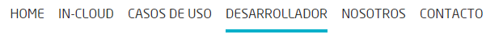
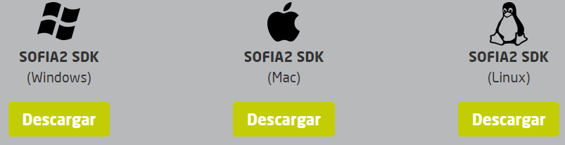
.. |image4| image:: ./media/image8.png
   :width: 3.30208in
   :height: 1.92708in
.. |image5| image:: ./media/image9.png
   :width: 6.07292in
   :height: 2.44792in
.. |image6| image:: ./media/image10.png
   :width: 1.93750in
   :height: 1.68750in
.. |image7| image:: ./media/image11.png
   :width: 6.13542in
   :height: 2.58333in
.. |image8| image:: ./media/image12.png
   :width: 6.13542in
   :height: 1.37500in
.. |image9| image:: ./media/image13.png
   :width: 6.13542in
   :height: 2.72917in
.. |image10| image:: ./media/image14.png
   :width: 4.57292in
   :height: 2.42708in
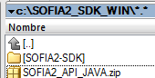
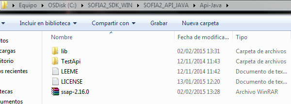
.. |image13| image:: ./media/image17.png
   :width: 6.14583in
   :height: 2.87500in
.. |image14| image:: ./media/image18.jpeg
   :width: 4.12500in
   :height: 1.19792in
.. |image15| image:: ./media/image19.png
   :width: 6.13542in
   :height: 2.95833in
.. |image16| image:: ./media/image20.png
   :width: 3.39583in
   :height: 1.59375in
.. |image17| image:: ./media/image21.png
   :width: 5.50000in
   :height: 1.15625in
.. |image18| image:: ./media/image22.png
   :width: 3.62500in
   :height: 3.61458in

.. |image20| image:: ./media/image24.png
   :width: 6.13542in
   :height: 0.35417in
.. |image21| image:: ./media/image25.png
   :width: 6.13542in
   :height: 0.68750in
.. |image22| image:: ./media/image26.png
   :width: 6.13542in
   :height: 1.55208in
.. |image23| image:: ./media/image27.png
   :width: 4.00000in
   :height: 3.89583in
.. |image24| image:: ./media/image28.png
   :width: 4.75000in
   :height: 3.68750in
.. |image25| image:: ./media/image29.png
   :width: 6.48958in
   :height: 1.42708in
.. |image26| image:: ./media/image30.png
   :width: 6.13542in
   :height: 3.67708in
.. |image27| image:: ./media/image31.png
   :width: 1.34375in
   :height: 0.63542in
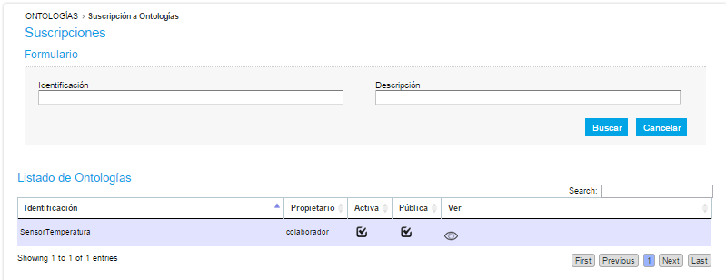
.. |image29| image:: ./media/image33.png
   :width: 0.33333in
   :height: 0.32292in
.. |image30| image:: ./media/image34.png
   :width: 6.13542in
   :height: 3.67708in
.. |image31| image:: ./media/image35.png
   :width: 0.81250in
   :height: 0.34375in
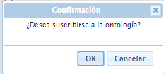
.. |image33| image:: ./media/image37.png
   :width: 6.13542in
   :height: 0.79167in
.. |image34| image:: ./media/image38.png
   :width: 1.29167in
   :height: 0.48958in
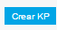
.. |image36| image:: ./media/image40.png
   :width: 6.52083in
   :height: 3.14583in
.. |image37| image:: ./media/image41.png
   :width: 5.04167in
   :height: 3.30208in
.. |image38| image:: ./media/image42.png
   :width: 0.26042in
   :height: 0.19792in
.. |image39| image:: ./media/image43.png
   :width: 0.22917in
   :height: 0.22917in
.. |image40| image:: ./media/image44.png
   :width: 0.23958in
   :height: 0.26042in
.. |image41| image:: ./media/image45.png
   :width: 6.13542in
   :height: 3.19792in
.. |image42| image:: ./media/image46.png
   :width: 1.75000in
   :height: 1.28125in

.. |image44| image:: ./media/image48.png
   :width: 4.22917in
   :height: 0.34375in
.. |image45| image:: ./media/image49.png
   :width: 4.20833in
   :height: 0.83333in
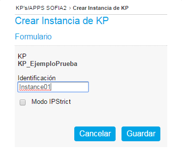
.. |image47| image:: ./media/image51.png
   :width: 0.87500in
   :height: 0.35417in
.. |image48| image:: ./media/image52.png
   :width: 5.44792in
   :height: 1.03125in
.. |image49| image:: ./media/image53.png
   :width: 0.22917in
   :height: 0.27083in
.. |image50| image:: ./media/image54.png
   :width: 6.14583in
   :height: 3.41667in
.. |image51| image:: ./media/image55.png
   :width: 1.18750in
   :height: 0.26042in
.. |image52| image:: ./media/image56.png
   :width: 4.33333in
   :height: 4.53125in
.. |image53| image:: ./media/image57.png
   :width: 2.88542in
   :height: 1.00000in
.. |image54| image:: ./media/image58.png
   :width: 2.20833in
   :height: 1.66667in
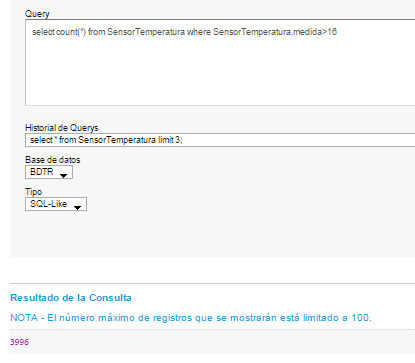
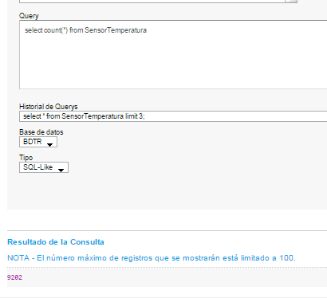
.. |image57| image:: ./media/image61.png
   :width: 3.95833in
   :height: 3.79167in
.. |image58| image:: ./media/image62.png
   :width: 1.10417in
   :height: 0.78125in
.. |image59| image:: ./media/image63.png
   :width: 5.05208in
   :height: 4.12500in
.. |image60| image:: ./media/image64.png
   :width: 2.77083in
   :height: 2.78125in
.. |image61| image:: ./media/image65.png
   :width: 3.85417in
   :height: 0.35417in
.. |image62| image:: ./media/image66.png
   :width: 0.64583in
   :height: 0.32292in
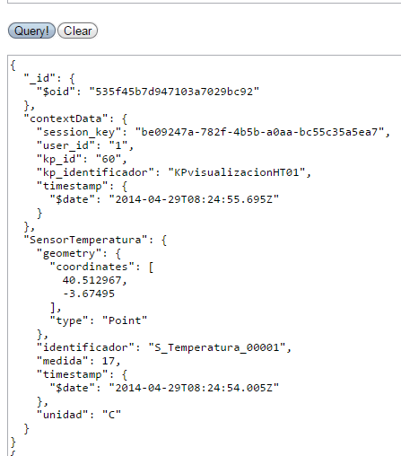
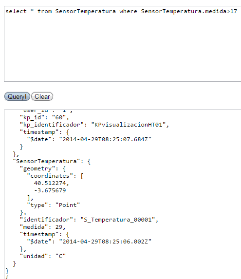
.. |image65| image:: ./media/image69.png
   :width: 6.13542in
   :height: 2.11458in
.. |image66| image:: ./media/image70.png
   :width: 6.13542in
   :height: 1.40625in
.. |image67| image:: ./media/image71.png
   :width: 1.18750in
   :height: 0.95833in
.. |image68| image:: ./media/image72.png
   :width: 3.61458in
   :height: 0.73958in
.. |image69| image:: ./media/image73.png
   :width: 6.13542in
   :height: 0.96875in
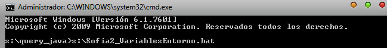
.. |image71| image:: ./media/image75.png
   :width: 6.13542in
   :height: 0.60417in
.. |image72| image:: ./media/image76.png
   :width: 6.13542in
   :height: 1.28125in
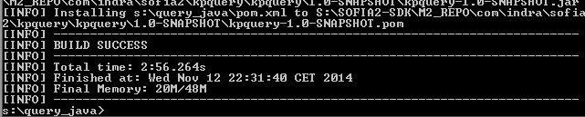
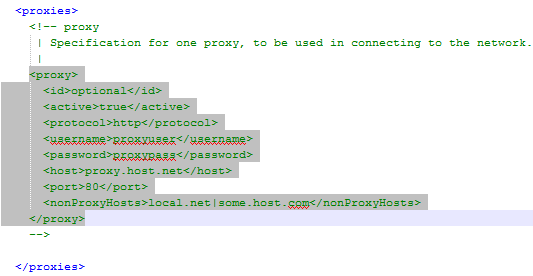
.. |image75| image:: ./media/image79.png
   :width: 4.80208in
   :height: 4.61458in
.. |image76| image:: ./media/image80.png
   :width: 3.96875in
   :height: 2.30208in
.. |image77| image:: ./media/image81.png
   :width: 1.21875in
   :height: 1.61458in
.. |image78| image:: ./media/image82.png
   :width: 3.75000in
   :height: 2.48958in
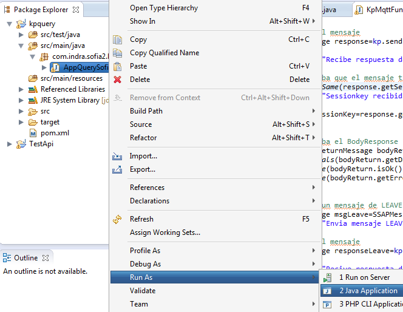
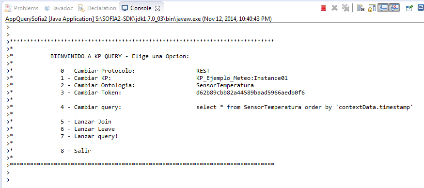
.. |image81| image:: ./media/image85.png
   :width: 2.47917in
   :height: 0.75000in

