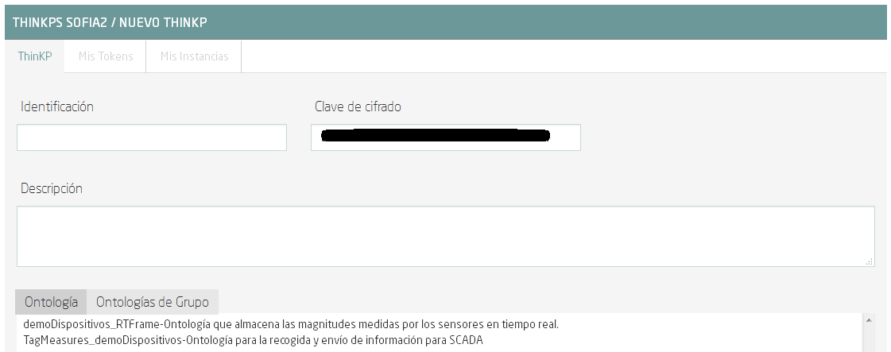

.. figure::  ./../../images/logo_sofia2_grande.png
 :align:   center

    

Gestión de dispositivos en Sofia2
=================================

Introducción
------------

Este tutorial pretende servir como una referencia paso a paso para la evaluación de la gestión de dispositivos IoT por la plataforma Sofia2 Smart IoT Platform.

En concreto esta guía construirá un entorno de demostración con la siguiente estructura: 

|image2|

En este caso en concreto, se utiliza el dispositivo SensorTag de Texas Instruments como dispositivo de adquisición de datos. Este dispositivo dispone de múltiples sensores y una interfaz de comunicación a través de Bluetooth Low Energy. Usando un Smartphone, se establecerá una conexión Bluetooth con el SensorTag, y comenzará un mapeo de los valores medidos por los sensores. El Smartphone será el encargado de encapsular la información y transmitirla a Sofia2 usando redes de telefonía móvil o una red WiFi.

Gracias a las capacidades de Sofia2, la información se puede almacenar, tratar y representar de manera sencilla. En este tutorial iremos explicando paso a paso cómo crear un proyecto en la plataforma FEEP IoT Enablement Platform Sofia2, en el que configuraremos un Dashboard mostrando diversos valores recibidos desde los dispositivos, además de un Sinóptico para mostrar también esta capacidad. Además usaremos el motor de reglas, utilizando Groovy, que evaluará si el valor de una de las magnitudes críticas medidas ha excedido un valor máximo, lanzando en consecuencia un SMS de alerta.

Todas estas capacidades quedarán englobadas en un proyecto sobre Sofia2. A modo de vista general del proyecto, cuando todos los elementos estén conformados se podrá visualizar como en la siguiente figura, donde podremos distinguir los distintos componentes que conforman la solución:

|image3|

Por último, para finalizar el tutorial, explicaremos las capacidades de la plataforma que nos permitirá gestionar los dispositivos conectados y su estado.

Primeros pasos: Creando un usuario y definiendo la ontología
------------------------------------------------------------

Creando un usuario
^^^^^^^^^^^^^^^^^^

Este tutorial se realizará sobre la  `instancia de Sofia2 <http://sofia2.com/console>`__ . El primer paso será generar una cuenta de usuario exclusiva para este proyecto. Tras la creación, el usuario tendrá privilegios de ROL USUARIO 

|image4|

y necesitará solicitar los privilegios de ROL COLABORADOR para poder acceder a todas las capacidades que se pretenden desarrollar en este escenario.

|image5|

Definición de la ontología a utilizar
^^^^^^^^^^^^^^^^^^^^^^^^^^^^^^^^^^^^^

Para el escenario de esta demostración se creará una sola ontología con el objetivo de recoger las distintas magnitudes obtenidas tanto del dispositivo SensorTag como del Smartphone.

Sofia2 soporta múltiples métodos de creación de ontologías (interfaz gráfico de definición de JSON Schemas, generación automática desde Excel, Wizard de creación de ontologías, etc). En este caso se mostrará la **creación guiada de la ontología**. Todas las operaciones posibles que involucran a las ontologías se sitúan bajo el segundo menú de comandos:

|image6|

En la creación guiada de Ontología se pueden configurar múltiples parámetros:

|image7|

De inicio hay que definir un nombre que identificará a la ontología de aquí en adelante, y existe un campo de descripción para anotar las particularidades y usos de la misma. Justo debajo del campo de nombre existe un campo para activar la ontología.

A continuación aparece la configuración de las bases de datos, en cuanto al trasvase de información desde la base de datos en tiempo real (BDTR), a la base de datos histórica (BDH). Para este escenario de demo, se mantendrán los datos en la BDTR.

El apartado de dependencia entre ontologías no aplica a este escenario. A continuación aparece el apartado de añadir nueva propiedad a una ontología y que será el que se use en esta demo para añadir los datos que se desean manejar. Para este caso, se crearán los siguientes campos:

+---------------+-------------------------------------------+--------------+------------+
| **Campo**     | **Descripción**                           | **Fuente**   | **Tipo**   |
+===============+===========================================+==============+============+
| deviceID      | Código IMEI del dispositivo gateway       | Smartphone   | String     |
+---------------+-------------------------------------------+--------------+------------+
| date          | Fecha de generación de la trama           | Smartphone   | Date       |
+---------------+-------------------------------------------+--------------+------------+
| accelX        | Aceleración en G’s sobre el eje X         | SensorTag    | Number     |
+---------------+-------------------------------------------+--------------+------------+
| accelY        | Aceleración en G’s sobre el eje X         | SensorTag    | Number     |
+---------------+-------------------------------------------+--------------+------------+
| accelZ        | Aceleración en G’s sobre el eje X         | SensorTag    | Number     |
+---------------+-------------------------------------------+--------------+------------+
| gyroX         | Velocidad de giro en rad/s en el eje X    | SensorTag    | Number     |
+---------------+-------------------------------------------+--------------+------------+
| gyroY         | Velocidad de giro en rad/s en el eje X    | SensorTag    | Number     |
+---------------+-------------------------------------------+--------------+------------+
| gyroZ         | Velocidad de giro en rad/s en el eje X    | SensorTag    | Number     |
+---------------+-------------------------------------------+--------------+------------+
| temperature   | Temperatura ambiente en ºC                | SensorTag    | Number     |
+---------------+-------------------------------------------+--------------+------------+
| humidity      | Valor de porcentaje de humedad relativa   | SensorTag    | Number     |
+---------------+-------------------------------------------+--------------+------------+
| geometry      | Coordenadas de geoposición                | Smartphone   | Geometry   |
+---------------+-------------------------------------------+--------------+------------+

El resultado final es la ontología completamente definida y lista para recibir información. En el escenario de demo, hemos denominado a la ontología como **demoDispositivos_RTFrame**. En la siguiente figura se muestra un ejemplo de instancia de esta ontología:

|image8|

Con esta definición y manteniendo la ontología activa, en el lado de la plataforma Sofia2 sólo faltaría definir el ThinKP que se usará para interactuar con los datos, y tras este paso, ya se podrá enviar y obtener datos de la plataforma.

Conectando el dispositivo 
-------------------------

Creación del ThinKP asociado
^^^^^^^^^^^^^^^^^^^^^^^^^^^^

En este apartado se creará un ThinKP para este usuario de demo. Para ello hay que pulsar sobre el tercer icono del menú de comandos de la izquierda de la pantalla, y seleccionar Mis ThinKPs:

|image9|

En la parte derecha de la siguiente pantalla aparecerá el botón de creación de un nuevo ThinKP:

|image10|

Tras pulsar el botón se desplegará el cuadro de creación del nuevo ThinKP. La creación es muy sencilla y tan solo requiere la introducción de un identificador y una breve descripción.

|image11|

Además será necesario asociar al menos una ontología asociada al ThinKP. En este caso tan solo se accederá a la ontología que creamos en los apartados anteriores, demoDispositivos_RTFrame, por lo que habría que seleccionarla y pulsar el botón de creación.

Con esto quedaría tal y como se muestra:

|image12|

Uso de la instancia del ThinKP en dispositivos IoT
^^^^^^^^^^^^^^^^^^^^^^^^^^^^^^^^^^^^^^^^^^^^^^^^^^

Tras finalizar la definición del ThinKP, quedaría listo para que distintas instancias del mismo pudieran interactuar con la plataforma. En esta demostración, se utilizará una instancia de ThinKP en el dispositivo que posee el rol de Gateway entre la placa de sensores y la plataforma Sofia2, el smartphone. Utilizando una instancia de ThinKP, se habilitará la inserción, lectura y en definitiva uso de las capacidades de Sofia2 desde el dispositivo Android.

En la siguiente figura se muestra como simplemente bastaría con introducir los valores de los parámetros asociados al ThinKP recién creado en Sofia2.

|image13|

En esta demostración se enviarán los datos de sensores hacia la plataforma, utilizando el protocolo REST que otorga una gran simplicidad a la inserción de datos utilizando operaciones POST. En la siguiente figura se muestra un extracto del método de envío de tramas a Sofia2, en donde se produce el mensaje de JOIN para abrir una sesión en Sofia2, realizando un POST que utiliza los parámetros de la instancia de ThinKP asociada.

|image14|

Con esto se obtendría un conector con Sofia2, a través del cual se pueden introducir datos en la ontología asociada siendo en este caso demoDispositivos_RTFrame.

En cuanto a la toma de datos, en esta demostración se conecta el smartphone con el dispositivo SensorTag a través de BLE (Bluetooth Low Energy). Las características de los servicios disponibles para esta placa en concreto se pueden encontrar en la `web <http://processors.wiki.ti.com/index.php/CC2650_SensorTag_User's_Guide>`__ asociada de Texas Instruments.

La captura de datos del dispositivo SensorTag se puede estructurar en 3 bloques principales:

|image15|

En la fase de **SCAN**, basta con utilizar el API de BLE de Android. En este ejemplo en concreto se ha desarrollado la aplicación para que sea soportada desde la versión KitKat de Android hasta las actuales. Para el escaneo se utiliza la llamada del sistema onLeScan, que se ejecuta cada vez que una nueva MAC de un dispositivo BLE ha sido detectada por el smartphone. En esta aplicación en concreto, simplemente se filtra la dirección del SensorTag y se lanza un Runnable para conectar con el dispositivo:

|image16|

Para iniciar/pausar el escáner basta con llamar a las funciones startLeScan/stopLeScan, mostradas en la figura, pasándoles la referencia del callback de escaneo definido anteriormente.

|image17|

Una vez se establece la conexión con el equipo, se pasa a la fase de **ENABLE**, donde hay que activar los sensores que se deseen monitorizar, siguiendo las directrices de la wiki de SensorTag.

El servidor GATT del SensorTag presenta un servicio para cada sensor de los que monta, y que a su vez constan de 3 características principales:

-  Configuración: Sirve para encender/apagar el sensor.

-  Datos: Característica donde se almacena el valor capturado por el sensor.

-  Periodo: Característica que almacena el valor de la resolución de lectura del sensor.

Si se desea recibir notificaciones cuando varíen los datos de la característica de datos, habrá que activarlas siguiendo las indicaciones, y la aplicación recibirá un callback con el nuevo valor.

En esta demostración se utilizan los sensores de temperatura a través de IR (con capacidad de leer temperatura ambiente, y temperatura de un objeto a corta distancia) y el de movimiento (con capacidad de leer datos de acelerómetro, giróscopo y magnetómetro). En la siguiente figura se presenta un extracto de la información necesaria para interactuar con el sensor. En la fase de **ENABLE**, habría que escribir ‘0x01’ en la característica de configuración del equipo, mientras que en la fase **FETCH**, se puede o bien leer directamente la característica de datos, o activar las notificaciones periódicas (usado en el proyecto).

|image18|

Con los datos de sensores obtenidos, bastará con encapsularlos en base a la ontología creada, por ejemplo conformando un String como el de la siguiente figura. En este ejemplo en concreto, se reporta también el código IMEI del dispositivo móvil a modo de indicador, y se añade la localización por GPS del smartphone para geo-localizar las medidas.

|image19|

Visualizando los datos
----------------------

Una vez realizados el diseño y la configuración de la ontología, en conjunto con la integración de los dispositivos IoT con Sofia2, dispondremos en la plataforma de todos estos datos, que se podrán utilizar de diversas maneras. Por ejemplo, representándola en tiempo real en un dashboard o un sinóptico, o procesándola mediante el motor de reglas.

El uso de estas dos capacidades de Sofia2 será lo que describamos en este apartado.

Composición de un Dashboard
^^^^^^^^^^^^^^^^^^^^^^^^^^^

Sofia2 tiene la capacidad de configurar gadgets y dashboards sobre la información disponible. Para ello accederemos al menú de Visualización, submenú de Gadgets:

|image20|

Para nuestro ejemplo, crearemos un par de gadgets de valor simple, para visualizar los datos de temperatura del sensor, y un par de gadgets de columna, para visualizar los ejes x, y y z del giroscopio y el acelerómetro de los sensores de nuestro SensorTag.

Para cualquiera de los dos casos, lo primero que tenemos que hacer es dar un nombre al gadget y seleccionar nuestro ThinKP, que nos dará visibilidad a la conexión con la ontología que hayamos configurado.

|image21|

Una vez seleccionado el ThinKP, tendremos dos opciones para obtener los datos:

-  Obtener los datos en directo: Esto es, el gadget se mantendrá suscrito a la ontología, actualizando el valor representado en el mismo momento en que un nuevo valor de ésta entra en el repositorio.

-  Obtener datos por query: Definiremos un intervalo de tiempo para el refresco del gadget, transcurrido el cual se lanzará la consulta que definamos contra la base de datos en tiempo real o bien contra la base de datos histórica.

En el caso de los valores simples, elegiremos la segunda opción, lanzando cada 20 segundos la siguiente query a la base BDTR (que nos devuelve el último registro insertado en la ontología):

**db.demoDispositivos\_RTFrame.find().sort({'demoDispositivos\_RTFrame.date':1}).sort({'contextData.timestamp':-1})**

|image22|

Con los datos seleccionados en nuestro gadget, solo necesitaremos seleccionar cuál de los campos de la instancia de ontología recuperada queremos representar, asignarle un nombre en la gráfica y opcionalmente una transformación del dato recuperado de la ontología:

|image23|

Con todos estos pasos, queda seleccionar un token de seguridad de los disponibles en el ThinKP y guardar el gadget creado.

|image24|

Ya con el conjunto de gadgets creados, podremos componer nuestro dashboard de una manera sencilla, accediendo al menú de visualización, submenú dashboards.

Primero configuraremos el estilo general, icono, tipo de menú y crearemos una primera página.

|image25|

Accediendo a la nueva página recién creada del dashboard, podremos añadir los gadgets creados, y arrastrarlos al área donde queramos que se visualice. Nuestro dashboard para este tutorial es el siguiente:

|image26|

Composición de Sinóptico
^^^^^^^^^^^^^^^^^^^^^^^^

Sofia2 contiene un módulo Scada que permite la creación y configuración de sinópticos. Para nuestro ejemplo, se creará un sinóptico sencillo que permite visualizar la actualización de datos en tiempo real.

Para comenzar, se deberá acceder al menú de Visualización y al submenú Sinópticos Sofia2.

|image27|

A continuación, teniendo en cuenta los atributos de la ontología creada que se quieren mostrar en el sinóptico, se definirán los tags asociados de la siguiente forma:

-  En el apartado **Mis tags**, se seleccionará **Crear Tag**.

-  Se añadirá el nombre o identificación que se quiera dar al tag.

-  Se seleccionará el tipo que tomará el tag. En este caso todos los atributos serán de tipo **Number**.

|image28|

|image29|

Tras concluir esta definición de tags, se volverá a la pantalla de Visualización de sinópticos y en el apartado Mis sinópticos se seleccionará Crear sinóptico.

Para añadir imágenes o archivos svg se deberá acceder al menú y seleccionar Importar archivo svg.

|image30|

Para añadir texto y etiquetas para los valores de los atributos, se deberá ir al menú lateral izquierdo y se seleccionará la opción de Insertar texto, insertando uno a uno todos los elementos de texto que se deseen.

|image31|

A continuación se añadirán las etiquetas para la visualización de los atributos de la ontología que se quieren mostrar. Para cada una se creará un elemento de texto con un asterisco, y después se seleccionará en el menú superior la clase de tag que se quiere mostrar, para este ejemplo todos serán de clase label.

|image32|

Una vez seleccionada la clase se seleccionará el botón de **tag properties** para asignar el tag que va a asociar a ese elemento

|image33|

|image34|

Para cada elemento de texto de tipo **label**, se deberá seleccionar el **tag** asociado, temperature, acceIX,..

|image35|

El módulo Scada contiene una ontología (TagMeasures_demoDispositivos), un Thinkp (KpScada_demoDispositivos) y un script (ScadaScript_demoDispositivos) asociados a los sinópticos. Estos elementos son los que permiten la visualización de los datos en tiempo real.

|image36|

Para este caso se creará un script que lo que haga sea insertar una instancia en la ontología TagMeasures_demoDispositivos cada vez que se inserte en la ontología demoDispositivos_RTFrame. Para la generación del script se deberán tener en cuenta únicamente los campos tagId (que se corresponderá con la identificación del tag) y measure (que se corresponderá con el valor que toma el tag) de la ontología TagMeasures_demoDispositivos. De tal forma que por cada atributo que se quiera mostrar, se insertará una instancia en la ontología del sinóptico.

|image37|

Para más detalle sobre la composición de un sinóptico se pueden visitar los siguientes enlaces:

`Versión inicial del Módulo Sofia2-SCADA <https://about.sofia2.com/2016/03/29/version-inicial-del-modulo-sofia2-scada/>`__

`Vídeo Demostrador Editor SVG <https://www.youtube.com/watch?v=IYbPyUu9DFc>`__

Jugando con los datos
---------------------

Continuando en la línea del tutorial, si en los apartados anteriores veíamos simplemente como representarlos, tal cual o bajo alguna transformación, de diversas maneras según el uso del dato, en este apartado vamos a configurar una regla, que se ejecutará por cada dato recibido, y vamos a configurar un API para ofrecer una interfaz de acceso a los datos de una manera controlada.

Configurando reglas en tiempo real
^^^^^^^^^^^^^^^^^^^^^^^^^^^^^^^^^^

En el contexto de nuestra prueba, que consiste en recibir datos de los sensores configurados en un beacon, vamos a controlar que uno de los valores no excede de un valor, y en caso de que esto ocurra, mandaremos un SMS al teléfono del administrador.

Para ello, vamos crear una regla de ontología, que se ejecutará por cada dato que se inserte en nuestra ontología **demoDispositivos_RTFrame** Esta opción la podemos encontrar en el menú **Reglas** submenú **Wizard de Creación de Reglas**

|image38|

Una vez seleccionados los campos de nombre, timeout (valor obligatorio), Tipo de regla (Ontología), ontología a la que queremos asociar la ejecución del código (en nuestro caso, demoDispositivos_RTFrame), y lenguaje (en nuestro ejemplo seleccionaremos groovy), podemos comenzar a introducir el código.

Para facilitar la estructura del código, localizaremos la condición de la regla en la sección **IF**, que en caso de devolver un **true** continuará ejecutando la sección escrita en la pestaña **THEN** y en caso opuesto, ejecutará la sección codificada en la pestaña **ELSE**. La pestaña **ERROR** contendrá el código para la gestión de los errores de ejecución del script.

|image39|

En nuestro caso, codificaremos las secciones **IF** y **THEN**

**En la sección IF** (podéis ver el código en la imagen anterior), se importan las librerías a utilizar, se declaran las variables de instancia de nuestro ThinKP, y su token, cargamos la ontología en la variable ontologyJson, y evaluamos el valor de humedad (si es superior a 30, la evaluación devolverá un true, y el script continuará ejecutando el código de la pestaña THEN)

**En la sección THEN** utilizaremos un proveedor de SMS para enviar un mensaje indicando la alerta del dispositivo. A través de una conexión httpGET

|image40|

Así de simple. Una vez guardado y activado el script, éste se ejecutará por cada dato insertado o modificado en la ontología.

Si vas a jugar con scripting en Sofia2, te interesará saber los siguientes **trucos:**

-  Con el cursor en la sección de edición de scripts, pulsa F11 para conseguir que se amplíe a toda la pantalla y así tendrás más espacio para escribir.

-  Para verificar si la ejecución del script ha sido correcta, o detalles de cualquier error de ejecución, puedes ir al menú **Herramientas** submenú **visualización de estado de procesos** y verás toda la información necesaria para poner en marcha tu script.

Publicando APIs de acceso a los datos
^^^^^^^^^^^^^^^^^^^^^^^^^^^^^^^^^^^^^

Ahora vamos a definir interfaces sobre los datos que estamos gestionando. Para ello, una de las opciones disponibles es la configuración de servicios REST a través del API Manager de Sofia2, que nos permitirá definir operaciones de lectura, escritura (*POST*), actualización (*PUT*), borrado (*DELETE*), búsqueda básica o búsquedas avanzadas (*GET*).

Para crear un conjunto de operaciones sobre la ontología *demoDispositivos_RTFrame* que estamos usando en este ejemplo, accederemos al menú ‘Mis APIS’, opción ‘Crear API’

|image41|

Por defecto, el formulario propone la configuración de un `API externa <https://about.sofia2.com/2014/09/08/nueva-version-api-manager-registro-apis-externas/>`__. En nuestro ejemplo, desmarcaremos esta opción, para poder seleccionar la ontología *demoDispositivos_RTFrame* en el combo, y esta acción nos propondrá un nombre para el API (*demoDispositivos_RTFramees* que podremos actualizar a lo que prefiramos)

Para habilitar cada una de las operaciones disponibles (GET, POST, PUT, DELETE…), solo tendremos que seleccionarlas en el listado, y añadirle una descripción. En nuestro caso, haremos un ejemplo sencillo de la operación CUSTOM QUERY

|image42|

Donde la invocación al método ‘ultimoDato’, lanzará la query:

**db.demoDispositivos\_RTFrame.find().sort({\\'demoDispositivos\_RTFrame.date\\':1}).sort({\\'contextData.timestamp\\':-1})**

Devolviendo el último dato insertado en la ontología.

Para información más detallada de todas las posibilidades del API Manager en Sofia2, os recomentamos que visitéis los siguientes post del Blog:

-  `Nuevo ciclo de vida en API Manager <https://about.sofia2.com/2015/11/12/nuevo-ciclo-de-vida-en-api-manager/>`__

-  `API Manager: Metodos Custom Query <https://about.sofia2.com/2015/06/29/api-manager-metodos-custom-query/>`__

-  `Control Throtling en API Manager <https://about.sofia2.com/2015/11/20/control-throtling-en-api-manager/>`__

-  `API Manager: Clonado de APIs <https://about.sofia2.com/2015/11/25/api-manager-clonado-de-apis/>`__

Gestión de dispositivos en Sofia2
---------------------------------

La gestión de los dispositivos conectados es una de las 10 tecnologías más relevantes en el ámbito IoT para los próximos años, según la estimación de Gartner

|image43|

En este apartado, y a modo de compendio de todas las capacidades presentadas anteriormente, se encarga de presentar las capacidades actuales y futuras de gestión de dispositivos por parte de Sofia2.

Antes de entrar en materia, un breve repaso de los conceptos que manejamos en Sofia2 para la configuración de las conexiones IoT:

-  **Spaces (Proyectos):** Un Space (Proyecto Sofia2) representa un entorno colaborativo virtual donde los usuarios pueden crear sus aplicaciones, por ejemplo creando Things, modelando sus entidades, aplicando algoritmos o creando visualizaciones.

-  **Ontología (Entities):** Una Entity (Ontología en terminología Sofia2 / **Thintology**) representa el Modelo de Dominio que maneja una Thing.

   -  Las Ontologías se representan en JSON y pueden representar un modelo básico (como si fuera una Tabla) o un modelo complejo con relaciones (como si tuviésemos un conjunto de tablas relacionadas).

   -  Cuando un Dispositivo (Thing) envía una medida hablamos de **instology**  (Instancia de Ontología).

   -  Las Entities pueden crearse de diversas formas: visualmente en un diagrama de clases UML, a través de un esquema JSON o XML, campo a campo o a partir de un CSV/XLS.

-  **ThinKP:** Una ThinKP (en terminología Sofia2 hablamos de KP: Knowledge Processor o de ThinKP) representa a cada uno de los elementos que interactúan con la plataforma, bien publicando, bien consumiendo información.

   -  Una Thing puede representar desde un dispositivo sencillo (un Arduino o un iBeacon) a un Gateway (una Raspberry) o un Sistema Empresarial (Backend Java u otro).

   -  Una Thing puede manejar una o varias Entities (ontologías).

   -  Una Thing al ponerse en ejecución crea una **instathing** (Instancia de KP), asociado a una Thing pueden crearse varias Instancias.

   -  Todas las comunicaciones con Sofia2 están securizadas. En el caso de las comunicaciones desde una instathing a la plataforma, tendremos un **token** de autenticación que garantizará que la thing conectada está registrada y autorizada para hacer la operación.

-  **Asset (Think Type):** Un Asset me permite definir las características estáticas de una Thing. Puede usarse para definir tipos de dispositivos (p. e. farolas en una ciudad o motores en una planta) o hacer una gestión de activos.

Desde el menú ThinKPs SOFIA2, submenú **'Mis ThinKPs'** podremos gestionar el alta, modificación y eliminación de los ThinKPs, sus tokens y las instancias de cada uno de ellos.

|image44|

Con esta configuración, podremos comunicar nuestras “things” con la plataforma, siguiendo el protocolo SSAP.

|image45|

Para ello, Sofia2 provee una serie de APIs de desarrollo (disponibles en nuestra web), de tal manera que esta comunicación se pueda implementar tanto en distintos lenguajes de programación, como en distintos protocolos de comunicación (MQTT, rest, websockets…)

|image46|

Una vez puesto en marcha nuestro proyecto, podremos controlar la actividad de nuestras conexiones desde varios puntos de vista:

**KPs Activos**

Desde el menú ThinKP Sofia2, submenú **'ThinKPs conectados'** podremos visualizar las conexiones activas, junto con sus datos (identificación, sessionKey y fecha de activación)

|image47|

**Gestión de conexiones**

Por otra parte, desde el menú de Administración, submenú **'Gestión de Conexiones'**, podremos visualizar las conexiones tanto desde el punto de vista físico como lógico, pudiendo hacer búsquedas, y cerrar conexiones o incluso bloquear clientes específicos, tal y como se muestra en la siguiente figura.

|image48|

**Gestión de Configuraciones SW**

Además, podremos controlar las versiones de los clientes desplegados en nuestros things, y su configuración, mediante la gestión de configuraciones, donde podremos asociar SW y parámetros de configuración a nuestros ThinKPs o a instancias de ThinKPs.

De esta manera, si queremos actualizar la versión del SW con la que se conectan nuestros things, actualizaremos la configuración de SW asignada, y la próxima vez que el dispositivo compruebe la versión de SW, se le informará que hay una nueva versión, pudiendo lanzar la descarga y actualización en cliente de manera automática.

Esta funcionalidad es muy útil en escenarios en que tenemos cientos de dispositivos conectados a nuestra plataforma (por ejemplo, una smartCity, o una fábrica), y queremos hacer actualizaciones remotas de todos ellos.

|image49|

**Gestión de assets**

A todas estas capacidades, y como funcionalidad adicional, podemos añadir la gestión de los assets (los elementos del mundo real conectados a través de nuestros ThinKPs), con funcionalidades como la geolocalización de cada uno de ellos, categorización y gestión de sus propiedades.

|image50|

En resumen, Sofia2 cuenta con un completo conjunto de funcionalidades para dar cobertura a las necesidades de gestión de los dispositivos conectados, tanto para controlar su actividad como para asegurar su correcta configuración.

Lo que viene en la próxima versión
----------------------------------

En cualquier caso, y siguiendo nuestro espíritu de mejora continua, estamos preparando novedades en las próximas versiones. Entre otras, estamos trabajando en una **gestión avanzada de dispositivos (ThinKPs)** que permitirá:

-  Obtener una visión centralizada del estado de todos los dispositivos y componentes conectados a la plataforma (desde sus distintas configuraciones, localización, mensajes y errores producidos hasta el estado de sus componentes HW). Para ello se incorporarán nuevos tipos de mensaje de comunicación:

   -  Error

   -  Logs

   -  Location

   -  Status
   

-  Comunicación y actuación directas desde la plataforma con cualquiera de los thinKP conectados, para obtener información y efectuar operaciones remotas.

-  Control de todas las funcionalidades (las nuevas y las ya existentes) desde un único punto de la consola, para lo que se reestructurará en una única pantalla, con las siguientes pestañas (incluimos los drafts conceptuales!):

 

**Gestión de ThinKPs:** Para la gestión de los thinKPs: Visualización, búsqueda, modificación y borrado.

|image51|

**Tipo de ThinKPs:** Para la gestión de lo que ahora se presenta como assets. Podremos buscar y gestionar toda esta información relacionándola con los thinKPs.

|image52|

**Logs:** La plataforma recibirá todas las trazas que se consideren relevantes desde cada uno de los dispositivos, permitiendo tener un único punto centralizado de control de logs de todos los thinKPs integrados, con distintos criterios de búsqueda.

|image53|

**Error y estado:** Igualmente, tendremos un único punto desde el que controlar y buscar todos los mensajes de error identificados en los dispositivos.

|image54|

Igualmente para el estado de cada ThinKP conectada.

|image55|

**Lanzar acciones:** Por último, podremos lanzar acciones sobre uno o varios dispositivos a la vez (búsqueda y multiselección), tales como actualizar el estado del dispositivo o hacer un reinicio en remoto.

|image56|

.. |image12| image:: ./media/image0013.png
   :width: 6.68750in
   :height: 4.18750in

.. |image18| image:: ./media/image0019.png
   :width: 6.68750in
   :height: 1.76042in

.. |image26| image:: ./media/image0027.png
   :width: 6.07292in
   :height: 2.77083in

.. |image30| image:: ./media/image0031.png
   :width: 4.32292in
   :height: 2.85417in

.. |image41| image:: ./media/image0042.png
   :width: 5.80208in
   :height: 2.43077in

.. |image46| image:: ./media/image0047.jpeg
   :width: 4.04167in
   :height: 2.48958in

.. |image52| image:: ./media/image0053.png
   :width: 5.84375in
   :height: 3.04167in

