.. figure::  ./../../images/logo_sofia2_grande.png
 :align:   center
 
Modelado de Ontologías
======================

Conceptos Básicos
-----------------

-  **JSON**: es un formato ligero para el intercambio de datos (como XML pero menos verboso)

-  **JSON**-**Schema:** un esquema JSON es un documento JSON que permite especificar cómo es un documento JSON al que se refiere (si hay atributos obligatorios, si son de tipo number, si pueden ser nulos). En la equivalencia XML correspondería con un esquema XML o con un DTD.

-  **Ontología** define formalmente un conjunto común de términos que se usan para describir y representar un dominio.

-  **Ontología SOFIA2:** En SOFIA2 un ontología es la definición del conjunto de clases y atributos de las mismas que van a compartir las distintas aplicaciones que interoperan dentro del SmartSpace. En SOFIA2 las ontologías de definen en JSON conforme a un esquema JSON.

-  **Instancia de Ontología:** es un elemento concreto de una ontología

Un primer vistazo
-----------------

Como hemos dicho en SOFIA2 una **ontología** representa una entidad en mi sistema (SmartSpace), y esta se define en **JSON**.

La Plataforma ofrece una **Web (+API REST) de Configuración** en la que los usuarios con permisos (colaboradores y administradores) pueden crear sus ontologías.

|image2|

Una ontología se define a partir de un **esquema JSON**.

Para simplificar la creación de Ontologías la Plataforma ofrece el concepto de Plantillas, que son esquemas JSON precargados que puede usar y ampliar el usuario para crear sus ontologías:

|image3|

Comencemos con la definición de un Ontología sencilla como la que representa un Sensor de Temperatura que almacena: identificador, timestamp, medida, unidad y coordenadas GPS.

Una instancia de esta ontologías sería algo como:

.. code-block:: json

   {
     "SensorTemperatura": {
     "identificador":"ST-TA3231-1",
     "timestamp":{"$date": "2014-01-27T11:14:00Z"},
     "medida":25.1,
     "unidad":"C",
     "geometry":
     {
      "type": "Point",
      "coordinates":[90,-10.1]
     }
    }
   } 

Puedo ver cómo se define el esquema JSON de esta ontología en SOFIA2:

|image4|

Esta ontología es pública, lo que implica que cualquier persona puede consultar datos de esta.

Si pinchamos Ver |image5| veremos el esquema JSON que describe esta Ontología (en posteriores apartados entraremos en detalle sobre la sintaxis de este esquema):

.. code-block:: json

    {
     "$schema":"http://json-schema.org/draft-04/schema#",
     
     "title":"SensorTemperatura Schema",
     
     "type":"object",
     
     "required":["**SensorTemperatura**"],
     "**properties**":
     {
      **"_id**":
      {
       "type":"object",
       "$ref":"#/identificador"
      },
     "**SensorTemperatura**":
      {
       "type":"string",
       "$ref":"#/**datos**"
      }
     },
    "additionalProperties":false,
    "**identificador**":
    {
     "title":"id",
     "description":"Id insertado del SensorTemperatura",
     "type":"object",
     "properties":
     {
      "$oid":
      {
       "type":"string"
      }
     },
    "additionalProperties":false
    },

    "**datos**":
    {
     "title":"datos",
     "description":"Info SensorTemperatura",
     "type":"object",
     "required":["identificador","timestamp","medida","unidad","coordenadaGps"],
     "properties":
     {
     "**identificador**":
     {
       "type":"string"
     },
     "**timestamp**":
     {
      "type":"object",
      "required":["$date"],
      "properties":
       {
        "$date":
         {
           "type":"string",
           "format":"date-time"
         }
       },
    "additionalProperties":false
     },
     "**medida**":
     {
       "type":"number"
     },
    "**unidad**":
    {
      "type":"string"
    },
    "**geometry**":
    {
     "$ref":"#/gps"
    }
    },
    "additionalProperties":false
    },

    "**gps**":
    {
    "title":"gps",
    "description":"Gps SensorTemperatura",
    "type":"object",
    "required":["coordinates","type"],
    "properties":
    {
    "**coordinates**":
    {
    "type":"**array**",
    "items":[
    {
    "type":"number",
    “maximum”:180,
    “mininum”:-180
    },

    {
    "type":"number",
    “maximum”:180,
    “mininum”:-180
    }
    ],
    "minItems":2,
    "maxItems":2
    },
    "type":
    {
     "type":"string",
     "enum":["**Point**"]
    }
    },
    "additionalProperties":false
    }
   } 

+--------------------------------------------------------------------------------------------------------------------------------------------------------------------------------------------------------------------------------------------------------------------------------------------------------------------------------------------------------------------------------------------------------+
| **NOTA**                                                                                                                                                                                                                                                                                                                                                                                               |
+========================================================================================================================================================================================================================================================================================================================================================================================================+
| En el esquema podemos observar que las propiedades ***timestamp*** y ***geometry*** están definidas de una forma especial. Esto es así para permitir realizar búsquedas por fecha y geoespaciales en MongoDB. Veamos cada caso en particular:                                                                                                                                                          |
|                                                                                                                                                                                                                                                                                                                                                                                                        |
| -  **timestamp**: MongoDB permite trabajar con fechas en formato ***ISO 8601*** date (**YYYY-MM-DDThh:mm:ss.fffZ).** Para que MongoDB interprete que un campo es de tipo fecha, espera recibir un JSON con una estructura similar a {"$date": "2014-01-27T11:14:00Z"} representados. El esquema que nos permite validar instancias de este tipo es el siguiente:                                       |
|                                                                                                                                                                                                                                                                                                                                                                                                        |
| { "timestamp":{                                                                                                                                                                                                                                                                                                                                                                                        |
|                                                                                                                                                                                                                                                                                                                                                                                                        |
| "type":"object",                                                                                                                                                                                                                                                                                                                                                                                       |
|                                                                                                                                                                                                                                                                                                                                                                                                        |
| "required":["$date"],                                                                                                                                                                                                                                                                                                                                                                                  |
|                                                                                                                                                                                                                                                                                                                                                                                                        |
| "properties":{                                                                                                                                                                                                                                                                                                                                                                                         |
|                                                                                                                                                                                                                                                                                                                                                                                                        |
| "$date":{                                                                                                                                                                                                                                                                                                                                                                                              |
|                                                                                                                                                                                                                                                                                                                                                                                                        |
| "type":"string",                                                                                                                                                                                                                                                                                                                                                                                       |
|                                                                                                                                                                                                                                                                                                                                                                                                        |
| "format":"date-time"                                                                                                                                                                                                                                                                                                                                                                                   |
|                                                                                                                                                                                                                                                                                                                                                                                                        |
| }                                                                                                                                                                                                                                                                                                                                                                                                      |
|                                                                                                                                                                                                                                                                                                                                                                                                        |
| },                                                                                                                                                                                                                                                                                                                                                                                                     |
|                                                                                                                                                                                                                                                                                                                                                                                                        |
| "additionalProperties": false                                                                                                                                                                                                                                                                                                                                                                          |
|                                                                                                                                                                                                                                                                                                                                                                                                        |
| }                                                                                                                                                                                                                                                                                                                                                                                                      |
|                                                                                                                                                                                                                                                                                                                                                                                                        |
| }                                                                                                                                                                                                                                                                                                                                                                                                      |
|                                                                                                                                                                                                                                                                                                                                                                                                        |
|     Esto nos permite realizar consultas como la siguiente :                                                                                                                                                                                                                                                                                                                                            |
|                                                                                                                                                                                                                                                                                                                                                                                                        |
| db.SensorTemperatura.find({"Sensor.created":{"$lt": new ISODate()}});                                                                                                                                                                                                                                                                                                                                  |
|                                                                                                                                                                                                                                                                                                                                                                                                        |
| -  **geometry:** MongoDB permite realizar consultas geoespaciales y para ello requiere que los campos que hayan de tratarse con este fin sean definidos, con la siguiente estructura:                                                                                                                                                                                                                  |
|                                                                                                                                                                                                                                                                                                                                                                                                        |
| { "geometry": {                                                                                                                                                                                                                                                                                                                                                                                        |
|                                                                                                                                                                                                                                                                                                                                                                                                        |
| "type": "object",                                                                                                                                                                                                                                                                                                                                                                                      |
|                                                                                                                                                                                                                                                                                                                                                                                                        |
| "required":["coordinates","type"],                                                                                                                                                                                                                                                                                                                                                                     |
|                                                                                                                                                                                                                                                                                                                                                                                                        |
| "properties":{                                                                                                                                                                                                                                                                                                                                                                                         |
|                                                                                                                                                                                                                                                                                                                                                                                                        |
| "coordinates":{                                                                                                                                                                                                                                                                                                                                                                                        |
|                                                                                                                                                                                                                                                                                                                                                                                                        |
| "type":"array",                                                                                                                                                                                                                                                                                                                                                                                        |
|                                                                                                                                                                                                                                                                                                                                                                                                        |
| "items":[                                                                                                                                                                                                                                                                                                                                                                                              |
|                                                                                                                                                                                                                                                                                                                                                                                                        |
| {                                                                                                                                                                                                                                                                                                                                                                                                      |
|                                                                                                                                                                                                                                                                                                                                                                                                        |
| "type":"number",                                                                                                                                                                                                                                                                                                                                                                                       |
|                                                                                                                                                                                                                                                                                                                                                                                                        |
| "maximum": 90,                                                                                                                                                                                                                                                                                                                                                                                         |
|                                                                                                                                                                                                                                                                                                                                                                                                        |
| "minimum": -90                                                                                                                                                                                                                                                                                                                                                                                         |
|                                                                                                                                                                                                                                                                                                                                                                                                        |
| },                                                                                                                                                                                                                                                                                                                                                                                                     |
|                                                                                                                                                                                                                                                                                                                                                                                                        |
| {                                                                                                                                                                                                                                                                                                                                                                                                      |
|                                                                                                                                                                                                                                                                                                                                                                                                        |
| "type":"number",                                                                                                                                                                                                                                                                                                                                                                                       |
|                                                                                                                                                                                                                                                                                                                                                                                                        |
| "maximum": 180,                                                                                                                                                                                                                                                                                                                                                                                        |
|                                                                                                                                                                                                                                                                                                                                                                                                        |
| "minimum": -180                                                                                                                                                                                                                                                                                                                                                                                        |
|                                                                                                                                                                                                                                                                                                                                                                                                        |
| }                                                                                                                                                                                                                                                                                                                                                                                                      |
|                                                                                                                                                                                                                                                                                                                                                                                                        |
| ],                                                                                                                                                                                                                                                                                                                                                                                                     |
|                                                                                                                                                                                                                                                                                                                                                                                                        |
| "minItems":2,                                                                                                                                                                                                                                                                                                                                                                                          |
|                                                                                                                                                                                                                                                                                                                                                                                                        |
| "maxItems":2                                                                                                                                                                                                                                                                                                                                                                                           |
|                                                                                                                                                                                                                                                                                                                                                                                                        |
| },                                                                                                                                                                                                                                                                                                                                                                                                     |
|                                                                                                                                                                                                                                                                                                                                                                                                        |
| "type":{                                                                                                                                                                                                                                                                                                                                                                                               |
|                                                                                                                                                                                                                                                                                                                                                                                                        |
| "type":"string",                                                                                                                                                                                                                                                                                                                                                                                       |
|                                                                                                                                                                                                                                                                                                                                                                                                        |
| "enum":["Point"]                                                                                                                                                                                                                                                                                                                                                                                       |
|                                                                                                                                                                                                                                                                                                                                                                                                        |
| }                                                                                                                                                                                                                                                                                                                                                                                                      |
|                                                                                                                                                                                                                                                                                                                                                                                                        |
| },                                                                                                                                                                                                                                                                                                                                                                                                     |
|                                                                                                                                                                                                                                                                                                                                                                                                        |
| "additionalProperties":false                                                                                                                                                                                                                                                                                                                                                                           |
|                                                                                                                                                                                                                                                                                                                                                                                                        |
| }                                                                                                                                                                                                                                                                                                                                                                                                      |
|                                                                                                                                                                                                                                                                                                                                                                                                        |
|     La propiedad *geometry*, está compuesto del tipo “Point” y de unas coordenadas, que representa un punto, dado por la latitud y longitud (“coordenates”:[Latitud,Longitud]). El rango de valores que soporta MongoDB para este tipo de coordenadas está entre [90, -90] para las latitud y [180,-180] para la longitud. Si se intenta insertar un valor fuera del rango, MongoDB retornará error.   |
|                                                                                                                                                                                                                                                                                                                                                                                                        |
|     Una instancia que cumple con esta estructura: {"geometry ": {"type":”Point”, “coordinates”:[1.9, -3.9]}}                                                                                                                                                                                                                                                                                           |
|                                                                                                                                                                                                                                                                                                                                                                                                        |
|     Podremos realizar búsquedas geoespaciales en MongoDB como la siguiente:                                                                                                                                                                                                                                                                                                                            |
|                                                                                                                                                                                                                                                                                                                                                                                                        |
| db.SensorTemperatura.find({“Sensor.geometry.coordinates”:{$near:[12,12],$maxDistance:1}})                                                                                                                                                                                                                                                                                                              |
+--------------------------------------------------------------------------------------------------------------------------------------------------------------------------------------------------------------------------------------------------------------------------------------------------------------------------------------------------------------------------------------------------------+

Puedo ver las **instancias de mis ontologías** desde la Web de Configuración a través de la opción Consulta a Base de Datos:

|image6|

Si en esta consulta lanzo una consulta de este estilo:

|image7|

Veré la información de la última instancia insertada en la BDTR de SOFIA2

{

**    "\_id": {**

      "$oid": "51e3dbd465701fd8e0f69828"

    },

    **"contextData": {**

      "session\_key": "08bf50c8-6ea6-41dc-99ac-5d12a6f517a3",

      "user\_id": 1,

      "kp\_id": 9,

      "kp\_identificador": "gatewaysensores",

      "timestamp": {"$date": "2014-01-27T11:14:00Z"}

    },

    {

**"SensorTemperatura": {**

"identificador":"ST-TA3231-1",

"timestamp":{"$date": "2014-01-27T11:14:00Z"},

"medida":25.1,

"unidad":"C",

"geometry":{

"type": "Point",

"coordinates":[90,-10.1]

}

}

}

Podemos observar que la información devuelta incluye:

-  El **identificador** de esa instancia:

    |image8|

-  **Información de contexto:** como el KP, instancia, usuario, sesión y fecha en la que se insertó.

    |image9|

-  **Instancia de la Ontología**

    |image10|

Tecnologías Implicadas
----------------------

JSON
^^^^

`**JSON es el acrónimo de JavaScript Object Notation** <http://www.json.org/>`__.

JSON es un formato ligero originalmente concebido para el intercambio de datos en Internet.

Tipos de datos 
~~~~~~~~~~~~~~~

-  **string** : Cadena de texto

-  **number**: Numérico

-  **object**: Objeto

-  **char**: Caracteres Unicode válidos

-  **array**: Colección de valore

-  **null**: Nulo

-  **boolean**: Valores true o false

En JSON, se presentan de estas formas:

Un **objeto** es un conjunto sin ordenar de pares clave-valor. Comienza por “{“ y termina con “}”. Cada nombre estará seguido por “:”, los pares clave-valor estarán separados por “,”.

|image11|

|image12|

Un **array** es una colección de valores. Comienza por “[“ y finaliza con “]”. Los valores se separan por “,”.

|image13|

|image14|

Un **valor** puede ser una cadena de caracteres con comillas doble, un número, true, false, null, un objeto o un array. Esta estructuras pueden anidarse:

|image15|

Un **string** es una secuencia de cero o más caracteres Unicode, encerrados entre comillas dobles (“)

|image16|

Un **número** es como un número decimal en Java.

|image17|

Referencias
~~~~~~~~~~~

`**http://cdn.dzone.com/sites/all/files/refcardz/rc173-010d-JSON\_2.pdf** <http://cdn.dzone.com/sites/all/files/refcardz/rc173-010d-JSON_2.pdf>`__

Esquemas JSON (JSON-SChema)
^^^^^^^^^^^^^^^^^^^^^^^^^^^

JSON-Schema (`**http://json-schema.org** <http://json-schema.org>`__ ) es un formato JSON para describir datos en JSON. Es en JSON lo que XSD a XML. Ofrece un contrato para definir los datos requeridos para una aplicación dada y la forma de interactuar con él.

Ejemplo
~~~~~~~

Para hacernos una idea veamos un ejemplo de un esquema JSON sencillo:

**{**

**"$schema":** **"**\ http://json-schema.org/draft-04/schema#\ **",**

**"title":** **"**\ Product\ **",**

**"description":** **"**\ A product from Acme's catalog\ **",**

**"type":** **"**\ object\ **",**

**"properties":** **{**

*"id"*\ **:** **{**

**"description":** **"**\ The unique identifier for a product\ **",**

**"type":** **"**\ integer\ **"**

**},**

*"name"*\ **:** **{**

**"description":** **"**\ Name of the product\ **",**

**"type":** **"**\ string\ **"**

**},**

*"price"*\ **:** **{**

**"type":** **"**\ number\ **",**

**"minimum":** **0,**

**"exclusiveMinimum":** **true**

**}**

**},**

**"required":** **["**\ id\ **",** **"**\ name\ **",** **"**\ price\ **"]**

**}**

Que validaría como válidos JSONs como este:

**{**

"id"**:** **1,**

"name"**:** **"**\ A green door\ **",**

"price"**:** **12.50,**

"tags"**:** **["**\ home\ **",** **"**\ green\ **"]**

**}**

Y como inválido este por no tener el atributo price:

**{**

"id"**:** **1,**

"name"**:** **"**\ A green door\ **",**

"tags"**:** **["**\ home\ **",** **"**\ green\ **"]**

**}**

Atributos de un esquema JSON
~~~~~~~~~~~~~~~~~~~~~~~~~~~~

Podemos ver la referencia completa de la especificación JSON aquí: `**http://json-schema.org/latest/json-schema-core.html** <http://json-schema.org/latest/json-schema-core.html>`__

**{**

**"$schema":** **"**\ http://json-schema.org/draft-04/schema#\ **",**

**"title":** **"**\ Product\ **",**

**"description":** **"**\ A product from Acme's catalog\ **",**

**"type":** **"**\ object\ **",**

**"properties":** **{**

*…*

*…*

*…*

*…*

**},**

**"required":** **["**\ id\ **",** **"**\ name\ **",** **"**\ price\ **"]**

**}**

Los atributos más utilizados en un esquema JON son:

-  ***“$schema”***: Nos permite indicar la versión del Schema JSON que queremos usar: 0.4 o 0.3, SOFIA2 se apoya en la versión 0.4 (*`http://json-schema.org/draft-04/schema# <http://json-schema.org/draft-04/schema>`__)*.

-  **“title”**: indicar un título con el que identificar el esquema.

-  **“description”**: Se puede utilizar este atributo para incluir una descripción de lo que va a representar el esquema JSON.

-  **“type”**: Para indicar el tipo que va a representar el esquema.

-  **“properties”**: Este atributo es un objeto con las definiciones de propiedades que definen los valores estáticos de una instancia de objeto. Es una lista no ordenada de propiedades. Los nombres de las propiedades se deben cumplir y el valor de las propiedades se definen a partir de un esquema, que debe cumplirse también.

-  **“patternProperties”**: Este atributo es un objeto con las definiciones de propiedades que definen los valores de una instancia de objeto. Es una lista desordenada de propiedades. Los nombres de las propiedades son patrones de expresiones regulares, las instancias de las propiedades deben cumplir con el patrón definido y el valor de la propiedad con el esquema que define esa propiedad.

-  **“additionalProperties”**: Permite indicar si la instancia JSON puede contener propiedades que no hayan sido definidas en el esquema. Tiene dos posibles valores (true o false), para indicar si se admite cualquier propiedad o no. Si no se añade la propiedad, se podrá incluir cualquier otra propiedad.

-  **“required”**: Permite indicar todas las propiedades que son obligatorias para una instancia JSON y que como mínimo debe incluir. Las propiedades se incluirán entre corchetes y separadas por el carácter “,”.

    (Este propiedad es obligatoria incluirla en el esquema).

-  **“$ref”**: Define una URI de un esquema que contienen la completa representación para esa propiedad.

Veamos en este extracto de esquema un ejemplo para los atributos definidos

    {

    "$schema":"http://json-schema.org/draft-04/schema#",

    "title":"SensorTemperatura Schema",

    "type":"object",

    "required":["SensorTemperatura"],

    "properties":{

    "\_id":{

    "type":"object",

    "$ref":"#/identificador"

    },

    "SensorTemperatura":{

    "type":"string",

    "$ref":"#/datos"}

    },

    "additionalProperties":false,

En este ejemplo podemos ver que hay una propiedad que es obligatoria “\ **SensorTemperatura**\ ” y que hay dos propiedades **“\_id**\ ” y “\ **SensorTemperatura**\ ”, que incluyen una referencia a un elemento que es el que contiene la representación completa de esa propiedad.

"identificador":{

"title":"id",

"description":"Id insertado del SensorTemperatura",

"type":"object",

"properties":{

"$oid":{

"type":"string"

}

},

"additionalProperties":false

},

"datos":{

"title":"datos",

"description":"Info SensorTemperatura",

"type":"object",

"required":["identificador","timestamp","medida","unidad","coordenadaGps"],

"properties":{

"identificador":{

"type":"string"

},

"timestamp":{

"type":"object",

"required":["$date"],

"properties":{

"$date":{

"type":"string",

"format":"date-time"

}

},

"additionalProperties":false

},

"medida":{

"type":"number"

},

"unidad":{

"type":"string"},

"geometry":{

"$ref":"#/gps"

}

},

"additionalProperties":false

Como podemos ver tanto “identificador” como en “datos” son esquemas que definen su representación. Podemos ver también que no se admiten ningún tipo de propiedad que no sean las definidas (se ha incluido “additionalProperties”).

-  **Enumerados**: Los enumerados los representaremos a como una lista entre corchetes y separados entre el carácter “,”. Los enumerados siempre son de tipo “string”. Por ejemplo si queremos definir una propiedad llamada “tipo” que sólo pueda tener uno de los dos valores “latitud” o “longitud”, quedaría del siguiente modo:

    “tipo”:{

    “type”:”string”,

    “enum”:[“latitud”,”longitud”]

    }

    Para instanciarlo, *“tipo”: “latitud”*

-  **“ítems”:** Define los elementos permitidos en un array, debe ser un esquema o un conjunto de esquemas.

-  **“additonalItems”:** Para indicar si se admiten elementos en el array, además de los definidos en el esquema.

-  **“minItems”:** Número mínimo de elementos que puede tener el array.

-  **“maxItems”:** Número máximo de elementos que puede tener el array.

En el siguiente ejemplo podemos ver cómo es el esquema para un array, “coordinates”, que debe ser de tipo numérico y que sólo puede tener dos elementos. También vemos que la propiedad “type”, es un enumerado con un único valor posible “Point”.

“geometry”:{

"type": "object",

"required":["coordinates","type"],

"properties":{

"coordinates":{

"type":"array",

"items":{

"type":"number"

},

"minItems":2,

"maxItems":2

},

"type":{

"type":"string",

"enum":["Point"]

}

},

"additionalProperties":false

}

Una instancia para este objeto sería como el siguiente

"geometry":{

"type": "Point",

"coordinates":[110.2,1233.1]

}

Podemos encontrar más información y ejemplos en el siguiente enlace: `**http://json-schema.org/** <http://json-schema.org/>`__

.. |image0| image:: ./media/image2.png
   :width: 2.15972in
   :height: 0.99167in
.. |image1| image:: ./media/image3.png
   :width: 1.40764in
   :height: 0.45556in
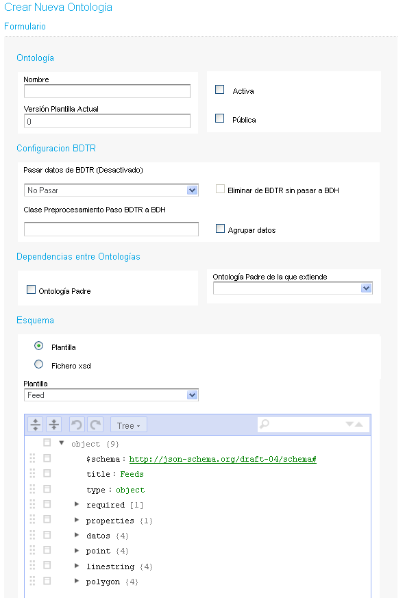
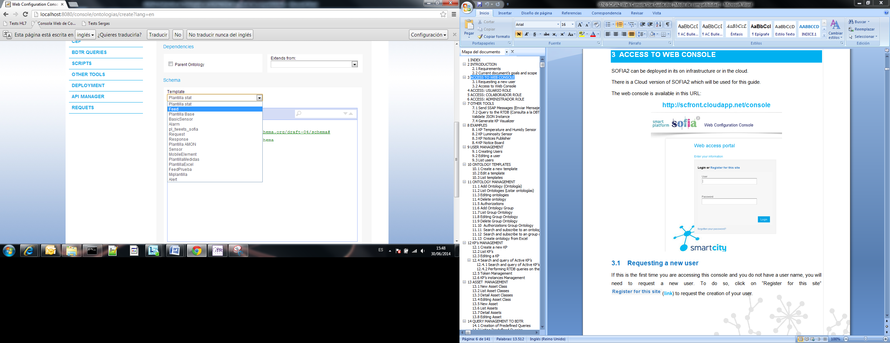
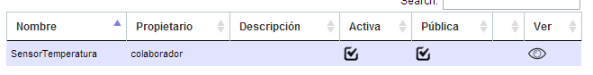
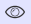
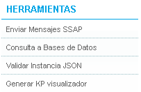
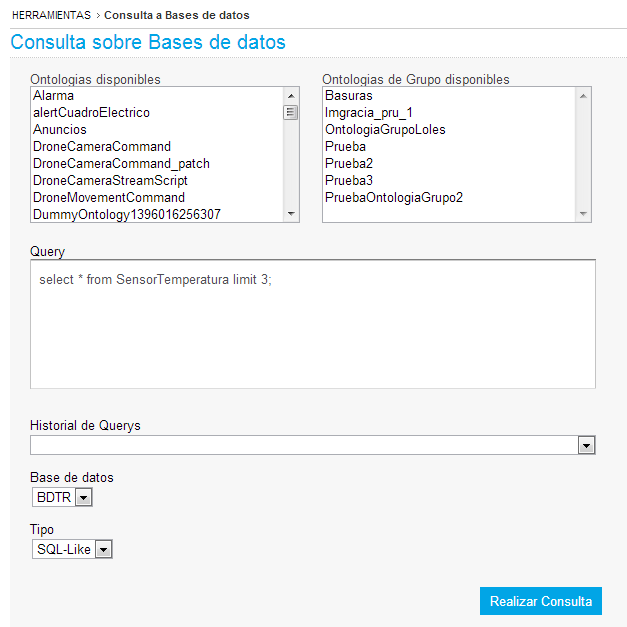
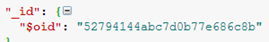
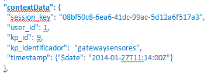
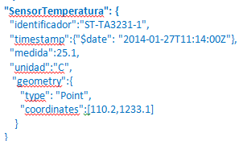
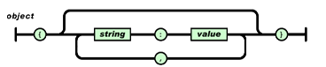
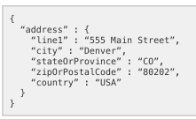
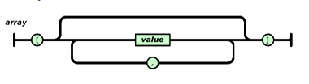
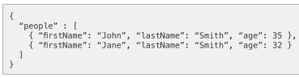
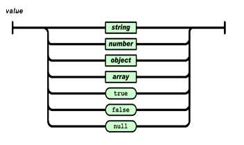
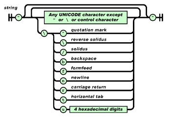
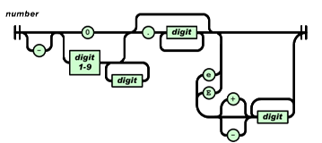

