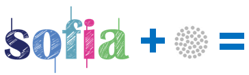

.. figure::  ./images/logo_sofia2_grande.png
 :align:   center
 
Origen y Evolución
==================

Sofia2 surge de un proyecto I+D europeo denominado SOFIA.

SOFIA es el acrónimo de **SMART OBJECTS FOR INTELLIGENT APPLICATIONS** y es una plataforma que surge de un proyecto de I +D Artemis de tres años finalizado en Marzo de 2012, en el que participan 19 partners de cuatro países de la UE, entre los cuales están Nokia, Philips, Fiat, Acciona e Indra.

Tras el proyecto Artemis Indra ha seguido evolucionando el proyecto SOFIA original creando una plataforma enfocada a su uso empresarial: **Sofia2**

|image6| |image2|

Sofia2 se ha enfocado en estas áreas:

-  **Adaptación al mundo empresarial**: funcionamiento en Alta Disponibilidad, con centros de datos distribuidos,…

-  Se ha simplificado el trabajo con la plataforma, especialmente en estas áreas:

   -  Desarrollo de las ontologías (pasando a ser ligeras).

   -  Lenguaje de consultas.

   -  Protocolo SSAP: con una implementación JSON además de la estándar XML.

-  Interfaces Big Data (Hadoop) para almacenamiento de grandes volúmenes de datos y datawarehouse.

-  Capacidades integración con Backends con protocolos estándares como Web Services,…

-  Concepto de plugins para ampliar el SIB.

-  Almacenamiento y Consultas GIS integradas.

-  Inclusión de mecanismos de seguridad plugeables.

-  Interfaces REST para poder conectar de forma simple desde smartphones, dispositivos, aplicaciones RIA,…

.. |image2| image:: ./manuals/basico/media/image2.png
   :width: 2.09236in
   :height: 0.96944in
