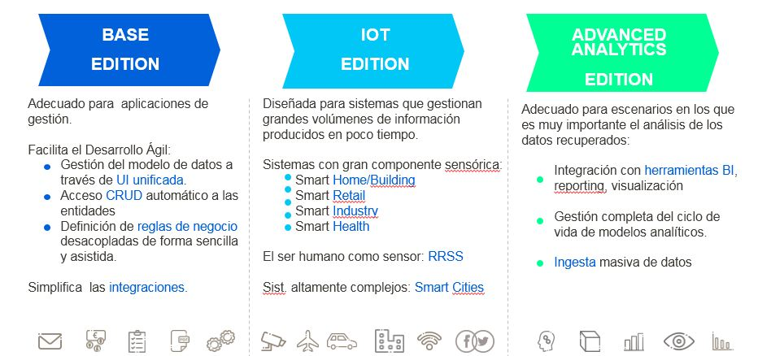

.. figure::  ./images/logo_sofia2_grande.png
 :align:   center
 
Versiones de la Plataforma
==========================

A nivel comercial manejamos 3 versiones de la Plataforma, **Base Edition, IoT Edition y Advanced Analytics Edition**, que se posicionan así:

 
| 
Base Edition
------------
 
Incluye los siguientes módulos:

* IoT Gateway con conectores MQTT, HTTP REST, WebSockets.
* Semantic Broker.
* Process con Rules en Python, R y Groovy, CEP y Planner.
* Real Time Database (RTDB) sobre MongoDB.
* Sofia2 Control Panel incluyendo Dashboards y Reports.

|  
IoT Edition
-----------
Además de los módulos de la versión Base incluye:

* Historical Database (HDB) sobre HIVE + Impala.
* Sofia2 API Manager.
* Sofia2 Holystic Viewer.
* Sofia2 Notebooks con soporte Spark, R y HIVE.

 
| 
Advanced Analytics Edition
--------------------------
